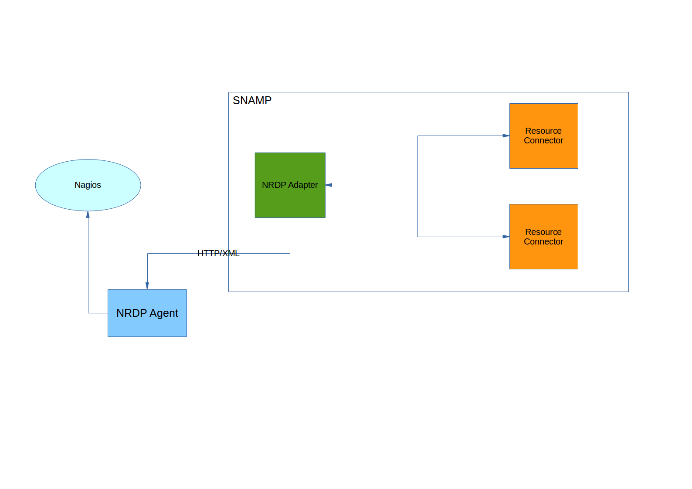

NRDP Resource Adapter
====
NRDP Resource Adapter allows to collect monitoring and management information from all resources connected to SNAMP using [passive check](http://nagios.sourceforge.net/docs/3_0/passivechecks.html). It utilizes [Nagiod Remote Data Processing](https://assets.nagios.com/downloads/nrdp/docs/NRDP_Overview.pdf) technology. So, you need to configure NRDP remote server to receive information in XML format from SNAMP.

The resource adapter sends check information about connected resources in XML format to NRDP agent at the specified period.

NRDP Resource Adapter supports following features (if these features are supported by managed resources as well):

Feature | Description
---- | ----
Attributes | Each attribute is being transferred to NRDP agent at the specified period
Notifications | Each notification is being delivered asynchronously to NRDP agent

Note that this adapter utilizes **its own internal thread pool that can be configured explicitly**.

For more information about NRDP and its XML format see [NRDP Overview](https://assets.nagios.com/downloads/nrdp/docs/NRDP_Overview.pdf).

## Configuration Parameters
NRDP Resource Adapter recognizes following configuration parameters:

Parameter | Type | Required | Meaning | Example
---- | ---- | ---- | ---- | ----
serverURL | URL | Yes | Address for NRDP remote server | `http://nagios.mydomain.com/nrdp`
connectionTimeout | Integer | No | HTTP connection timeout (in millis) used by SNAMP when connecting to NRDP server. Default value is 4 seconds | `6000`
token | String | Yes | Authentication token configured in NRDP server and required for authentication of passive check senders | `xyzterw`
passiveCheckSendPeriod | Integer | No | Period of passive check (in millis) sent to NRDP server by the resource adapter. This parameter affects attributes only because notifications will be delivered asynchronously. Default value is 1 second | `2000`

Note that parameters related to thread pool are omitted. See **SNAMP Configuration Guide** page for more information about thread pool configuration. All other parameters will be ignored.

## Configuring attributes
Following configuration parameters of the attributes have influence on NRDP Resource Adapter behavior:

Parameter | Type | Required | Meaning | Example
---- | ---- | ---- | ---- | ----
serviceName | String | No | Service name that will be specified in the passive check packet. User-defined name of the connected resource will be used if no name is specified. This parameter helps to specify more informative name of the monitored resource in Nagios. | `internet-bank-cluster-node-0`
minValue | String | No | Minimum possible value (exclusive) of the attribute | `3000`
maxValue | String | No | Maximum possible value (exclusive) of the attribute | `10000`
units | String | No | Unit of measurement (UOM) of the attribute value. For example: `ms`, `m`, `kg`, `MB` | `MB`

NRDP Resource Adapter automatically detects service status using `minValue` and `maxValue` if it is specified in the configuration. `OK` status will be assigned using the following rule: `minValue < actual < maxValue`.

Additionally, if read operation fails with exception then the adapter informs about `CRITICAL` status of the service.

## Configuring events
Following configuration parameters of the events influence NRDP Resource Adapter behavior:

Parameter | Type | Required | Meaning | Example
---- | ---- | ---- | ---- | ----
serviceName | String | No | Service name that will be specified in the passive check packet. User-defined name of the connected resource will be used if no name is specified. This parameter helps to specify more informative name of the monitored resource in Nagios. | `internet-bank-cluster-node-0`

## Clustering
NRDP Resource Adapter unless most other adapters is active component. That means that the Monitoring & Management Tool doesn't send request to it. The adapter sends information to the Tool asynchronously. If you have many nodes in your SNAMP cluster then NRDP remote server will accepts many duplicate requests. It happens because each node has its own configured copy of NRDP resource adapter instance. That is normal for low network latency.
