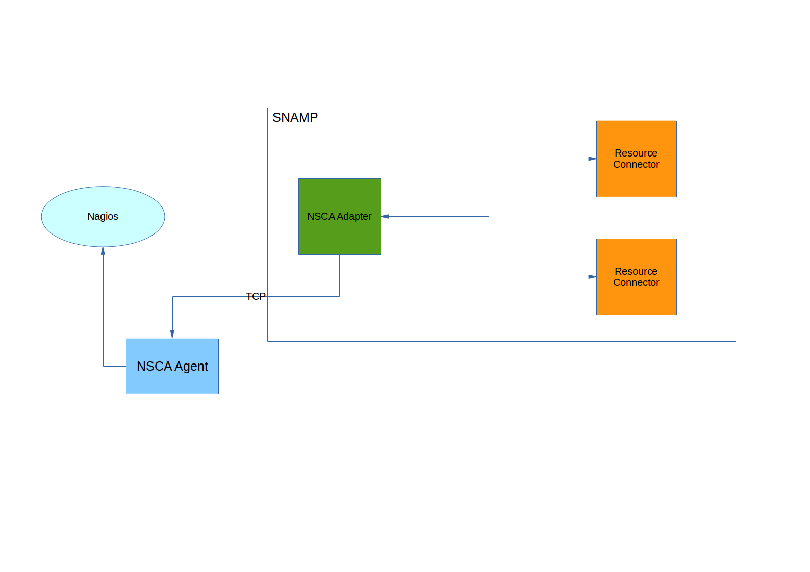

NSCA Resource Adapter
====
NSCA Resource Adapter allows to collect monitoring and management information from all resources connected to SNAMP using [passive check](http://nagios.sourceforge.net/docs/3_0/passivechecks.html). It utilizes [Nagios Service Check Acceptor](http://nagios.sourceforge.net/download/contrib/documentation/misc/NSCA_Setup.pdf) technology. So, you need to configure NSCA remote server to receive information in binary format from SNAMP.

The resource adapter sends check information about connected resources in binary format to NSCA agent at the specified period of time.

NSCA Resource Adapter supports the following features (if these features are supported by managed resources as well):

Feature | Description
---- | ----
Attributes | Each attribute will be transferred to NSCA agent at the specified period of time
Notifications | Each notification will be delivered asynchronously to NSCA agent

Note that this adapter utilizes **its own internal thread pool that can be configured explicitly**.

For more information about NSCA see [NSCA Setup](http://nagios.sourceforge.net/download/contrib/documentation/misc/NSCA_Setup.pdf). Additionally, this adapter may post information to [Icinga](https://www.icinga.org/) and [OpsView](http://www.opsview.com/).

## Configuration Parameters
NSCA Resource Adapter recognizes following configuration parameters:

Parameter | Type | Required | Meaning | Example
---- | ---- | ---- | ---- | ----
nagiosHost | IP Address or DNS-name | Yes | Address of Nagios with configured NSCA add-on
nagiosPort | Integer | Yes | Port of remote Nagios app with configured NSCA add-on
connectionTimeout | Integer | No | Socket connection timeout used by adapter when connecting to NSCA add-on. Default value is `5000` | `10000`
password | String | No | Password used for authentication on NSCA add-on | `qwerty`
encryption | Enum | No | Encryption algorithm for information posted to NSCA add-on | `3des`
passiveCheckSendPeriod | Integer | No | Period of passive check (in millis) sent to NSCA add-on by the resource adapter. This parameter affects attributes only because notifications will be delivered asynchronously. Default value is 1 second | `3000`

Note that parameters related to thread pool is omitted. See **SNAMP Configuration Guide** page for more information about thread pool configuration. All other parameters will be ignored.

### Encryption algorithms
Possible values of `encryption` configuration parameter:

Value | Description
---- | ----
none | No encryption will be applied
xor | Simple XOR between payload and password
3des | TripleDES will be applied. `password` will be used as cryptographic key.

## Configuring attributes
Following configuration parameters of the attributes have influence on NSCA Resource Adapter behavior:

Parameter | Type | Required | Meaning | Example
---- | ---- | ---- | ---- | ----
serviceName | String | No | Service name that will be specified in the passive check packet. If it is not specified then user-defined name of the connected resource will be used instead. The service name helps to specify more informative name of the monitored resource in Nagios. | `internet-bank-cluster-node-0`
minValue | String | No | Minimum possible value (exclusive) of the attribute | `3000`
maxValue | String | No | Maximum possible value (exclusive) of the attribute | `10000`
units | String | No | Unit of measurement (UOM) of the attribute value. For example: `ms`, `m`, `kg`, `MB` | `MB`

If no service status is specified in the configuration - NSCA Resource Adapter automatically detects one using `minValue` and `maxValue`. `OK` status will be assigned using the following rule: `minValue < actual < maxValue`.

Additionally, if read operation fails with exception then the adapter informs about `CRITICAL` status of the service.

## Configuring events
Following configuration parameters of the events have influence on NSCA Resource Adapter behavior:

Parameter | Type | Required | Meaning | Example
---- | ---- | ---- | ---- | ----
serviceName | String | No | Service name that will be specified in the passive check packet. If it is not specified then user-defined name of the connected resource will be used instead. Service name helps to specify more informative name of the monitored resource in Nagios. | `internet-bank-cluster-node-0`

## Clustering
NSCA Resource Adapter is active component (unless most other adapters). Therefore Monitoring & Management Tool doesn't send request to that. The adapter sends information to the Tool asynchronously. If you have big amount of nodes in your SNAMP cluster then NSCA remote server will accept many duplicate requests. It happens because each node has its own configured copy of NSCA resource adapter instance. That is normal for low network latency.
