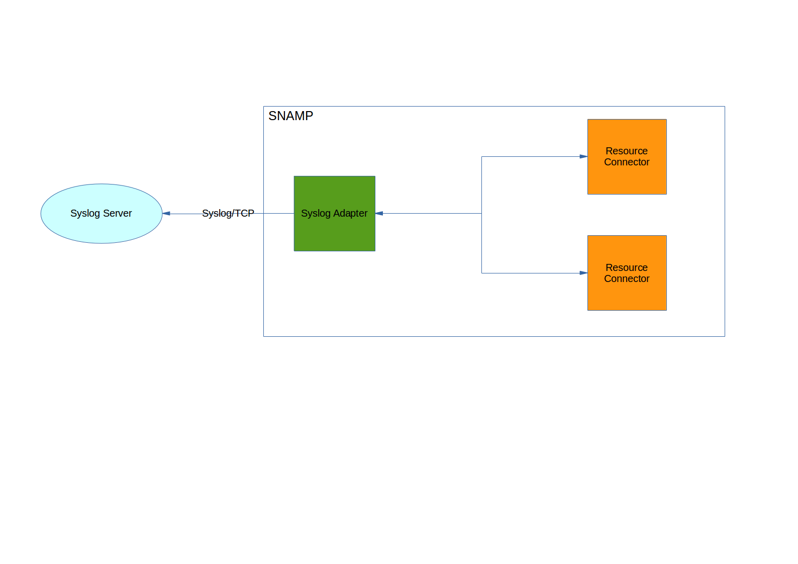

Syslog Resource Adapter
====
Syslog Resource Adapter allows to collect monitoring and management information from all resources connected to SNAMP using Syslog ([RFC-3164](http://www.ietf.org/rfc/rfc3164.txt) or [RFC-5424](http://www.ietf.org/rfc/rfc5424.txt)) protocol. So, you need to configure Syslog server to receive information in binary format from SNAMP.

The resource adapter sends check information about connected resources in binary format to Syslog server at the specified period of time.

Syslog Resource Adapter supports the following features (if they are supported by managed resources as well):

Feature | Description
---- | ----
Attributes | Each attribute will be transferred to Syslog server at the specified period of time
Notifications | Each notification will be delivered asynchronously to Syslog server

## Configuration Parameters
Syslog Resource Adapter recognizes the following configuration parameters:

Parameter | Type | Required | Meaning | Example
---- | ---- | ---- | ---- | ----
port | Integer | Yes | Listen port of Syslog server | `6514`
address | String | Yes | IP address or DNS-name of the Syslog Server | `syslog.acme.com`
connectionTimeout | Integer | No | Socket connection timeout used when connecting to Syslog server. Default value is `2000` | `3000`
protocol | Enum | No | Type of the Syslog protocol. Default value is `rfc-5424` | `rfc-3164`
ssl | `true` or `false` | No | Enable or disable SSL support | `false`
passiveCheckSendPeriod | Integer | No | Period of periodic check (in millis) sent to Syslog server by the resource adapter. This parameter affects attributes only because notifications are being delivered asynchronously. Default value is 1 second

### Supported protocols
`protocol` configuration parameter can have one of the following values:

Value | Description
---- | ----
rfc-3164 | BSD syslog protocol (deprecated protocol).
rfc-5424 | [RFC-5424](http://www.ietf.org/rfc/rfc5424.txt) Syslog protocol. It is preferred value.

## Configuring attributes
The following configuration parameters of the attributes have influence on Syslog Resource Adapter behavior:

Parameter | Type | Required | Meaning | Example
---- | ---- | ---- | ---- | ----
applicationName | String | No | Identify the device or application that originated the message. By default it is equal to the user-defined resource name | `webapi-server`
facility | Enum or Integer | No | Facility level of the periodic attribute check. The default value is `AUDIT` | `ALERT`

## Configuring events
The following configuration parameters of the events have influence on Syslog Resource Adapter behavior:

Parameter | Type | Required | Meaning | Example
---- | ---- | ---- | ---- | ----
applicationName | String | No | Identify the device or application that originated the message. By default it is equal to the user-defined resource name | `webapi-server`
facility | Enum or Integer | No | Facility level of the notification. Default value is `DAEMON` | `ALERT`
severity | Enum | Severity level of the notifications. Default value is `debug` | `panic`

Severity must be specified in the same format as described in **SNAMP Configuration Guide** page. Syslog Resource Adapter performs the following mapping between Syslog Severity and SNAMP Severity:

SNAMP | Syslog
---- | ----
panic | EMERGENCY(1)
alert | ALERT(2)
critical | CRITICAL(3)
error | ERROR(4)
warning | WARNING(5)
notice | NOTICE(6)
informational | INFORMATIONAL(7)
debug | DEBUG(8)
Any other | DEBUG(8)

## Facility level
Facility level for attributes and notifications may be specified in the configuration. Default value for attributes is `AUDIT`. Default value for notifications is `DAEMON`. There are following supported facility levels:

Numeric code | Enum value | Description
---- | ----
0 | KERN | kernel messages
1  | USER | user-level messages
2 | MAIL | mail system
3 | DAEMON | system daemons
4 | AUTH | security/authorization messages
5 | SYSLOG | messages generated internally by syslogd
6 | LPR | line printer subsystem
7 | NEWS | network news subsystem
8 | UUCP | UUCP subsystem
9 | CRON | clock daemon
10 | AUTHPRIV | security/authorization messages
11 | FTP | FTP daemon
12 | NTP | NTP subsystem
13 | AUDIT | log entry
14 | ALERT | log alert
15 | CLOCK | clock daemon
16 | LOCAL0 | local use 0  (local0)
17 | LOCAL1 | local use 1  (local1)
18 | LOCAL2 | local use 2  (local2)
19 | LOCAL3 | local use 3  (local3)
20 | LOCAL4 | local use 4  (local4)
21 | LOCAL5 | local use 5  (local5)
22 | LOCAL6 | local use 6  (local6)
23 | LOCAL7 | local use 7  (local7)
