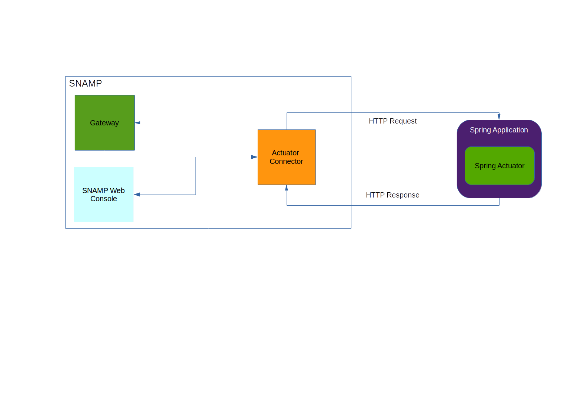

Actuator Connector
====
Actuator Connector allows to obtain metrics and health information from Java application based on [Spring Framework](http://projects.spring.io/spring-framework/) and [Spring Actuator](http://www.baeldung.com/spring-boot-actuators).



Short list of supported features:

Feature | Comments
---- | ----
Attributes | Transforming metrics exposed by Actuator endpoint `/metrics.json` into attributes
Health checks | Transform health indicator exposed by Actuator endpoint `/health.json` into health check

## Connection String
Connection string is an URL as defined in _RFC 3986_ that points to the Actuator endpoint.

Examples:
```
http://service.company.domain/
https://service.company.domain:9233/
```

Actuator supports any protocol in addition to `http` and `https` that is registered in Java Virtual Machine.

## Configuration Parameters
Actuator Connector recognizes the following parameters:

Parameter | Type | Required | Meaning | Example
---- | ---- | ---- | ---- | ----
authentication | string | No | Type of authentication required by Actuator endpoint. If not specified then authentication is not required | `digest`
userName | string | Yes if authentication is defined | User name required by Actuator endpoint | `actuator-user`
password | string | Yes if authentication is defined | Password required by Actuator endpoint | `se@re1`
metricsPath | string | No | A relative path to Actuator endpoint with metrics. Default is `/metrics.json` as defined by Actuator specification | `/m.json`
healthPath | string | No | A relate path to Actuator endpoint with health indicators. Default is `/health.json` as defined by Actuator specification | `/h.json`

### Possible values of authentication parameter
Actuator connector supports the following types of authentication:
* `digest` for HTTP Digest authentication
* `basic` for HTTP Basic authentication

## Configuring attributes
Each attribute configured in Actuator Connector has the following configuration schema:
* _Name_ - name of metrics in JSON returned by `/metrics.json` endpoint. Configuration property `name` is also can be used to define name of the metric.
* Configuration parameters ignored by connector

Attribute name should be the same as JSON field in the Actuator endpoint that returns metrics. Example of JSON returned by Spring application:
```json
{
    "mem" : 193024,
    "mem.free" : 87693,
    "processors" : 4,
    "instance.uptime" : 305027,
    "uptime" : 307077,
    "systemload.average" : 0.11,
    "heap.committed" : 193024,
    "heap.init" : 124928,
    "heap.used" : 105330,
    "heap" : 1764352,
    "threads.peak" : 22,
    "threads.daemon" : 19,
    "threads" : 22,
    "classes" : 5819,
    "classes.loaded" : 5819,
    "classes.unloaded" : 0,
    "gc.ps_scavenge.count" : 7,
    "gc.ps_scavenge.time" : 54,
    "gc.ps_marksweep.count" : 1,
    "gc.ps_marksweep.time" : 44,
    "httpsessions.max" : -1,
    "httpsessions.active" : 0,
    "counter.status.200.root" : 1,
    "gauge.response.root" : 37.0
}
```

## Health check
Resulted health status is constructed from all health indicators returned by `/health.json` endpoint. Example of JSON returned by Spring application:
```json
{
    "status" : "DOWN",
    "myHealthCheck" : {
        "status" : "DOWN",
        "Error Code" : 1,
        "Description" : "You custom MyHealthCheck endpoint is down"
     },
     "diskSpace" : {
         "status" : "UP",
         "free" : 209047318528,
         "threshold" : 10485760
     }
}
```

In this case resulted health status will be **Malfunction** status.

Mapping between status returned by Actuator health indicator and SNAMP malfunction levels:

Health indicator | Malfunction level
---- | ----
DOWN | SEVERE
OUT_OF_SERVICE | LOW
UNKNOWN | MODERATE

If status is **UP** then it will be replaced with SNAMP **OK** status.

## Information Model Mapping
This section describes mapping between JSON data types and SNAMP Management Information Model

JSON Data Type | Management Information Model
---- | ----
String | string
number that has `.0` | float64 or bigdecimal
integer number | int64
boolean | bool
BASE-64 encoded string | array(int8)
