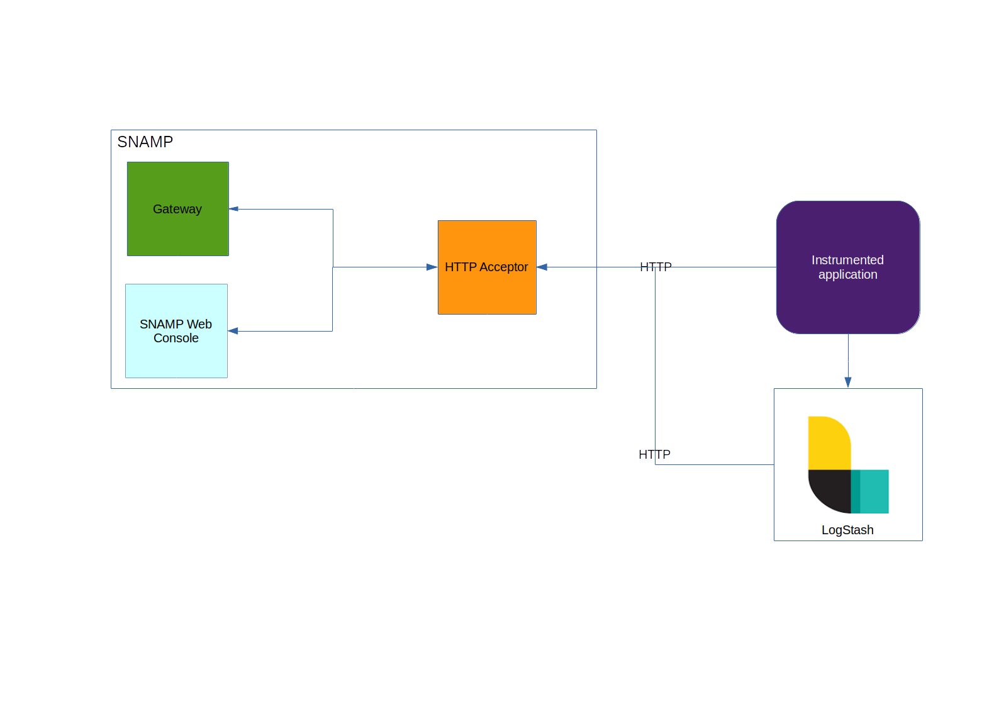

HTTP Acceptor
====
HTTP Acceptor is a passive Resource Connector that accepts information with monitoring data from **managed resources** using HTTP transport and JSON format. The **managed resources** are responsible for delivering data asynchronously to this connector. This is a perfect solution for environment with numerous microservices. HTTP Acceptor uses this information to produce advanced metrics and statistics. But **managed resource** should use **SNAMP Instrumentation Library** and modify its code for delivering necessary data.



HTTP Acceptor is an implementation on top of [Data Stream Connector](ds-connector.md) and provides the following HTTP endpoints for receiving measurements:
* GET `/snamp/data/acquisition/ping` - used for testing purposes and returns generic information about connector
* POST `/snamp/data/acquisition/measurements` - uploads JSON array with measurements
* POST `/snamp/data/acquisition/measurement` - upload single measurement in JSON format
* POST `/snamp/data/acquisition/` - upload measurement in custom format (`text/plain`, `application/json` or `application/xml`) and convert it into standard measurement using Groovy-based parser.

> Host and port for these endpoints can be configured in `/etc` folder inside of SNAMP installation (read **Configuration** section in Administrator's Guide).

Many instances of this Resource Connector shares the same endpoints. But instance of this connector receives measurements only if **InstanceName**/**ComponentName** matches to **resource name**/**group name** respectively. All other measurements will be ignored by instance of the connector.

## Connection String
Connection String is not used by HTTP Acceptor.

## Configuration Parameters
HTTP Acceptor recognizes the following parameters in addition to Data Stream Connector:

Parameter | Type | Required | Meaning | Example
---- | ---- | ---- | ---- | ----
parserScriptPath | string | Yes if used in conjunction with `parserScript` | URL to folder with user-defined Groovy-based parsers | `file:/opt/snamp/scripts`
parserScript | string | Yes if used in conjunction with `parserScriptPath` | User-defined Groovy script used to parse unstructured HTTP requests | `HttpAcceptorParser.groovy`

### Custom parsers
Custom parser will be used by HTTP Acceptor if managed resource uses endpoint `/snamp/data/acquisition`. This endpoint may accept any unstructured data in text, XML and JSON formats. The parser used to convert unstructured text into well-known measurement format. Parser script should define the following function:
```groovy
def parse(headers, body){
}
```

Formal parameters:
* `headers` parameter contains all HTTP request headers
* `body` parameter contains plain text, XML DOM or JSON DOM of the request

Read more about parsers [here](ds-connector.md).

## Configuring attributes
HTTP Acceptor provides the same set of attributes as described in [Data Stream Connector](ds-connector.md).

## Configuring events
HTTP Acceptor provides the same set of events as described in [Data Stream Connector](ds-connector.md).

## Configuring operations
HTTP Acceptor provides the same set of operations as described in [Data Stream Connector](ds-connector.md).

## Health checks
Health checks are based on heartbeat messages received from managed resources through HTTP.

## Using HTTP balancers in clustered configuration
It is allowed to install NGINX/HA Proxy or any other HTTP load balancer between SNAMP and managed resources. In this case initial request will be received by balancer and then re-sended to one of SNAMP nodes.

## Using Logstash
HTTP Acceptor can be used to process measurements extracted from logs by Logstash utility. Parsing rule based on Grok should be configured in Logstash.
