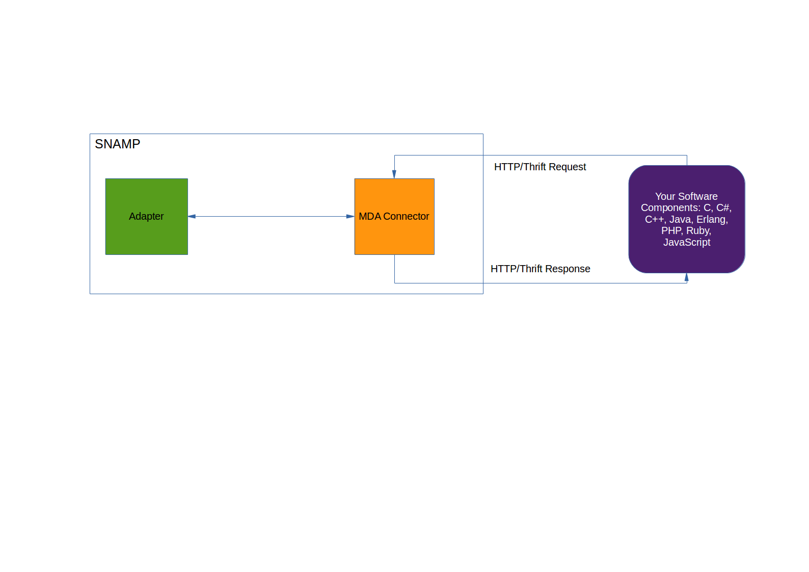

MDA Resource Connector
====
MDA is an acronym of Monitoring Data Acceptor. This means that the connector is passive and doesn't establish direct connection to the managed resource unlike many other active connectors. In other words, the data flow directed from managed resource to resource connector. The managed resources responsible for delivery monitoring data to the connector. This approach is very helpful for monitoring Public/Private Clouds with hundreds or even thousands of components.



MDA Resource Connector provides two type of transport for delivering monitoring data:

Transport | Description
---- | ----
HTTP | MDA Connector exposes simple REST API that is used to set attributes and delivery of notifications. This kind of transport is very useful for delivering monitoring data and metrics from components located in Public Cloud into SNAMP across Internet
[Thrift](http://thrift.apache.org/) | Binary RPC protocol that is used to set attributes and delivery of notifications. Thrift client is available for many programming languages such as `C`, `C++`, `C#`, `D`, `Delphi`, `Erlang`, `Haxe`, `Haskell`, `Java`, `JavaScript`, `PHP`, `Ruby` and etc. This kind of transport os very useful in performance critical scenarios when components located in Intranet or Private Cloud.

MDA Connector stores the delivered attributes and notification in distributed or local memory and exposes these values to the Resource Adapters. Type of the storage depends on SNAMP installation. So if you use clustered installation then MDA Connector store attributes and notifications in Hazelcast. If you use standalone installation then SNAMP use in-process Java heap.

Feature | Comments
---- | ----
Attributes | Can be delivered via HTTP or Thrift and stored into Hazelcast or Java Heap
Events | Can be delivered via HTTP or Thrift and propagated to all Resource Adapters

> Note that this connector utilizes **its own internal thread pool that can be configured explicitly**.

Appliance of MDA Connector limited by capability of making changes in the existing software components. You can select one of the following approaches:

* Assembly you software with HTTP or Thrift client satisfied to MDA Connector Service Contract
* Deploy daemon/service on the same machine with HTTP or Thrift client satisfied to MDA Connector Service Contract. This daemon uses another protocol for accessing data of your software component. This approach is very helpful when software component is legacy and modification is not allowed.

## Connection String
Connection string used to configure transport type of the MDA Connector.

### HTTP Transport
If empty connection string is specified then MDA exposes REST interface via HTTP protocol available at the following context:
```
http://<snamp-host>:3535/snamp/connectors/mda/<resource-name>
```
where `resource-name` is a name of the managed resource in SNAMP configuration.

URL context can be changed by specifying relative URL path in the connection string. For example, if you specify `/my/url/path` as Connection String then full path will be `http://<snamp-host>:3535/my/url.path`

### Thrift Transport
Thrift transport can be established using the following format of Connection String:
```
thrift://<host>:<port>
```
Where `host` is IP-address or DNS-name of inbound interface used to listen and process incoming Thrift threads. `port` is a port number of inbound interface. Thrift is a binary procol running on top of TCP and can be used in Intranet only. It has the following advantages in comparison with HTTP/JSON:

* Thrift is more compact protocol
* Thrift supports persistent TCP connection and avoids the continuous TCP handshakes that HTTP incurs
* Thrift generates the client code completely, so you don't have to deal with anything other than invoking the client

## Configuration Parameters
MDA Resource Connector recognizes the following parameters:

Parameter | Type | Required | Meaning | Example
---- | ---- | ---- | ---- | ----
waitForHazelcast | Integer | No | Timeout (in millis) used to synchronize with Hazelcast OSGi bundle. If this parameter is specified then MDA Connector tries to use Hazelcast in-memory data grid as storage of attribute values. If this parameter is not specified then MDA Connector attempts to discover Hazelcast OSGi bundle but without waiting. If Hazelcast OSGi bundle doesn't exist (or not loaded yet) then connector decide to use local in-memory storage | `10000`
socketTimeout | Integer | No |  Incoming connection timeout (in millis) used only if Thrift transport is configured. Default is `4000`
expirationTime | Integer | No | Expiration time (in millis) of attribute values in the storage. If attribute was not updated by external component then Resource Adapter can't obtain its value. This is very helpful for detecting availability of the component. Default is infinite (never expires) | `2000`

`waitForHazelcast` is useful for Clustered installation of SNAMP only. So you want to use SNAMP Cluster then it is recommended to set `waitForHazelcast` parameter to `20000` (20 seconds).

`expirationTime` configuration parameter is useful in conjunction with `healthCheck` event of [Aggregation Connector](aggregator-connector.md).

## Configuring attributes
Each attribute configured in MDA Resource Connector has the following configuration schema:

* `Name` - name of attribute in REST API or Thrift IDL
* Configuration parameters:

Parameter | Type | Required | Meaning | Example
---- | ---- | ---- | ---- | ----
expectedType | Enum | Yes | Type of the attribute | `bool`
dictionaryItemNames | Comma-separated list of strings | If **expectedType**=`dictionary` | Comma-separated list of dictionary fields | `total, used`
dictionaryItemTypes | Comma-separated list of enum values |  If **expectedType**=`dictionary` | Comma-separated list of types for each field if **expectedType** is `dictionary` | `int32, int64`
dictionaryName | String |  If **expectedType**=`dictionary` | The name of dictionary type | `MemoryStatus`

Note that parameters related to thread pool are omitted. See **SNAMP Configuration Guide** page for more information about thread pool configuration. All other parameters will be ignored.

### Thread Pool settings
MDA Resource Connector uses thread pool in different ways. This behavior depends on transport type:

* For `Thrift` transport, the connector uses thread pool for handling attributes and notifications
* For `HTTP` transport, the connector uses thread pool for firing notifications only. Attributes is processing in HTTP Server threads configured globally for Apache Karaf instance.

### Supported types
**expectedType** configuration parameter must have one of the following values:

Value | Description
---- | ----
int8 | 8-bit integer
int16 | 16-bit integer
int32 | 32-bit integer
int64 | 64-bit integer
float32 | Floating-point number with single precision
float64 | Floating-point number with double precision
bool | boolean flag (`true`/`false`)
string | Text
datetime | Date/time value (usually used as timestamp)
objectname | JMX Object Name
bigint | Integer with arbitrary precision
bigdecimal | Real number with arbitrary precision
char | Single character
array(int8) | Array of 8-bit integers
array(int16) | Array of 16-bit integers
array(int32) | Array of 32-bit integers
array(int64) | Array of 64-bit integers
array(bool) | Array of flags
array(string) | Array of strings
array(char) | Array of characters (it is highly recommended to use `string` instead)
array(float32) | Array of floating-points numbers with single precision
array(float64) | Array of floating-points numbers with double precision
array(objectname) | Array of JMX Object Names
array(datetime) | Array of timestamps
array(bigint) | Array of arbitrary integers
array(bigdecimal) | Array of arbitrary reals
dictionary | Composite structure consisting of several fields

## Configuring events
Each event configured in MDA Resource Connector has the following configuration schema:

* `Category` - category name used to send notifications using REST API or Thrift API
* Configuration parameters:

Parameter | Type | Required | Meaning | Example
---- | ---- | ---- | ---- | ----
expectedType | Enum | Yes | Type of the attribute | `bool`
dictionaryItemNames | Comma-separated list of strings | If **expectedType**=`dictionary` | Comma-separated list of dictionary fields | `total, used`
dictionaryItemTypes | Comma-separated list of enum values |  If **expectedType**=`dictionary` | Comma-separated list of types for each field if **expectedType** is `dictionary` | `int32, int64`
dictionaryName | String |  If **expectedType**=`dictionary` | The name of dictionary type | `MemoryStatus`

## Communicating with MDA
As explained above MDA Connector provides REST or Thrift endpoint used to send monitoring data from your components. Each communication mechanism provides its own Service Contract based on transport particularity.

### HTTP Endpoint
If MDA Connector is configured for HTTP transport then you can use the following endpoints to send and retrieve monitoring data from your components:
> Full URL can be changed via Connection String

Postfix | Full URL | HTTP method | Data Type | Description
---- | ---- | ---- | ----
/attributes | http://host:3535/snamp/connectors/mda/_resource-name_/attributes | PUT | JSON Object | Updates one or more values of attributes in the single request
/attributes/_name_ | http://host:3535/snamp/connectors/mda/_resource-name_/attributes/_name_ | PUT | JSON depends on attribute type | Updates value of the specified attribute
/attributes/_name_ | http://host:3535/snamp/connectors/mda/_resource-name_/attributes/_name_ | GET | _None_ | Obtains value of the specified attribute in JSON format
/attributes | http://host:3535/snamp/connectors/mda/_resource-name_/attributes | DELETE | _None_ | Sets all attributes to their default values
/notifications/_category_ | http://host:3535/snamp/connectors/mda/_resource-name_/notifications/_category_ | PUT | JSON Object | Sends notification

#### Attributes
The following table shows mapping between JSON data type and SNAMP data type specified in `expectedType` configuration parameter of the attribute:

SNAMP data type | JSON data type | Example
---- | ---- | ----
int8 | Number | `42`
int16 | Number | `42`
int32 | Number | `42`
int64 | Number | `42`
bigint | Number | `100500`
bigdecimal | Number | `100500.67`
float32 | Number | `3.14`
float64 | Number | `3.14`
string | String | `"Hello, world!"`
char | String | `"a"`
bool | Boolean | `true`
objectname | String | `"java.lang:type=Memory"`
datetime | Number | `134462732444`
array(int8) | Array of Numbers | `[1, 4]`
array(int16) | Array of Numbers | `[1, 4]`
array(int32) | Array of Numbers | `[1, 4]`
array(int64) | Array of Numbers | `[1, 4]`
array(float32) | Array of Numbers | `[3.14, 2.71]`
array(float64) | Array of Numbers | `[3.14, 2.71]`
array(bigint) | Array of Numbers | `[100500, 100501]`
array(bigdecimal) | Array of Numbers | `[100500.56, 100501.89]`
array(string) | Array of Strings | `["One", "Two"]`
array(char) | Array of Strings | `["a", "b", "c"]`
array(bool) | Array of Booleans | `[true, false]`
array(datetime) | Array of Numbers | `[134462732444, 134462732467]`
array(objectname) | Array of Strings | `["java.lang:type=Memory"]`
dictionary | JSON Object | `{"used": 25972875, "total": 22957285652}`

Note that dictionary type mapping differs from convention used in HTTP Adapter. This is necessary to reduce volume of data passed from your components to MDA Connector. For example, you have an attribute configured as follows:

* `expectedType = dictionary`
* `dictionaryName = MemoryUsage`
* `dictionaryItemNames = used, total`
* `dictionaryItemTypes = int64, int64`

This attribute can be changed using the following request:
```
HTTP PUT http://<snamp-host>:3535/snamp/connectors/mda/os-monitor/attributes/memory
{
  "used": 4862762555,
  "total": 242745286578625
}
```

#### Notifications
Notification can be emitted using the following request:
```
HTTP PUT http://<snamp-host>:3535/snamp/connectors/mda/os-monitor/notifications/alarm
{
  "message": "Disk I/O error occurs", //human-readable message of the notification, required field
  "timeStamp": 13242425525,   //time stamp as Unix time, required field
  "sequenceNumber": 10,   //unique sequential id of the notification, required field
  "userData": "Some payload"  //additional data associated with notification, optional field
}
```
`userData` field must have the data type according with `expectedType` parameter configured on the event. If `expectedType` is not defined then `userData` field must be omitted in JSON.

### Thrift Endpoint
Thrift Endpoint is available only when you specify **thrift** scheme in Connection String. For example, it can be `thrift://0.0.0.0:9878`. It means that MDA Connector accepts incoming TCP requests on `9878` port and listen on all available network interfaces.

Thrift transport provided MDA Connector has the following limitations;

* Binary Protocol only, i.e. [TBinaryProtocol](http://thrift-tutorial.readthedocs.org/en/latest/thrift-stack.html#protocol-layer)
* TCP underlying transport only
* Blocking socket I/O for transport at server side, i.e. [TSocket](http://thrift-tutorial.readthedocs.org/en/latest/thrift-stack.html#tranport-layer). It is highly recommended to use the same transport at client-side

Additionally, you should write Thrift IDL file and generate necessary clients for your programming language. There are special naming and signature convention exist for service operations defined in IDL:

* Attribute getter must have the following form: `<attribute-type> get_XYZ()`, where `XYZ` is a system name of attribute (**not user-defined name!**)
* Attribute setter must have the following form: `<attribute-type> set_XYZ(1:<attribute-type> value)`
* Notification sender must have the following form: `oneway void notify_XYZ(1:string message, 2:i64 timeStamp, 3:i64 sequenceNumber, 4:<userData-type> value)`. The fourth parameter is optional. It must not be specified if `expectedType` configuration parameter is not defined on the event. `XYZ` is a category of the event as it is defined in Resource configuration.

MDA Connector provides a set of predefined system operations:

* `oneway void reset()` - resets all attributes to its defaults

The following table shows mapping between JSON data type and SNAMP data type specified in `expectedType` configuration parameter of the attribute:

SNAMP data type | Thrift data type
---- | ----
int8 | byte
int16 | i16
int32 | i32
int64 | i64
float32 | double
float64 | double
bool | bool
string | string
datetime | i64
objectname | string
bigint | string
bigdecimal | string
char | string
array(int8) | binary
array(int16) | `list<i16>`
array(i32) | `list<i32>`
array(i64) | `list<i64>`
array(bool) | `list<bool>`
array(string) | `list<string>`
array(char) | string
array(float32) | `list<double>`
array(float64) | `list<double>`
array(objectname) | `list<string>`
array(datetime) | `list<i64>`
array(bigint) | `list<string>`
array(bigdecimal) | `list<string>`
dictionary | struct

Service name may be of any string, there is no limitations on that. The same is true for structure names.

Mapping between SNAMP `dictionary` and Thrift `struct` has the following limitations:

* Only scalar items
* Order of fields in Thrift IDL depends on **natural** ordering of item names

For example, you have the following configuration of `dictionary` data type on attribute `dictAttr`:

* `expectedType = dictionary`
* `dictionaryName = TestDict`
* `dictionaryItemNames = avail, total, foo, bar`
* `dictionaryItemTypes = bool, int64, string, i16`

The natural (ascending) order of items: avail, bar, foo, total. The final signature will be:
```thrift
struct TestDict{
  1:bool avail,
  2:i16 bar,
  3:string foo,
  4:i64 total
}

TestDict set_dictAttr(1:TestDict value)
TestDict get_dictAttr()
```

The following example demonstrates complex Thrift IDL which covers a several attributes and a single notification:
```thrift
namespace java com.bytex.snamp.testing.connectors.mda

struct MemoryStatus {
    1: required i32 free
    2: required i64 total
}

service MonitoringDataAcceptor{
    i16 get_short()
    i16 set_short(1:i16 value)

    i64 get_date()
    i64 set_date(1:i64 value)

    string get_biginteger()
    string set_biginteger(1:string value)

    string get_str()
    string set_str(1:string value)

    binary get_array()
    binary set_array(1:binary value)

    bool get_boolean()
    bool set_boolean(1:bool value)

    i64 get_long()
    i64 set_long(1:i64 value)

    MemoryStatus get_dict()
    MemoryStatus set_dict(1:MemoryStatus value)

    list<i64> get_longArray()
    list<i64> set_longArray(1:list<i64> value)

    oneway void notify_testEvent(1:string message, 2:i64 seqnum, 3:i64 timeStamp, 4:i64 userData)

    oneway void reset()
}
```
