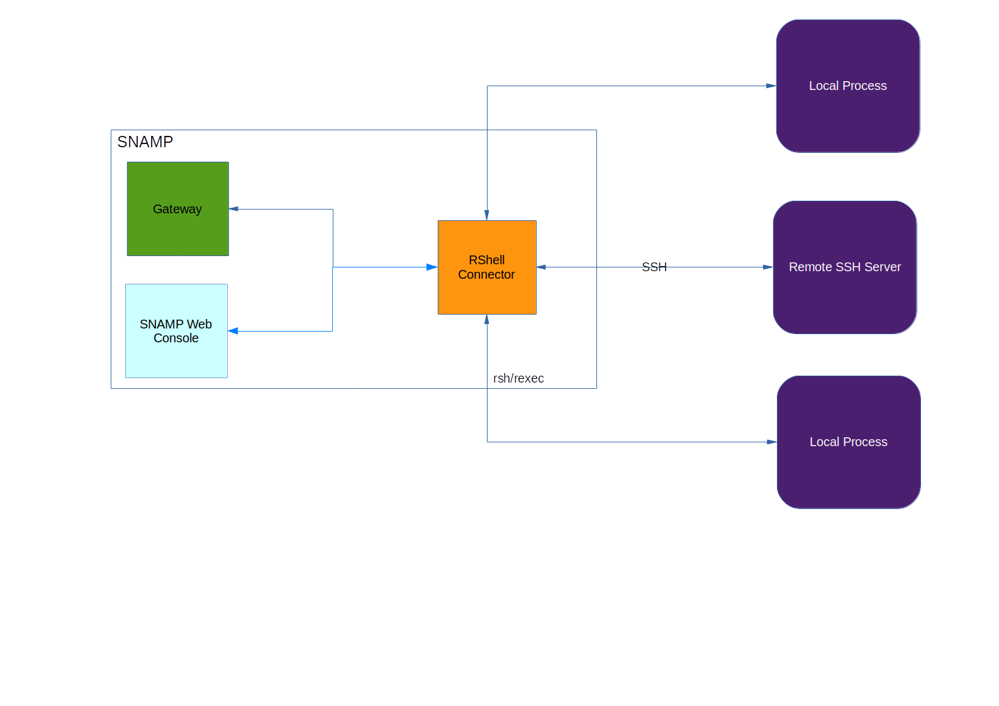

RShell Resource Connector
====
RShell Resource Connector is a multiprotocol connector that allows to monitor resources using following protocols:

* [Remote Process Execution](http://en.wikipedia.org/wiki/Remote_Process_Execution) - allows to execute process on remote machine using _rexec_ protocol
* [Remote Shell](http://en.wikipedia.org/wiki/Remote_Shell), or _rsh_ - equivalent of _rexec_ protocol for BSD Unix systems
* Local Process Execution - executes any process on the same OS where SNAMP installed
* [Secure Shell](http://en.wikipedia.org/wiki/Secure_Shell) - allows to execute process on remote machine using _SSH_ protocol



This connector uses one of the supported protocols to execute a process (local or remote) and convert information from its STDOUT into the management information. Many command-line utilities provide useful information about OS and hardware state, such as:

* GNU Core Utilities:
  * `df` - disk free space on file systems
  * `du` - disk usage on file systems
  * `nice` - modifies scheduling priority
  * `stat` - data about an inode
  * `uptime` - tells how long the system has been running
* Linux Commands:
  * `free` - unused and used memory and swap space
  * `who` - display who is on the system

Also, you can execute any `bash` or `powershell` script and expose its result as an attribute.

Short list of supported features:

Feature | Comments
---- | ----
Attributes | Transforming STDOUT into attribute values and STDIN to set attribute values
Operations | Transforming operation context into STDIN for external process

Details of this connector operating are hidden in the XML-based `Tool Profile` (or Command-line tool profile). Tool Profile (TP) is XML file that describes how to parse STDOUT from process and prepare input from SNAMP. You can use following instruments for text parsing:

* Regular expressions
* JavaScript
* [StringTemplate](http://www.stringtemplate.org/) - template for tool to parse STDIN

## Connection String
Connection string specifies protocol and the host name:

* _rexec://host-name-or-ip:port_ - `rexec` protocol will be used. Remote \*nix machine is identified by the host name or IP address
* _rsh://host-name-or-ip:port_ - `rsh` protocol will be used. Remote \*nix machine is identified by the host name or IP address
* _ssh://host-name-or-ip:port_ - `ssh` protocol will be used.
* _process_ - local process execution will be used (_process_ is a keyword, not a name of the external program)

## Configuration Parameters
JMX Resource Connector recognizes following parameters:

* For local processes only:

Parameter | Type | Required | Meaning | Example
---- | ---- | ---- | ---- | ----
normalExitCode | Integer | No | Indicating normal exit code of external program. By default, `0` is used for Linux and Windows OS. When external program returns any other exit code it will be recognized as an error | `1`

* For _rexec_ protocol only:

Parameter | Type | Required | Meaning | Example
---- | ---- | ---- | ---- | ----
remoteUser | String | Yes | Login name on the remote machine | `acme`
password | String | Yes | Password of the user on the remote machine | `qwerty`

* For _rsh_ protocol only:

Parameter | Type | Required | Meaning | Example
---- | ---- | ---- | ---- | ----
localUser | String | Yes | Login name on the local machine | `acme`
remoteUser | String | Yes | Login name on the remote machine | `acme`

* For _ssh_ protocol only:

Parameter | Type | Required | Meaning | Example
---- | ---- | ---- | ---- | ----
knownHosts | File name | No | Path to the `hosts` file | `/home/user/.ssh/known_hosts`
socketTimeout | Integer | No | SSH connection timeout | 3000
encoding | String | No | Encoding of the characters in SSH session | `UTF-8`
userName | String | No | Login name of the remote | `acme`
sshKeyFile | File name | No | Path to SSH key file (if `password` is not specified). Supported key formats: OpenSSH, PKCS8, PuTTY | `hostkey.ser`
password | String | No | Password of the user on the remote machine | `qwerty`
fingerprint | String | No | Fingerprint of the key | `e8:0d:af:84:bb:ec:05:03:b9:7c:f3:75:19:5a:2a:63`

## Configuring attributes
Behavior of each configured attribute described in the XML file called **Command-Line Tool Profile**. So, each reading and writing operation under the attribute executes the external program.

Use the following attribute configuration scheme:

* _Name_ - full path to the Command-Line Tool Profile. It is possible to use `name` configuration parameter to specify path to Profile.
* Any configuration parameter will be visible to STDIN template specified in the Command-Line Tool Profile

## Configuring operations
Behavior of each configured operation described in the XML file called **Command-Line Tool Profile**. So, each invocation of the operation executes the external program.

Use the following operation configuration scheme:
* _Name_ - full path to he Command-Line Tool Profile. It is possible to use `name` configuration parameter to specify path to Profile.
* Any configuration parameter will be visible to STDIN template specified in the Command-Line Tool Profile

Operation utilize only `reader` section of the profile. `writer` section will be ignored.

## Command-line tool profile
Tool Profile is an XML file that describes following aspects of the textual stream parsing and formatting.

* **Reader definition** - describes how to execute command-line program when reading the attribute value or operation result. If this section is omitted then attribute is write-only
  * _Input section_ - how to construct command-line (STDIN). Template can be constructed using [StringTemplate](http://www.stringtemplate.org/) syntax
  * _Output section_ - how to parse STDOUT from program. Parser can be described in declarative DSL using XML tags from `http://snamp.bytex.solutions/schemas/command-line-tool-profile/v1.0` namespace. Additionally, you can mix declarative syntax with regular expressions and JavaScript code.
* **Writer definition** - describes how to execute command-line program when writing the attribute value. If this section is omitted then attribute is read-only. Operation doesn't use this section.
  * _Input section_ - how to construct command-line (STDIN). Template can be constructed using [StringTemplate](http://www.stringtemplate.org/) syntax
  * _Output section_ can be omitted

All template parameters used in _Input section_ should be specified as an attribute configuration parameters.

XSD schema of the Tool Profile:
```xml
<?xml version="1.0" encoding="UTF-8" standalone="yes"?>
<xs:schema version="1.0" targetNamespace="http://snamp.bytex.solutions/schemas/command-line-tool-profile/v1.0" xmlns:tns="http://snamp.bytex.solutions/schemas/command-line-tool-profile/v1.0" xmlns:xs="http://www.w3.org/2001/XMLSchema">

  <xs:element name="column" type="TableColumnParsingRule"/>
  <xs:element name="const" type="tns:Constant"/>
  <xs:element name="entry" type="tns:DictionaryEntryParsingRule"/>
  <xs:element name="item" type="tns:ArrayItemParsingRule"/>
  <xs:element name="line-terminator" type="tns:LineTerminationParsingRule"/>
  <xs:element name="profile" type="tns:XmlCommandLineToolProfile"/>
  <xs:element name="skip" type="tns:SkipTokenParsingRule"/>
  <xs:element name="template" type="tns:XmlCommandLineTemplate"/>

  <xs:complexType name="TableColumnParsingRule" final="extension restriction">
    <xs:simpleContent>
      <xs:extension base="xs:string">
        <xs:attribute ref="ns1:name" use="required"/>
        <xs:attribute ref="ns1:type" use="required"/>
        <xs:attribute ref="ns1:indexed" use="required"/>
      </xs:extension>
    </xs:simpleContent>
  </xs:complexType>

  <xs:complexType name="XmlCommandLineToolProfile">
    <xs:sequence>
      <xs:element name="modifier" type="tns:XmlCommandLineTemplate" form="qualified" minOccurs="0"/>
      <xs:element name="reader" type="tns:XmlCommandLineTemplate" form="qualified" minOccurs="0"/>
    </xs:sequence>
  </xs:complexType>

  <xs:complexType name="XmlCommandLineTemplate">
    <xs:sequence>
      <xs:element name="output" type="tns:CommandLineToolOutputParser" form="qualified" minOccurs="0"/>
      <xs:element name="input" type="xs:string" form="qualified" minOccurs="0"/>
    </xs:sequence>
  </xs:complexType>

  <xs:complexType name="CommandLineToolOutputParser" mixed="true">
    <xs:sequence>
      <xs:choice minOccurs="0" maxOccurs="unbounded">
        <xs:element ref="tns:entry"/>
        <xs:element ref="tns:line-terminator"/>
        <xs:element ref="tns:column"/>
        <xs:element ref="tns:item"/>
        <xs:element ref="tns:skip"/>
        <xs:element ref="tns:const"/>
      </xs:choice>
    </xs:sequence>
    <xs:attribute ref="tns:blobFormat"/>
    <xs:attribute ref="tns:dateTimeFormat"/>
    <xs:attribute ref="tns:numberFormat"/>
    <xs:attribute ref="tns:language" use="required"/>
    <xs:attribute ref="tns:type" use="required"/>
  </xs:complexType>

  <xs:complexType name="DictionaryEntryParsingRule" final="extension restriction">
    <xs:simpleContent>
      <xs:extension base="xs:string">
        <xs:attribute ref="tns:key" use="required"/>
        <xs:attribute ref="tns:type" use="required"/>
      </xs:extension>
    </xs:simpleContent>
  </xs:complexType>

  <xs:simpleType name="LineTerminationParsingRule">
    <xs:restriction base="xs:string"/>
  </xs:simpleType>


  <xs:complexType name="ArrayItemParsingRule" final="extension restriction">
    <xs:simpleContent>
      <xs:extension base="xs:string">
        <xs:attribute ref="tns:elementType" use="required"/>
      </xs:extension>
    </xs:simpleContent>
  </xs:complexType>

  <xs:simpleType name="SkipTokenParsingRule">
    <xs:restriction base="xs:string"/>
  </xs:simpleType>

  <xs:simpleType name="Constant">
    <xs:restriction base="xs:string"/>
  </xs:simpleType>

  <xs:simpleType name="BlobFormat">
    <xs:restriction base="xs:string">
      <xs:enumeration value="hex"/>
      <xs:enumeration value="base32"/>
      <xs:enumeration value="base64"/>
    </xs:restriction>
  </xs:simpleType>

  <xs:simpleType name="CommandLineToolReturnType">
    <xs:restriction base="xs:string">
      <xs:enumeration value="bool"/>
      <xs:enumeration value="string"/>
      <xs:enumeration value="char"/>
      <xs:enumeration value="blob"/>
      <xs:enumeration value="int8"/>
      <xs:enumeration value="int16"/>
      <xs:enumeration value="int32"/>
      <xs:enumeration value="int64"/>
      <xs:enumeration value="bigint"/>
      <xs:enumeration value="bigdecimal"/>
      <xs:enumeration value="dictionary"/>
      <xs:enumeration value="array"/>
      <xs:enumeration value="table"/>
      <xs:enumeration value="date"/>
      <xs:enumeration value="float32"/>
      <xs:enumeration value="float64"/>
    </xs:restriction>
  </xs:simpleType>

  <xs:attribute name="blobFormat" type="tns:BlobFormat"/>
  <xs:attribute name="dateTimeFormat" type="xs:string"/>
  <xs:attribute name="elementType" type="tns:CommandLineToolReturnType"/>
  <xs:attribute name="indexed" type="xs:boolean"/>
  <xs:attribute name="key" type="xs:string"/>
  <xs:attribute name="language" type="xs:string"/>
  <xs:attribute name="name" type="xs:string"/>
  <xs:attribute name="numberFormat" type="xs:string"/>
  <xs:attribute name="type" type="tns:CommandLineToolReturnType"/>
</xs:schema>
```
Additional information about semantics of some XML elements:

* `blobFormat` - sensitive only when `type=blob`
* `dateTimeFormat` - sensitive only when `type=date`
* `elementType` - sensitive only when `type=array`
* Primitive arrays supported ony
* `key` attribute indicates key name for `dictionary` type
* `indexed` attribute indicates indexed column for `table` type only
* `name` attribute indicates column name for `table` type
* `numberFormat` only for numeric types (`int8`, `int16`, `int32`, `int64`, `float32`, `float64`, `bigint`, `bigdecimal`)

Supported values of `language` attribute:

* `regexp` - regular expressions used as a parsing language
* `JavaScript` - JS used as a parsing language

There are several special global variables available for parsing script (except `regexp`):

* `scan` - object of `java.util.Scanner` class which contains scanner of STDOUT
* `parser` - data type converter with the following methods:
  * `byte parseByte(String value)`
  * `byte parseByte(String value, String format)` - with extended number format (see decimal formats in Java)
  * `short parseShort(String value)`
  * `short parseShort(String value, String format)`
  * `int parseInt(String value)`
  * `int parseInt(String value, String format)`
  * `long parseLong(String value)`
  * `long parseLong(String value, String format)`
  * `float parseFloat(String value)`
  * `float parseFloat(String value, String format)`
  * `double parseDouble(String value)`
  * `double parseDouble(String value, String format)`
  * `BigInteger parseBigInteger(String value)`
  * `BigInteger parseBigInteger(String value, String format)`
  * `BigDecimal parseBigDecimal(String value)`
  * `BigDecimal parseBigDecimal(String value, String format)`
  * `Date parseDate(String value)`
  * `Date parseDate(String value, String format)`

### Example
Following example demonstrates how to parse output from `free` Linux utility:
```xml
<?xml version="1.0" encoding="UTF-8" standalone="yes"?>
<ns1:profile xmlns:ns1="http://snamp.bytex.com/schemas/command-line-tool-profile/v1.0">
    <ns1:reader>
        <ns1:output ns1:language="regexp" ns1:type="dictionary" language="">
            <ns1:skip>[a-z]+</ns1:skip>
            <ns1:skip>[a-z]+</ns1:skip>
            <ns1:skip>[a-z]+</ns1:skip>
            <ns1:skip>[a-z]+</ns1:skip>
            <ns1:skip>[a-z]+</ns1:skip>
            <ns1:skip>[a-z]+</ns1:skip>
            <ns1:skip>[a-zA-Z]+\:</ns1:skip>
            <ns1:entry ns1:key="total" ns1:type="int64">[0-9]+</ns1:entry>
            <ns1:entry ns1:key="used" ns1:type="int64">[0-9]+</ns1:entry>
            <ns1:entry ns1:key="free" ns1:type="int64">[0-9]+</ns1:entry>
        </ns1:output>
        <ns1:input>free {format}</ns1:input>
    </ns1:reader>
</ns1:profile>

```
Example of `free -m` output:
```
total       used       free     shared    buffers     cached
Mem:          7884       6060       1824        274        486       2574
-/+ buffers/cache:       3000       4884
Swap:         4095          0       4095
```
As far as you can see `writer` section is omitted, therefore the configured attribute is read-only.

`language="regexp"` means that parsing is based on the regular expressions.

`type="dictionary"` indicates that the STDOUT should be transformed into _DICTIONARY_ data type (key/value pairs).

First six `skip` strings indicate that the name of the columns in the `free` output should be omitted: `total`, `used`, `free`, `shared`, `buffers`, `cached` and `Mem:`.

Now position of the parsed placed on `7884` token. Semantically, this column contains amount of used memory, in MB. Therefore, we should use `[0-9]+` regular expression. The result of regexp match will be parsed as `int64` value and saved with `total` key in the dictionary (`ns1:entry ns1:key="total" ns1:type="int64"`).

`free {format}` describes how to construct command line and execute the process. `{format}` is a template parameter which actual value comes from user-defined configuration parameters of attribute. It is possible to use any valid _StringTemplate_ expression in the command-line template.
