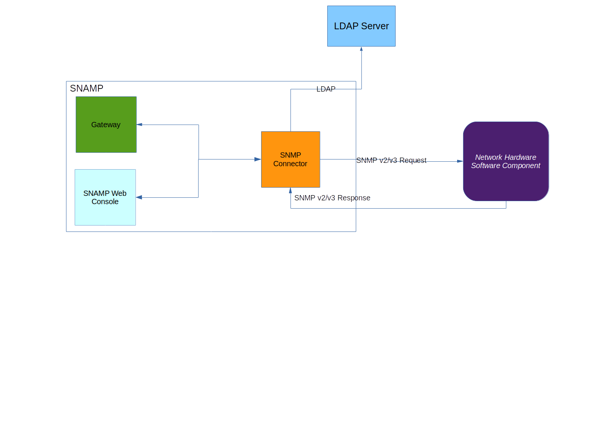

SNMP Resource Connector
====
SNMP Resource Connector allows to manage and monitor managed resources (software components, networks switchers and routers) accessible through SNMPv2/SNMPv3 protocol.
> SNMPv1 protocol is not supported. UDP is the only supported transport protocol. `TCP` binding is not supported.



Short list of supported features:

Feature name | Description
---- | ----
Attributes | Each SNMP Managed Object with unqiue OID will be accessible as an attribute. Accessing the attributes is implemented via SNMP GET/SET
Notifications | Converting SNMP Traps to SNAMP notifications

Note that this connector utilizes **its own internal thread pool that can be configured explicitly**.

## Connection String
SNMP Resource Connector requires an address of the SNMP Agent acting as a managed resource. This address has following format:
```
udp://<ip-address>/<port>
```

It is recommended to use IPv4 or IPv6 address instead of Host Name to avoid DNS resolving problems.

On Linux, you may use `snmpwalk` to test SNMP connection. Make sure that SNMP Agent is SNMPv2/SNMPv3 compatible.

Examples of connection string:
* `udp://127.0.0.1/161`
* `udp://192.168.0.1/9293`

## Configuration Parameters
SNMP Resource Connector recognizes the following parameters:

Parameter | Type | Required | Meaning | Example
---- | ---- | ---- | ---- | ----
community | String | Yes (for SNMPv2) | _SNMP Community string_ is like user id or password and allowed for SNMPv2 only | `public`
engineID | HEX | Yes (for SNMPv3) | Authoritative engine ID (for SNMPv3 only) in hexadecimal format | `80:00:13:70:01:7f:00:01:01:be:1e:8b:35`
userName | String | Yes (for SNMPv3) | Security name used for authentication on SNMPv3 agent
authenticationProtocol | Enum | Yes (for SNMPv3) | Authentication protocol (password hashing algorithm) | `sha`
encryptionProtocol | Enum | Yes (for SNMPv3) | SNMP packet encryption protocol (payload encryption algorithm) | `aes128`
password | String | Yes (for SNMPv3) | Password used to authenticate on SNMPv3 agent | `pwd`
encryptionKey | String | Yes (for SNMPv3) | Secret string used as an encryption key for symmetric encryption algorithm specified in `encryptionProtocol` parameter | `secret`
securityContext | String | No | Context name of the scoped PDU (for SNMPv3 only) | `context`
socketTimeout | Integer | No | UDP socket timeout, in millis. It is used as a maximum time interval for receiving and sending PDU packets over network. TIt must be specified if your network has high latency | `2000`
localAddress | `udp://<ip-address>/<port>` | No | UDP outgoing address and port. Usually, you should not specify this parameter. But it is useful for testing purposes when you QA team wants to capture data packet traces between SNAMP and SNMP agent | `udp://127.0.0.1/44495`
smartMode | Boolean | No | Enables or disables smart mode | `true`

Note that parameters related to thread pool are omitted. See **SNAMP Configuration Guide** page for more information about thread pool configuration. All other parameters will be ignored.

The resource connector cannot determine SNMP protocol version automatically. Moreover, it cannot automatically discover values of security parameters such as `community`, `authenticationProtocol`, `userName`, `password` etc.

### SNMPv2 configuration
SNMP Resource Connector will choose SNMPv2 protocol if `userName` configuration parameter is undefined. In this case only `community` configuration parameter affecting SNMPv2 communication process. Any other SNMPv3-specific parameters will be ignored.

### SNMPv3 configuration
SNMP Resource Connector will choose SNMPv3 protocol if `userName` configuration parameter is defined. The value of `community` parameter will be ignored. But `userName` is not the only required configuration parameter for SNMPv3 communication.

### Authentication protocol
SNMP Resource Connector supports following authentication protocols:

Enum value | Description
---- | ----
md5 | Password will be hashed using MD5 algorithm
sha | Password will be hashed using SHA algorithm

### Encryption protocol
SNMP Resource Connector supports following encryption protocols:

Enum value | Description
---- | ----
aes128 | [Advanced Encryption Standard](http://en.wikipedia.org/wiki/Advanced_Encryption_Standard) with 128-bit key strength
aes192 | [Advanced Encryption Standard](http://en.wikipedia.org/wiki/Advanced_Encryption_Standard) with 192-bit key strength
aes256 | [Advanced Encryption Standard](http://en.wikipedia.org/wiki/Advanced_Encryption_Standard) with 256-bit key strength
des | [Data Encryption Standard](http://en.wikipedia.org/wiki/Data_Encryption_Standard)
3des | [Triple Data Encryption Algorithm](http://en.wikipedia.org/wiki/Triple_DES)

## Configuring attributes
SNMP Resource Connector interprets SNMP Managed Object as an attribute. Each SNMP Managed Object is identified by OID (OBject Identifier). Structurally, an OID consists of a node in a hierarchically-assigned namespace, formally defined using the ITU-T's ASN.1 standard, [X.690](http://en.wikipedia.org/wiki/X.690).

Each attribute configured in SNMP Resource Connector has following configuration schema:

* `Name` - OID of the SNMP Managed Object (for example, `1.4.5.7.5.9.0`)
* Configuration parameters:

Parameter | Type | Required | Meaning | Example
---- | ---- | ---- | ---- | ----
snmpConversionFormat | Enum | No | Specifies mapping between ASN.1 and SNAMP type system | `text`
responseTimeout | Integer | No | Specifies timeout (in millis) when waiting SNMP GET/SET response from agent | `2000`

### Conversion format
Some ASN.1 data types can be mapped into more than one SNAMP data type (see **SNAMP Management Information Model** for more information). This behavior can be specified manually using `snmpConversionFormat` configuration parameter.

Following table describes ASN.1 mapping for different conversion formats:

ASN.1 data type | Conversion format | SNAMP MIM data type
---- | ---- | ----
OCTET_STRING | _Default_ (if not specified) | Connector will choose `text` or `hex` automatically if string containing in Managed Object is human-readable
OCTET_STRING | text | string (human-readable)
OCTET_STRING | hex | string (in HEX format, for example `8d:65:32:57:f6`)
OCTET_STRING | raw | int8 array
OID | _Default_ (if not specified) | int16 array
OID | text | string (in dotted notation, for example `1.5.10.0`)
OID | raw | int16 array
TIME_TICKS | _Default_ (if not specified) | int64
TIME_TICKS | text | string
TIME_TICKS | raw | int64
IP_ADDRESS | _Default_ (if not specified) | int8 array
IP_ADDRESS | text | string (human-readable address, for example `127.0.0.1`)
IP_ADDRESS | raw | int8 array

## Configuring events
Each event configured in JMX Resource Connector has following configuration schema:
* `Category` - OID of the SNMP Trap
* Configuration parameters:

Parameter | Type | Required | Meaning | Example
---- | ---- | ---- | ---- | ----
severity | String | No | Overrides severity level of the emitted notification | `warning`
messageTemplate | String | No | Message template used to convert SNMP trap into its textual representation (not compatible with `messageOID` parameter) | `Hello from {1.0} object. ID is {2.0}``
messageOID | OID | No | Message OID postfix which contains the notification message text | `1.1.2.0`

If `messageTemplate` and `messageOID` parameters are not specified then notification message will be constructed using concatenation of all variables in the Trap.

All variables will be placed into `userData` part of the SNMP Notification. Mapping between ASN.1 and SNAMP Management Information Model will be performed according with table described in **Configuring attributes** section.

### Message template
SNMP Traps doesn' contain human-readable message implicitly. But it is possible to construct this message using textual pattern.

Each SNMP variable binding in the Trap is identified by its unique OID. This variable can be placed into the textual pattern instead of `{O.I.D}` placeholder. For example, SNMP Trap consits of the following variables:
```
OID(1.1) = OCTET_STRING('Hello')
OID(1.2) = INTEGER32(42)
```

`messageTemplate` is specified as follows:
```
{1.1} associated with {1.2}
```

Final human-readable message placed into SNAMP Notification:
```
Hello associated with 42
```

### Message OID
There is an alternative way to extract human-readable message from SNMP Trap using `messageOID` configuration parameter. This parameter must contain OID of the variable in the Trap that will be interpreted as a textual message. For example, SNMP Trap consits of the following variables:
```
OID(1.1) = OCTET_STRING('Hello')
OID(1.2) = INTEGER32(42)
```

`messageOID` is specified as follows:
```
1.1
```

The final human-readable message placed into SNAMP Notification:
```
Hello
```

## Smart mode
SNMP Resource Connector provides support of Smart mode. Ot means that the connector can automatically expose attributes without manual configuration.
> Information about SNMP Traps cannot be discovered automatically so you need to configure events manually

It discovers all available managed objects using SNMP walk mechanism. Each object with its OID will be registered in the connector automatically. OID of the managed object will be used as user-defined name of the attribute.

## System-level configuration parameters
These parameters can be specified at JVM level and affects all instances of SNMP Resource Connector:

Parameter | Type | Required | Meaning | Example
---- | ---- | ---- | ---- | ----
com.bytex.snamp.connectors.snmp.discoveryTimeout | Integer | No | Timeout value (in millis) used when walking through available OIDs. Walking will be performed while using discovery functionality or smart mode | `3000`
