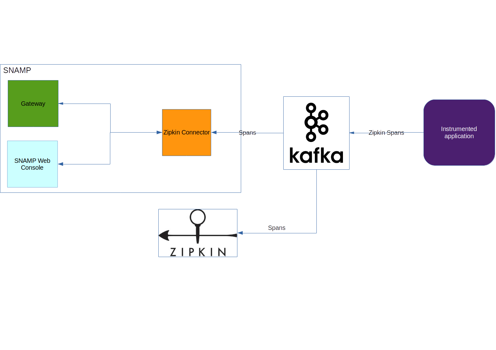

Zipkin Connector
====
Zipkin Connector is a passive Resource Connector that accepts information with monitoring data from Zipkin-enabled application using HTTP transport or Kafka. The **managed resources** are responsible for delivering data asynchronously to this connector. It is perfect solution if you use [Zipkin](http://zipkin.io/) in your enterprise. HTTP endpoint provided by this connector matches to HTTP endpoint provided by Zipkin: `/v1/spans`.

> Host and port for this endpoint can be configured in `/etc` folder inside of SNAMP installation (read **Configuration** section in Administrator's Guide).

The recommended way to process spans received from applications is to use [Apache Kafka](https://kafka.apache.org/).

Zipkin Connector works well with Apache Kafka 0.8.

## Connection String
Connection String is not used by Zipkin Connector.

## Configuration Parameters
Zipkin Connector recognizes the following parameters in addition to Data Stream Connector:

Parameter | Type | Required | Meaning | Example
---- | ---- | ---- | ---- | ----
parserScriptPath | string | Yes if used in conjunction with `parserScript` | URL to folder with user-defined Groovy-based parsers | `file:/opt/snamp/scripts`
parserScript | string | Yes if used in conjunction with `parserScriptPath` | User-defined Groovy script used to parse Zipkin spans | `ZipkinParser.groovy`
useServiceNameAsInstance | bool | No | Interpret service name supplied by remote component in Zipkin Span as instance name (resource name) instead of component name (group name) | `true`

### Custom parsers
Custom parser can be used to override default converter of Zipkin spans into SNAMP spans. Read more about parsers [here](ds-connector.md).

## Configuring attributes
Zipkin Connector provides the same set of attributes as described in [Data Stream Connector](ds-connector.md), but some gauges are unused by default. Zipkin Span consists information about timing without instant measurements of metrics. Therefore, Zipkin Connector updates gauges associated with duration only, such as **timer** and **arrivals**. Other gauges can be supported using custom span parser.

## Configuring events
Zipkin Connector provides the same set of events as described in [Data Stream Connector](ds-connector.md), but in the default implementation only `com.bytex.snamp.measurement.span` notification can be produced by connector. Other notification types can be supported using custom span parser.

## Configuring operations
Zipkin Connector provides the same set of operations as described in [Data Stream Connector](ds-connector.md).

## Health checks
Zipkin span doesn't contain information about health checks. Therefore, by default health checks are not supported. But it is possible to implement custom parser in Groovy and extract health information from annotations contained in Spans.
