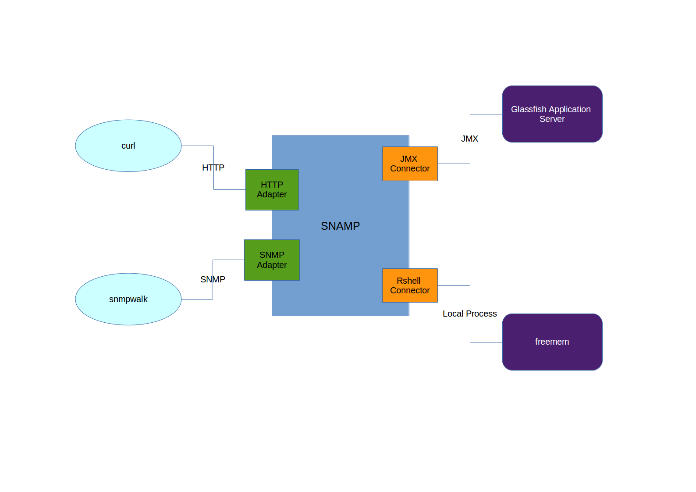
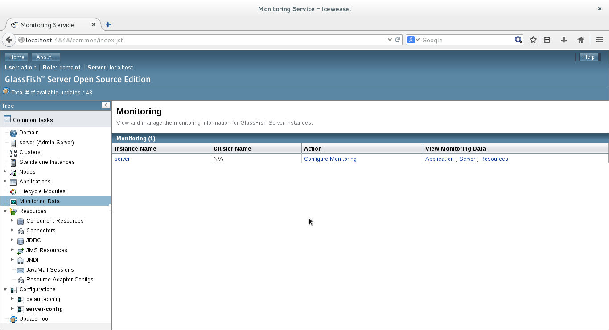
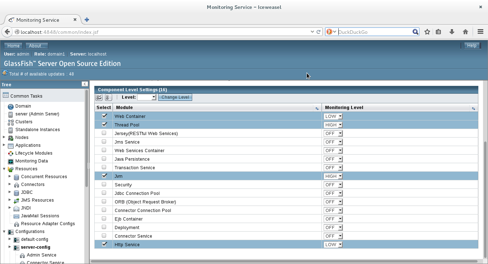

Step-by-Step Guide
====
This document provides step-by-step guide of SNAMP deployment and configuration.

## Overview
Let's identify required capabilities of the target configuration:

1. Monitoring Java Application Server via SNMPv2 using JMX-to-SNMP bridge
1. Monitoring Java Application Server via HTTP using JMX-to-HTTP bridge
1. Observing monitoring data transmitted by external component via HTTP or Apache Thrift
1. Collecting monitoring data using third-party programs and exposing this data via HTTP or SNMPv2

Following SNAMP components will be used to implement requirements described above:

1. JMX Resource Connector - allows to connect Java Application Server with SNAMP via JMX protocol
1. RShell Resource Connector - allows to execute any local process and parse its output into the the necessary monitoring information
1. MDA Resource Connector - allows to store monitoring data received from external component via HTTP or Apache Thrift
1. HTTP Resource Adapter - provides access to the management information exposed by all connectors using simple HTTP requests
1. SNMP Resource Adapter - provides access to the management information exposed by all connectors using SNMPv2 protocol



**Java Application Server** is represented by Glassfish Application Server V4.

**snmpwalk** - reading SNMP managed objects exposed by SNMP Resource Adapter.

**curl** - reading attributes exposed by HTTP Resource Adapter.

**free** supply the information about available memory in Operating System.

## Prerequisites
Prepare your test environment as described below:

1. Operating system: Linux (we highly recommended to use Debian 7/8)
1. Java 7 or higher (make sure that `JAVA_HOME` environment variable points to a valid JRE location)
1. Fresh version of SNAMP
1. Glassfish Application Server installed as a daemon and configuration for automatic startup on OS boot
1. Install _curl_ and _snmpwalk_ utilities

### Glassfish installation
Download and install **Glassfish Application Server**
```bash
cd /opt
wget download.java.net/glassfish/4.0/release/glassfish-4.0.zip
unzip glassfish-4.0.zip
rm glassfish-4.0.zip
ls ./glassfish4
```

Create file 'glassfish' and append the necessary data:
```bash
vim /etc/init.d/glassfish
```

Write the lines below into the file and save it:
```bash
#! /bin/sh  

export AS_JAVA=/usr/lib/jvm/default-java
GLASSFISHPATH=/opt/glassfish4/bin

case "$1" in  
start)  
echo "starting glassfish from $GLASSFISHPATH"  
$GLASSFISHPATH/asadmin start-domain domain1  
;;  
restart)  
$0 stop  
$0 start  
;;  
stop)  
echo "stopping glassfish from $GLASSFISHPATH"  
$GLASSFISHPATH/asadmin stop-domain domain1  
;;  
*)  
echo $"usage: $0 {start|stop|restart}"  
exit 3  
;;  
esac  
:  
```

Make the init script file executable
```bash
chmod a+x /etc/init.d/glassfish
```

Configure Glassfish for autostart on Linux boot

```bash
update-rc.d glassfish defaults
```

Start Glassfish server

```bash
service glassfish start
```

Install demo Web Application:

```bash
wget https://glassfish.java.net/downloads/quickstart/hello.war
/opt/glassfish4/bin/asadmin deploy ./hello.war
```

Open Glassfish Administration Console, select **Monitoring Data** node in the tree and click on `Configure Monitoring` hyperlink.


Configure the following monitoring levels:


Save settings and close Web Browser.

### Install command-line utilities
Execute the following commands in bash shell:

```bash
apt-get install snmp
apt-get install curl
```

## Installation
Download and unzip (or untar) the latest SNAMP version.

Execute SNAMP using the following command

```bash
sh ./snamp/bin/karaf
```

...you will see the following welcome screen:

```
_____ _   _          __  __ _____  
/ ____| \ | |   /\   |  \/  |  __ \
| (___ |  \| |  /  \  | \  / | |__) |
\___ \| . ` | / /\ \ | |\/| |  ___/
____) | |\  |/ ____ \| |  | | |
|_____/|_| \_/_/    \_\_|  |_|_|

Bytex SNAMP (1.0.0)

Hit '<tab>' for a list of available commands
and '[cmd] --help' for help on a specific command.
Hit '<ctrl-d>' or type 'system:shutdown' or 'logout' to shutdown SNAMP.

snamp.root@karaf>
```

## Configuration
Verify that initial SNAMP configuration is empty:
```bash
curl -u karaf:karaf http://localhost:3535/jolokia/read/com.bytex.snamp.management:type=SnampCore/configuration?maxDepth=20&maxCollectionSize=500&ignoreErrors=true&canonicalNaming=false
```

Go to home directory and create file with name `freemem.xml` and following content:
```xml
<?xml version="1.0" encoding="UTF-8" standalone="yes"?>
<ns1:profile xmlns:ns1="http://snamp.bytex.solutions/schemas/command-line-tool-profile/v1.0">
    <ns1:reader>
        <ns1:output ns1:language="regexp" ns1:type="dictionary" language="">
            <ns1:skip>[a-z]+</ns1:skip>
            <ns1:skip>[a-z]+</ns1:skip>
            <ns1:skip>[a-z]+</ns1:skip>
            <ns1:skip>[a-z]+</ns1:skip>
            <ns1:skip>[a-z]+</ns1:skip>
            <ns1:skip>[a-z]+</ns1:skip>
            <ns1:skip>[a-zA-Z]+\:</ns1:skip>
            <ns1:entry ns1:key="total" ns1:type="int64">[0-9]+</ns1:entry>
            <ns1:entry ns1:key="used" ns1:type="int64">[0-9]+</ns1:entry>
            <ns1:entry ns1:key="free" ns1:type="int64">[0-9]+</ns1:entry>
        </ns1:output>
        <ns1:input>free {format}</ns1:input>
    </ns1:reader>
</ns1:profile>
```

This file describes how to parse stdout of the `free` utility. This parser definition file expects the following output:
```
total       used       free     shared    buffers     cached
Mem:      16331720   16022604     309116     595432     470520    7210368
Swap:            0          0          0
```

Go to the home directory and create file with name `config.json`and following content:
```json
{
  "type": "write",
  "mbean": "com.bytex.snamp.management:type=SnampCore",
  "attribute": "configuration",
  "value":
{
    "ResourceAdapters": {
        "snmpmon": {
            "UserDefinedName": "snmpmon",
            "Adapter": {
                "Name": "snmp",
                "Parameters": {
                    "port": {
                        "Value": "3222",
                        "Key": "port"
                    },
                    "host": {
                        "Value": "127.0.0.1",
                        "Key": "host"
                    },
                    "socketTimeout": {
                        "Value": "5000",
                        "Key": "socketTimeout"
                    },
                    "context": {
                        "Value": "1.1",
                        "Key": "context"
                    }
                }
            }
        },
	"httpmon": {
            "UserDefinedName": "httpmon",
            "Adapter": {
                "Name": "http",
                "Parameters": { }
            }
        }
    },
    "ManagedResources": {
      "operatingSystemInfo": {
      "UserDefinedName": "operatingSystemInfo",
      "Connector": {
        "Parameters": {},
        "ConnectionString": "",
        "Attributes": {
          "testString": {
            "Name": "testString",
            "Attribute": {
              "ReadWriteTimeout": 5000,
              "AdditionalProperties": {
                "name": {
                  "Key": "name",
                  "Value": "str"
                },
                "expectedType": {
                  "Key": "expectedType",
                  "Value": "string"
                },
                "oid": {
                    "Value": "1.1.15.0",
                    "Key": "oid"
                }
              }
            }
          }
        },
        "Events": {
          "testEvent": {
            "Category": "testEvent",
            "Event": {
              "AdditionalProperties": {
                "name": {
                    "Key": "name",
                    "Value": "AsyncEvent"
                },
                "expectedType": {
                  "Key": "expectedType",
                  "Value": "int64"
                }
              }
            }
          }
        },
        "ConnectionType": "mda"
      }
    },
	"processes":{
		"Connector": {
                "Parameters": {},
                "ConnectionString": "process",
                "Attributes": {
                    "memoryUsage": {
                        "Attribute": {
                            "AdditionalProperties": {
                                "name": {
                                    "Key": "name",
                                    "Value": "~/freemem.xml"
                                },
                                "oid": {
                                    "Value": "1.1.10.0",
                                    "Key": "oid"
                                }
                            },
                            "ReadWriteTimeout": 10000
                        },
                        "Name": "memoryUsage"
                    }
                },
                "Events": { },
                "ConnectionType": "rshell"
            },
            "UserDefinedName": "processes"
	},
        "glassfish-v4": {
            "Connector": {
                "Parameters": {},
                "ConnectionString": "service:jmx:rmi:///jndi/rmi://localhost:8686/jmxrmi",
                "Attributes": {
                    "cpuLoad": {
                        "Attribute": {
                            "AdditionalProperties": {
                                "name": {
                                    "Key": "name",
                                    "Value": "ProcessCpuLoad"
                                },
                                "objectName": {
                                    "Value": "java.lang:type=OperatingSystem",
                                    "Key": "objectName"
                                },
                                "oid": {
                                    "Value": "1.1.1.0",
                                    "Key": "oid"
                                }
                            },
                            "ReadWriteTimeout": 10000
                        },
                        "Name": "cpuLoad"
                    },
                    "context": {
                        "Attribute": {
                            "AdditionalProperties": {
                                "name": {
                                  "Key": "name",
                                  "Value": "ContextRoot"
                                },
                                "objectName": {
                                    "Value": "amx:pp=/domain/applications,type=application,name=hello",
                                    "Key": "objectName"
                                },
                                "oid": {
                                    "Value": "1.1.2.0",
                                    "Key": "oid"
                                }
                            },
                            "ReadWriteTimeout": 10000
                        },
                        "Name": "context"
                    },
                    "memoryUsage": {
                        "Attribute": {
                            "AdditionalProperties": {
                                "name": {
                                    "Key": "name",
                                    "Value": "HeapMemoryUsage"
                                },
                                "objectName": {
                                    "Value": "java.lang:type=Memory",
                                    "Key": "objectName"
                                },
                                "oid": {
                                    "Value": "1.1.6.1",
                                    "Key": "oid"
                                }
                            },
                            "ReadWriteTimeout": 10000
                        },
                        "Name": "memoryUsage"
                    }
                },
                "Events": { },
                "ConnectionType": "jmx"
            },
            "UserDefinedName": "glassfish-v4"
        }
    }
}
}
```

> Verify that `~/freemem.xml` is a valid location of file `freemem.xml`. It is highly recommended to use absolute path to the file.

Load configuration into SNAMP
```bash
curl -u karaf:karaf -X POST -d @config.json http://localhost:3535/jolokia/
```

> Note that configuration loading can take a few seconds or minutes. This time depends on performance of your hardware

Verify the uploaded configuration
```bash
curl -u karaf:karaf http://localhost:3535/jolokia/read/com.bytex.snamp.management:type=SnampCore/configuration?maxDepth=20&maxCollectionSize=500&ignoreErrors=true&canonicalNaming=false
```

Now you have configured SNAMP with two Resource Connectors and two Resources Adapters. SNAMP performs following binding of the managed attributes:

Source attribute | Attribute name | SNMP object | HTTP url
---- | ---- | ---- | ----
ProcessCpuLoad | cpuLoad | 1.1.1.0 | /snamp/adapters/http/httpmon/attributes/glassfish-v4/cpuLoad
ContextRoot | context | 1.1.2.0 | /snamp/adapters/http/httpmon/attributes/glassfish-v4/context
HeapMemoryUsage | memoryUsage | 1.1.6.1 | /snamp/adapters/http/httpmon/attributes/glassfish-v4/memoryUsage
free -m | memoryUsage | 1.1.10.0 | /snamp/adapters/http/httpmon/attributes/processes/memoryUsage

## Test
Open terminal and type
```bash
snmpwalk -v2c -cpublic 127.0.0.1:3222 1.1
```

... you will see attributes converted from JMX and stdout of `free` to SNMP objects by SNMP Resource Adapter
```
iso.1.1.0 = STRING: "0.005072769100375348"
iso.1.2.0 = STRING: "/hello"
iso.1.6.1.2.1 = Counter64: 268435456
iso.1.6.1.3.1 = Counter64: 131134336
iso.1.6.1.4.1 = Counter64: 477102080
iso.1.6.1.5.1 = Counter64: 189169992
iso.1.10.0.2.1 = Counter64: 4361832
iso.1.10.0.3.1 = Counter64: 8195896
iso.1.10.0.4.1 = Counter64: 3834064
```

Verify that the same attributes are accessible through HTTP:
```bash
curl http://127.0.0.1:3535/snamp/adapters/http/httpmon/attributes/glassfish-v4/memoryUsage
```

..you will see attributes converted from JMX and stdout of `free` to JSON objects by HTTP Resource Adapter
```json
{
    "type": {
        "typeName": "java.lang.management.MemoryUsage",
        "description": "java.lang.management.MemoryUsage",
        "items": {
            "committed": {
                "description": "committed",
                "type": "int64"
            },
            "init": {
                "description": "init",
                "type": "int64"
            },
            "max": {
                "description": "max",
                "type": "int64"
            },
            "used": {
                "description": "used",
                "type": "int64"
            }
        }
    },
    "value": {
        "committed": 268435456,
        "init": 131134336,
        "max": 477102080,
        "used": 189431512
    }
}
```


Create file `data.json` with content `"Test string"`. Read/write test attribute value from/to MDA Connector:
```bash
curl -X PUT -H "Accept: application/json" -T data.json http://127.0.0.1:3535/snamp/connectors/operatingSystemInfo/attributes/str
```
