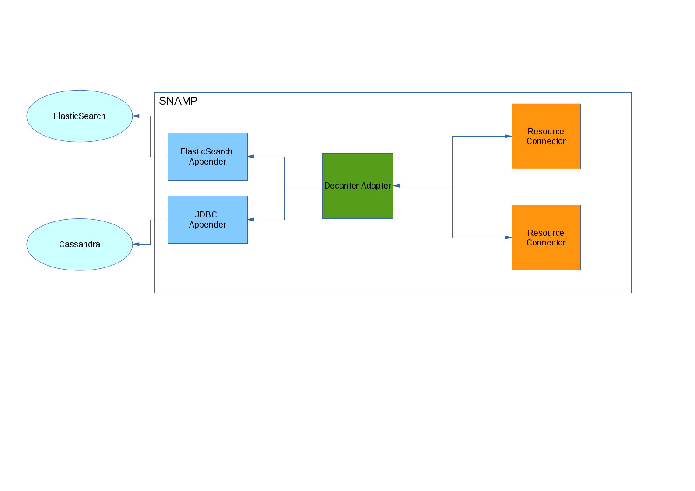

Decanter Adapter
====
Decanter Adapter provides a bridge between SNAMP and [Karaf Decanter](https://karaf.apache.org/index/subprojects/decanter.html). With Decanter you can store all monitoring data provided by managed resources into ElasticSearch, Cassandra or any other database using JDBC.



The adapter provides two kind of collectors:

1. Event-drivent collector used to harvest all notifications produced by managed resources
1. Polled collector used to harvest attributes of managed resources

The harvested information can be stored using Appenders. Use [this manual](http://karaf.apache.org/manual/decanter/latest-1/index.html) to install necessary Decanter appenders. The following example demonstrates how to install ElasticSearch appender via Karaf console:

```
feature:repo-add mvn:org.apache.karaf.decanter/apache-karaf-decanter/1.0.1/xml/features
feature:install decanter-appender-elasticsearch
```

Notification _N_ emitted by managed resource _R_ will be transformed into OSGi [Event](https://osgi.org/javadoc/r4v41/org/osgi/service/event/Event.html) and transferred into `decanter/collect/R/N` topic. This event consists of the following fields:

1. `message` - human-readable message associated with the notification
1. `sequenceNumber` - sequence number of the notification
1. `severity` - severity of the notification
1. `timeStamp` - the time when notification was generated
1. `data` - the data associated with notification
  1. `objectname` data type will be converted into `string`
  1. `dictionary` data type will be converted into Java [Map](http://docs.oracle.com/javase/7/docs/api/java/util/Map.html).

Attribute _A_ provided by managed resource _R_ will transformed into OSGi Event and transferred into `decanter/collect/R/A` topic. This event consists of the following fields:

1. `value` - attribute value
1. `javaType` - Java-compliant name of the attribute type
1. `snampType` - SNAMP-compliant name of the attribute type
