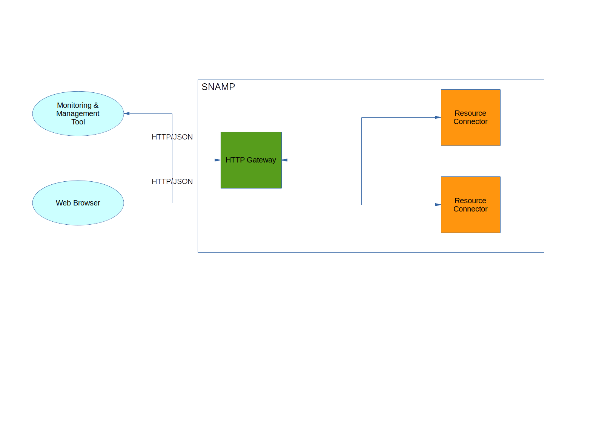

HTTP Gateway
====

HTTP Gateway allows to manage and monitor connected resources via HTTP protocol. This gateway exposes REST service which uses JSON data exchange format.



By default, REST service is available at the following URL:
```
http://<snamp-host>:3535/snamp/gateway/http/<gateway-instance-name>
```

You can change HTTP port in `<snamp>/etc/org.ops4j.pax.web.cfg` file or by typing `config:property-set -p org.ops4j.pax.web org.osgi.service.http.port 8080` in the shell console.

HTTP Gateway supports following features (if they these features supported by managed resources as well):

Feature | Description
---- | ----
Attributes | Read/write attributes of any type using GET and POST requests
Notifications | Receiving notifications asynchronously using WebSockets

Attribute is accessible using the following URL:
```
http://<snamp-host>:3535/snamp/gateway/http/<gateway-instance-name>/attributes/<resource-name>/<attribute-name>
```

Use `GET` request to retrieve attribute value and `POST` to change its value. For example:
```
Request:
POST http://localhost:3535/snamp/gateway/http/dummy-instance/attributes/java-app-server/logLevel
Content-Type: application/json

Response:
"DEBUG"
```

Also, Web client may receive notifications using WebSocket in JSON format: `ws://<snamp-host>:3535/snamp/gateway/http/<gateway-instance-name>/notifications/<notification-name>`

## Configuration Parameters
HTTP Gateway recognizes the following configuration parameters:

Parameter | Type | Required | Meaning | Example
---- | ---- | ---- | ---- | ----
dateFormat | String | No | Configures gateway to serialize Date objects into JSON string according to the pattern provided | `yyyy-MM-dd'T'HH:mm:ss.SSSZ`

Any other configuration parameters will be ignored by gateway.

## Data formats
HTTP Gateway uses JSON as a representation of the management information. Following table describes mapping between types of **Management Information Model** and JSON:

Management Information Model | JSON data type
---- | ----
int8 | Number
int16 | Number
int32 | Number
int64 | Number
bool | Boolean
string | String
objectname | String
char | String
bigint | Number
bigdecimal | Number
date | String
float32 | Number
float64 | Number

### Array
An array data that comes from managed resource will be converted into appropriate JSON array type. For example, an array of `int32` values will be converted into an array of Numbers (`[1, 5, 7.8, 42]`).

### Table
Table is represented in JSON format as follows:
```json
{
  "type":{
    "rowType":{
      "typeName":"TestTableRow",
      "description":"Descr",
      "items":{
        "column1":{"description":"column1 descr","type":"int32"},
        "column2":{"description":"column2 descr","type":"string"}
      }
    },
    "index":["column1"],
    "typeName":"TestTable",
    "description":"Descr"
  },
  "rows":[
    {"column1":42,"column2":"String1"},
    {"column1":43,"column2":"String2"}
  ]
}
```

`type` element describes metadata information about table:
* `typeName` - table name
* `description` - human-readable description of the table
* `rowType` - definition of columns (name, type and description)
* `index` element contains an array of columns which are the part of table index

`rows` element contains an array of table rows.

> When you change table rows (via POST request) you should not modify anything in `type` element.

Possible values of `type` element: `void`, `bool`, `int8`, `int16`, `int32`, `int64`, `char`, `string`, `objectname`, `float32`, `float64`, `bigint`, `bigdec`, `date`.

### Dictionary
Dictionary is represented in JSON format as follows:
```json
{
  "type":{
    "typeName":"Dictionary",
    "description":"Description stub",
    "items":{
      "key1":{
        "description":"Dummy item",
        "type":"int32"
      },
      "key2":{
        "description":"Dummy item",
        "type":"string"
      }
    }
  },
  "value":{"item1":2, "item2": "Hello, world"}
}
```

`type` element describes metadata information about dictionary:
* `typeName` - table name
* `description` - human-readable description of the dictionary
* `items` - definition of dictionary keys (name, type and description)

`value` element contains a dictionary key/value pairs.

### Notification
Notification received through WebSocket/Comet/SSE channel can be represented in JSON format as follows:
```json
{
  "source":"java-app-server",
  "type":"jmx.attribute.change",
  "sequenceNumber":5,
  "timeStamp":"Jun 11, 2015 12:26:54 PM",
  "message":"Log level changed",
  "userData":{
    "type":{
      "typeName":"dict",
      "description":"dict",
      "items":{
        "item1":{"description":"Dummy item","type":"int32"}
      }
    },
    "value":{"item1":2}
  }
}
```

Information model of the notification described in **Management Information Model** page.
