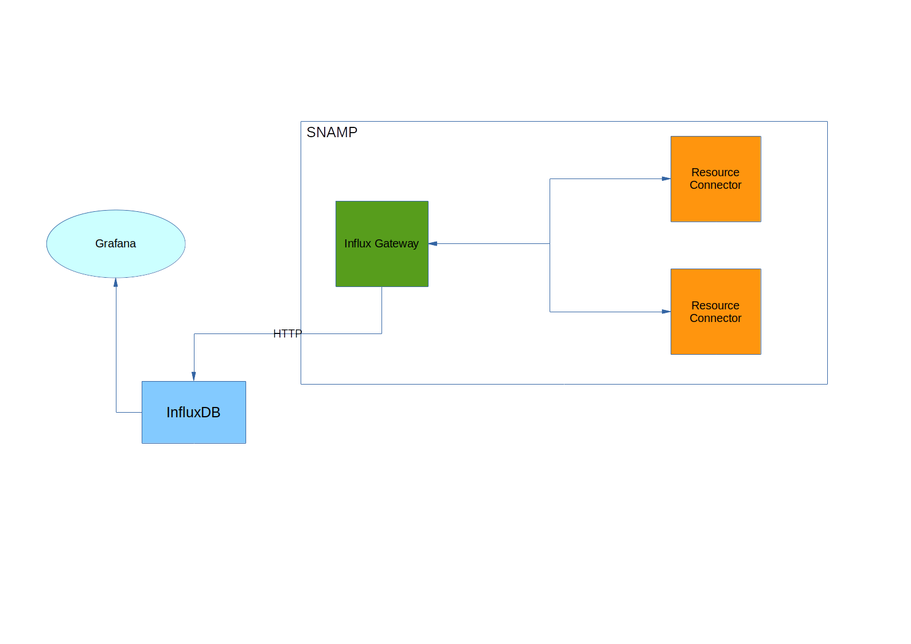

InfluxDB Gateway
====
InfluxDB Gateway writes monitoring data obtained from resource connectors into [InfluxDB](https://www.influxdata.com/time-series-platform/influxdb/) for further analysis by third-party tools like Splunk. Also, InfluxDB can be used in conjunction with [Grafana](https://grafana.com/) for additional visualization of monitoring data.



InfluxDB Gateway supports following features (if these features are supported by managed resources as well):

Feature | Description
---- | ----
Notifications | Writes all notification into database immediately
Attributes | Dumps all values into database periodically

InfluxDB Gateway uses REST API provided by InfluxDB database for writing notifications and attributes.

## Configuration Parameters
SMTP Gateway recognizes following configuration parameters:

Parameter | Type | Required | Meaning | Example
---- | ---- | ---- | ---- | ----
databaseLocation | URL | Yes | URL of InfluxDB REST API | `http://localhost:8181/`
databaseLogin | String | Yes | Technical user name used to write records into InfluxDB | `snamp-user`
databasePassword | String | Yes | Password for technical user | `p@zzw%d`
databaseName | String | Yes | Name of database used to store records produced by this gateway | `snamp`
uploadPeriod | Number | No | Time period (in millis) of recording attributes into database. Default is 1 second | `4000`

## Recording data into database
Attributes are recorded into database in periodic manner or immediately if resource connector supports notification of type `jmx.attribute.change`. Notifications are recorded into database immediately.  

### Recording attributes
Each attribute is recorded as set of tags and scalar value of attribute. For example:
```
usedRAM,connectionType=http,group=javaApp,managedResource=test-target value=100500i
```

where :
* `usedRAM` is a name of attribute
* `connectionType` represents type of resource connector which supplies the attribute
* `group` - resource group
* `managedResource` - name of managed resource in the group, which is connected by resource connector specified in `connectionType`
* `value` is a scalar value of the attribute

This record may include additional key/value pairs exported from configuration of resource connector. For example, if resource connector supplies attribute `usedRAM` and configured with parameters `param1=value1` and `param2=value2` then final record for database will be constructed as follows:
```
usedRAM,connectionType=http,group=javaApp,managedResource=test-target,param1=value1,param2=value2 value=100500i
```

Additional tags help to sort, find, extract and process data from InfluxDB by external analysis tool.

### Recording notifications
InfluxDB Gateway provides special processing of different kind of notifications:
* Measurements (see related section in **SNAMP Management Information Model**):
    - Value measurement will be recorded in the same manner as attribute value
    - Span will be recorded with multiple fields: `correlationID`, `spanID`, `parentSpanID`, `duration`, `moduleName`
    - Time measurement will be recorded in the same manner as attribute value where `value` field will be defined as `duration` supplied by measurement
* Regular notifications:
    - Notification will be recored with multiple values: `sequenceNumber` and `message`
    - Time stamp will be extracted from notification

The record produced from notification has the same tags as records produced for attributes.
