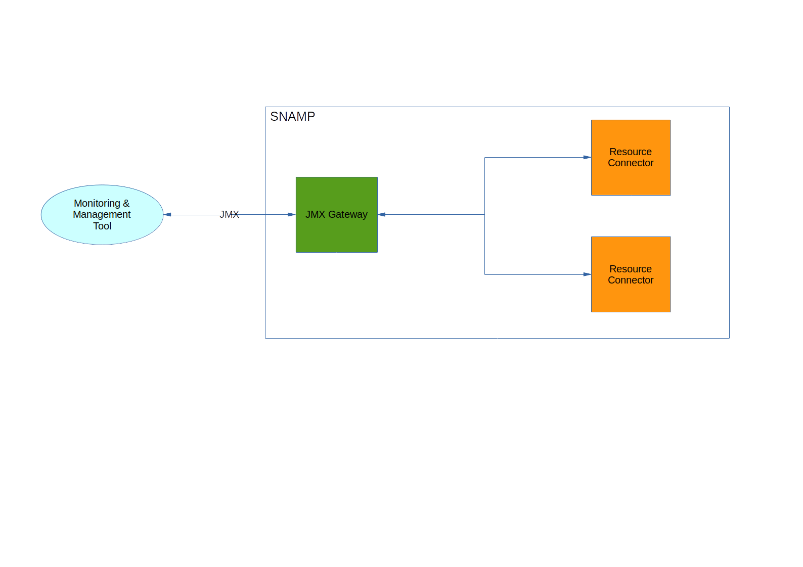

JMX Gateway
====

JMX Gateway allows to manage and monitor connected resources via JMX protocol even if connected resources are not JMX-compliant (and non-Java software). Each instance of the gateway exposes MBean through existing MBean Server. This MBean provides access to monitoring and management features (attributes, notifications and operations) for non-JMX resources.



Each managed resource will be exposed as separated MBean. Each MBean has similar _ObjectName_ used for registration at MBean Server. You should specify the root _ObjectName_ that will be used to construct derived _ObjectNames_ for each exposed resource.

For example, object name `com.acme.mbeans:type=RootBean` is specified as a root _ObjectName_ and your configuration contains two managed resources with `network-switch-1` and `native-app-1` names. In this case, JMX Gateway will expose two MBeans: `com.acme.mbeans:type=RootBean,resource=network-switch-1` and `com.acme.mbeans:type=RootBean,resource=native-app-1`.

By default, JMX Gateway uses MBean Server supplied by Apache Karaf. Therefore, you can use following JMX connection string from your JMX tool (JConsole or VisualVM):
```
service:jmx:rmi:///jndi/rmi://localhost:1099/karaf-root
```

JMX Gateway supports following features (if these features are supported by managed resources as well):

Feature | Description
---- | ----
Attributes | Attributes of MBean
Notifications | Notifications of MBean
Operations | Operations of MBean

Each MBean exposed by gateway is an Open MBean with full support of Open JMX Data Types, including _TabularData_ and _CompositeData_.

## Configuration Parameters
JMX Gateway recognizes following configuration parameters:

Parameter | Type | Required | Meaning | Example
---- | ---- | ---- | ---- | ----
objectName | objectname | Yes | Base name of all exposed MBeans | `com.acme.mbeans:type=RootBean`
usePlatformMBean | bool | No | `true` to use MBean Server supplied by Java Platform. `false` to use MBean Server supplied by Apache Karaf. Default value is `false`. This parameter is useful for troubleshooting only | `true`

Any other configuration parameters will be ignored by gateway.

> Note that security settings used by MBean depends on the MBean Server used for registration. For example, JMX security in Apache Karaf is managed by container itself and should specify JMX login/password pair. **karaf**/**karaf** is the default login/password pair.

## Configuring events
Following configuration parameters of the events influence on JMX Gateway behavior:

Parameter | Type | Required | Meaning | Example
---- | ---- | ---- | ---- | ----
severity | String | No | Overrides severity level of the emitted notification. See **SNAMP Resource Connectors** for more information about `severity` parameter | `warning`

Other configuration parameters will not modify behavior of the gateway instances.

## Configuring operations
The gateway doesn't require special configuration for operations.
