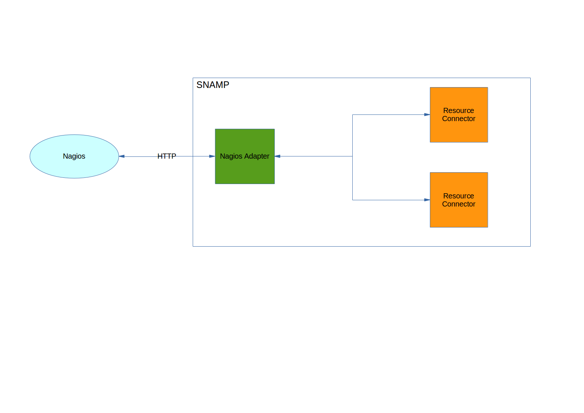

Nagios Resource Adapter
====
Nagios Resource Adapter allows to collect monitoring and management information from all resources connected to SNAMP using [active check](http://nagios.sourceforge.net/docs/3_0/activechecks.html). Simply, this adapter is just a HTTP endpoint that returns information in [Nagios Plugin Format](http://nagios.sourceforge.net/docs/3_0/pluginapi.html) about managed resource.



Nagios Resource Adapter supports following features (if these features are supported by managed resources as well):

Feature | Description
---- | ----
Attributes | Attribute and its value will be converted into _Nagios Plugin Format_ and placed into HTTP response

Notifications are not supported by Nagios Resource Adapter.

Use following URL for retrieving attributes:
```
HTTP GET
http://<snamp-host>:<port>/snamp/adapters/nagios/<adapter-instance-name>/attributes/<resource-name>/<attribute-name>
```

`3535` is a default port of a SNAMP web server.

This adapter supports following output formats for each attribute:

* Plain scalar value of the attribute
* Service status with associated descriptive value
* Extended output with thresholds as it is described in [Nagios Plugin Format](http://nagios.sourceforge.net/docs/3_0/pluginapi.html)

Service status will be detected automatically by resource adapter. But the detection algorithm depends on thresholds (warning/criticial/min/max levels) specified in the configuration parameters.

You may use `curl` or `wget` utilities in the `bash` script when you configure Nagios.

## Configuration Parameters
Nagios Resource Adapters doesn't provide any recognizable configuration parameters.

## Configuring attributes
Following configuration parameters of the attributes influence Nagios Resource Adapter behavior:

Parameter | Type | Required | Meaning | Example
---- | ---- | ---- | ---- | ----
serviceName | String | No | Used to identify an external service. Attribute name will be used if no service name is specified. This parameter helps to specify more informative name of the monitored resource in Nagios. | `Laptop`
criticalThreshold | Threshold | No | Used to specify threshold for a critical level of the service based on the attribute value. It should be specified in [Nagios Threshold Format](https://nagios-plugins.org/doc/guidelines.html#THRESHOLDFORMAT) | `~:10`
warningThreshold | Threshold | No | Used to specify threshold for a warning level of the service based on the attribute value It should be specified in [Nagios Threshold Format](https://nagios-plugins.org/doc/guidelines.html#THRESHOLDFORMAT) | `10:`
minValue | String | No | Minimum possible value (exclusive) of the attribute | `10`
maxValue | String | No | Maximum possible value (exclusive) of the attribute | `100`
label | String | No | Label of the metric. User-defined attribute name will be used if no label is specified | `mem`
units | String | No | Unit of measurement (UOM) of the attribute value. For example: `ms`, `m`, `kg`, `MB` | `MB`

`criticalThreshold`, `warningThreshold`, `minValue` and `maxValue` parameters should be used together.

For example, you have an attribute with name `string` and user-defined name `str`. If _serviceName_ configuration parameter of this attribute is defined as `logService` then HTTP GET will return the following string:
```
logService OK: STRVAL
```
where `STRVAL` is a value of `string` attribute.

If _serviceName_ configuration parameter will be omitted then HTTP GET will return:
```
string OK: STRVAL
```

Another example. You have an attribute `utilized` with the following configured parameters:

* `serviceName = memory`
* `maxValue = 100`
* `minValue = 0`
* `criticalThreshold = 80`
* `warningThreshold = 60`
* `units = MB`
* User-defined name is `aom`

Possible HTTP GET results will be:
```
memory OK: 20MB | aom=20MB;60;80;0;100
memory WARNING: 65MB | aom=65MB;60;80;0;100
memory CRITICAL: 85MB | aom=85MB;60;80;0;100
```

Nagios Resource Adapter automatically resolves service status using threshold/min/max values. If thresholds are not specified then the adapter specifies `CRITICAL` status only when attribute read operation causes exception.

Now add `label = utilized` configuration parameter. Possible HTTP GET results will be changed:
```
memory OK: 20MB | utilized=20MB;60;80;0;100
memory WARNING: 65MB | utilized=65MB;60;80;0;100
memory CRITICAL: 85MB | utilized=85MB;60;80;0;100
```
