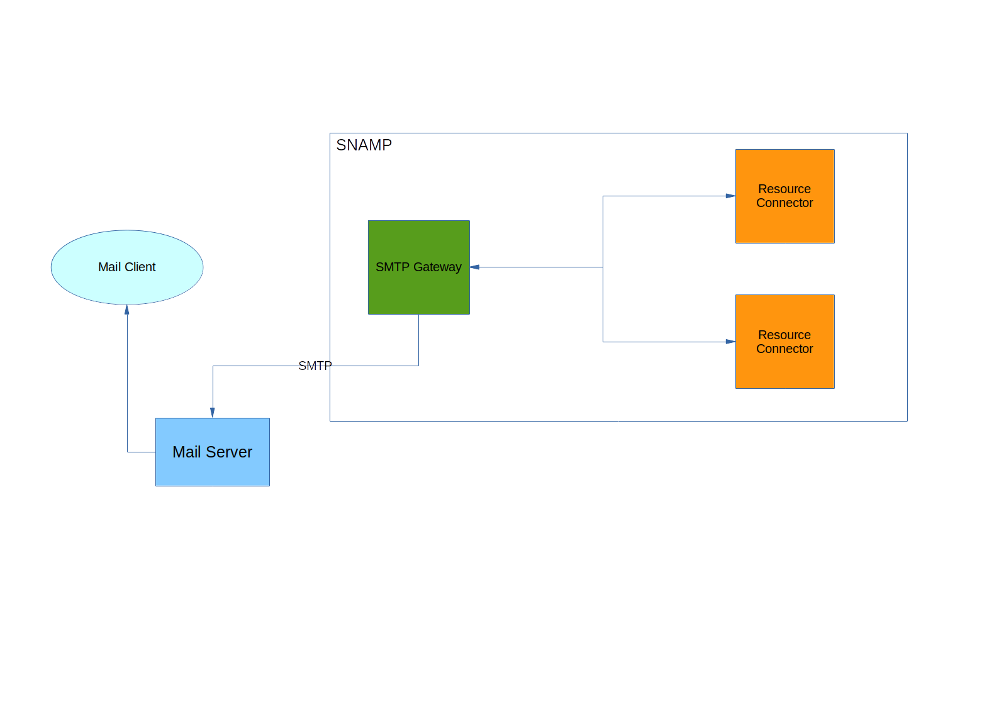

SMTP Gateway
====
SMTP Gateway allows to send important notifications to e-mail using SMTP or SMTPS (SMTP over TLS) protocol. It can be notifications from **managed resources** or health checks.



SMTP Gateway supports following features (if these features are supported by managed resources as well):

Feature | Description
---- | ----
Notifications | Wraps notification into e-mail message
Health check | Sends e-mail message with bad health status associated with managed resource or resource group

SMTP Gateway generates outbound e-mail for the following events:
* Managed resource emits notification. E-mail generation can be specified for each notification separately.
* Bad health status of connected resource is detected
* Bad health status of resource group is detected
* Automatic scaling is forced by any supervisor
* New managed resource is registered or removed manually (by administrator) or automatically by supervisor

## Configuration Parameters
SMTP Gateway recognizes following configuration parameters:

Parameter | Type | Required | Meaning | Example
---- | ---- | ---- | ---- | ----
enableTLS | Boolean | No | Enable or disable TLS when SMTPS is required. Default is `true` | `false`
socketTimeout | Number | No | Socket I/O timeout, in milliseconds. Default is `10000` | `5000`
host | string | Yes | DNS name or IP address of SMTP server | `smtp.mail.company`
port | Number | No | SMTP port number. Default is `25` | `45`
userName | string | Yes | User name used for authentication on SMTP server | `mail-sender`
password | string | Yes | Password used for authentication on SMTP server | `p@ssw#d`
from | e-mail address | Yes | Value of field **From** for every outgoing e-mail generated by this gateway | `snamp@company.com`
to | list of e-mail addresses | Yes | Semicolon-separated list of receivers | `ops@company.com;admin@company.com`
Cc | list of e-mail addresses | No | Semicolon-separated list of receivers (carbon copy) | `support@company.com;info@company.com`
healthStatusTemplate | URL | No | URL of e-mail template used to create message with information about health status. If not specified then default template will be used | `ftp://content.company.com/hs-template.txt`
newResourceTemplate | URL | No | URL of e-mail template used to create message with information about resource provisioning. If not specified then default template will be used | `ftp://content.company.com/prov-template.txt`
removedResourceTemplate | URL | No | URL of e-mail template used to create message with information about resource deallocation. If not specified then default template will be used | `ftp://content.company.com/de-template.txt`
scaleOutTemplate | URL | No | URL of e-mail template used to create message when cluster is enlarged by supervisor. If not specified then default template will be used | `ftp://content.company.com/sout-template.txt`
scaleInTemplate | URL | No | URL of e-mail template used to create message when cluster size is decreased by supervisor. If not specified then default template will be used |  `ftp://content.company.com/sin-template.txt`
maxClusterSizeReachedTemplate | URL | No | URL of e-mail template used to create warning message when cluster cannot be enlarged because maximum cluster size is reached. If not specified then default template will be used | `ftp://content.company.com/mcsr-template.txt`

Default templates you can find in our GIT repository [here](https://bitbucket.org/bytex-solutions/snamp/src/master/gateways/smtp-gateway/src/main/resources/com/bytex/snamp/gateway/smtp/).

## Configuring events
Following configuration parameters of the events influence on SMTP Gateway behavior:

Parameter | Type | Required | Meaning | Example
---- | ---- | ---- | ---- | ----
sendToEmail | Boolean | No | `true` to send notifications via e-mail; `false` to ignore such kind of notifications. Default is `false` | `true`
mailTemplate | URL | No | URL of e-mail template used to create message with information about notification | `ftp://content.company.com/notif-template.txt`
severity | String | No | Overrides severity level of the emitted notification. See **SNAMP Resource Connectors** for more information about `severity` parameter | `warning`

## E-mail message templates
E-mail templates are based on [StringTemplate](https://github.com/antlr/stringtemplate4/blob/master/doc/index.md). Each type of template specifies its own set of template parameters used for rendering final e-mail messages. Template parameter should be specified as follows:
```
Text {parameter-name} text
```

Examples:
```
Resource {resourceName} in group {groupName} has bad health status
Time stamp: {timeStamp}
```

### Notification template
Notification template provides the following template parameters:

Template parameter | Meaning
---- | ----
{timeStamp} | Time stamp of notification
{notificationType} | Notification type
{message} | Human-readable message supplied by notification
{sequenceNumber} | Sequence number of notification
{source} | Source of notification
{resourceName} | Name of managed resource emitting the notification
{description} | Description of notification. Can be defined through configuration of event.
{severity} | Severity of notification. Can be defined through configuration of event.

Example of template:
```
Notification {notificationType} generated by {resourceName} at {timeStamp}.

{message}

Severity: {severity}
Description: {description}
Sequence number: {sequenceNumber}
```

### Template for health status
Template for health status provides the following template parameters:

Template parameter | Meaning
---- | ----
malfunctionLevel | Level of malfunction. See **Health check** section in **SNAMP Management Information Model** for more information.
status | Health status of the resource group
statuses | A set of health statuses associated with resources in the group
resourceName | Name of most problematic managed resource
groupName | Resource group
timeStamp | Time stamp of health status

Example of template:
```
Resource {resourceName} in group {groupName} has bad health status

{status}

Time stamp: {timeStamp}
Severity: {malfunctionLevel}
Health statuses of group members:
{statuses; separator="\n"}
```

### Template for resource provisioning and deallocation
Template for resource provisioning and deallocation provides the same set of template parameters:

Template parameter | Meaning
---- | ----
resourceName | Name of newly registered resource
groupName | Resource group
timeStamp | Time stamp of health status

Examples of template:
```
New resource {resourceName} was added into group {groupName} at {timeStamp}.
```
```
Resource {resourceName} was removed from group {groupName} at {timeStamp}.
```

### Template for scale-in and scale-out
Scale-in message template provides the following template parameters:

Template parameter | Meaning
---- | ----
evaluationResult | Evaluation result of all scaling policies. See **Supervisors** document for more information.
castingVoteWeight | Casting vote used as a barrier value for decision about scaling
groupName | Resource group
timeStamp | Time stamp of health status

Example of template:
```
Group {groupName} was decreased automatically during scale-in operation at {timeStamp}.
Casting vote: {castingVoteWeight}
Voting result:
{evaluationResult; separator="\n"}
```
