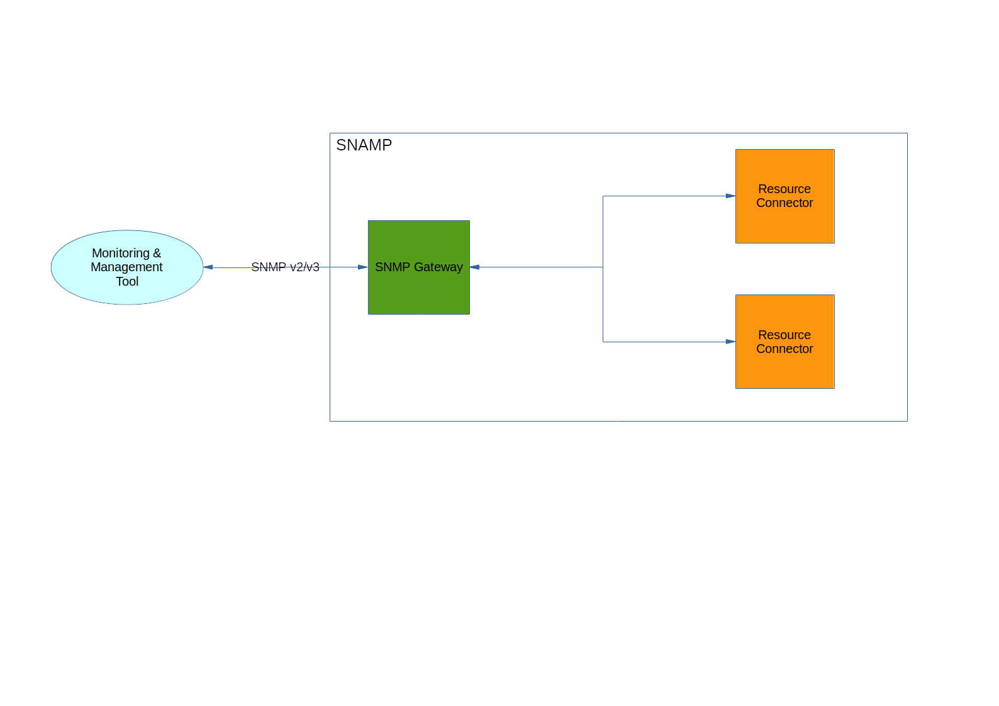

SNMP Gateway
====
SNMP Gateway exposes management information about connected resources through SNMP protocol. It supports SNMPv2 and SNMPv3 protocol versions. You may use many powerful tools such as `snmpwalk`, Nagios (there is a separate gateway, but can work with SNMP gateway as well), HP OpenView, OpenNMS, Microsoft System Center Operations Manager, Zabbix for monitoring components connected to SNAMP.



SNMP Gateway supports following features (if these features are supported by managed resources as well):

Feature | Description
---- | ----
Attributes | Each attribute is being exposed as Managed Object with their own unique OID
Notifications | Each notification is being asynchronously delivered to SNMP Trap Receiver as Traps

Additionally, SNMP Gateway supports integration with LDAP. You can place authentication and authorization parameters into LDAP server for more centralized control. Also, this gateway utilizes **its own internal thread pool that can be configured explicitly**.

## Configuration Parameters
SNMP Gateway recognizes following configuration parameters:

Parameter | Type | Required | Meaning | Example
---- | ---- | ---- | ---- | ----
context | OID | Yes | Prefix OID used to filter attributes and events during agent boot process | `1.1`
engineID | HEX String | No | Engine ID is used with a hashing function to generate keys for authentication and encryption of SNMP v3 messages. If you do not specify engine ID, one is generated when you enable the standalone SNMP agent. This parameter works with SNMPv3 protocol only | `80:00:13:70:01:7f:00:01:01:be:1e:8b:35`
snmpv3-groups | Semicolon-separated list of groups | No | List of groups with users that can be authenticated on SNMP Agent. Groups can be configured locally or supplied from LDAP. This parameter works with SNMPv3 protocol only | See **User groups** section for examples
socketTimeout | Integer | No | Socket timeout (in millis) used for sending outgoing UDP packets. Default value is `5000` | `2000`
restartTimeout | Integer | No | Timeout value (in millis) used by instance of the gateway to reconfigure internal database of managed objects. This configuration parameter is for experts only. Change it when you want to expose more than 256 attributes in total. Default value is `10000`  | `3000`
port | Integer | Yes | Port number used to listen incoming UDP packets | `161`
host | IP Address | Yes | Network interface used to listen incoming UDP packets | `0.0.0.0`
ldap-uri | URI | No | Address of LDAP server. This parameter work with SNMPv3 protocol only | `ldap://127.0.0.1:389`
ldap-groups | _RFC 1960_-based expression | No | Expression used to find SNMPv3 user groups in LDAP | `(&(objectclass=domain)(objectclass=top))`
ldap-user | Distinguished name (DN) | No |  DN of the user used for LDAP authentication | `uid=admin,ou=system`
ldap-password | String | No | Password applied for LDAP authentication | `qwerty`
ldap-auth-protocol | Enum | No | LDAP authentication mechanism | `GSSAPI`
ldap-base-dn | Distinguished name (DN) | No | Base DN of the LDAP database tree used in search operations | `dc=ad,dc=organization,dc=com`
ldap-user-search-filter | _RFC 1960_-based expression | No | Filter used to search entries with user entries for SNMPv3 authentication | `(cn=User)`
jndi-ldap-factory | String | No | Full name of Java class used for instantiating LDAP client. Default value is `com.sun.jndi.ldap.LdapCtxFactory`. This value is valid for Oracle JDK and OpenJDK only. You must specify this parameter for any other JVM | `com.sun.jndi.ldap.LdapCtxFactory`
ldap-user-password-attribute-name | String | No | Property name in the LDAP entry which holds password of the SNMPv3 user. Default value is `userPassword` | `userPassword`

Note that parameters related to thread pool is omitted. See **SNAMP Configuration Guide** page for more information about thread pool configuration. All other parameters will be ignored.

### SNMPv2 setup
For SNMPv2 setup you need to use the following parameters:

* `context`
* `host`
* `port`
* `socketTimeout`
* `restartTimeout`

The gateway uses `public` community for all managed objects.

### SNMPv3 setup without LDAP
For SNMPv3 setup you need to use the following parameters:

* `context`
* `host`
* `port`
* `socketTimeout`
* `restartTimeout`
* `engineID`
* `snmpv3-groups`

`snmpv3-groups` contains set of group names separated by semicolon symbol `;`. Each group should be described using configuration parameters with the following patterns:

* `<groupName>-security-level` - security level for all users in the group. Possible values are:
  * `noAuthNoPriv` - no authentication and traffic encryption
  * `authNoPriv` - authentication is enabled but no traffic encryption is being used
  * `authPriv` - authentication and traffic encryption are enabled
* `<groupName>-access-rights` - semicolon-separated list of access rights. The possible elements of the set:
  * `read` - SNMPv3 client can read managed objects
  * `write` - SNMPv3 client can modify managed objects
  * `notify` - SNMPv3 client can receive traps
* `<groupName>-users` - semicolon-separated list of users in the group

Each user should be configured using configuration parameters with the following patterns:

* `<userName>-password` - the password for the user
* `<userName>-auth-protocol` - authentication protocol used to encrypt password. This parameter is not compatible with `noAuthNoPriv` security level. Possible values are:
  * `sha` - Secure Hash Authentication (SHA-1) used to protect password and user name
  * `md5` - MD5 used to protect password and user name
* `<userName>-privacy-key` - secret key for symmetric cryptography used to encrypt traffic between SNMPv3 agent and client. This parameter is not compatible with `noAuthNoPriv` and `authNoPriv` security levels.
* `<userName>-privacy-protocol` - cryptographic algorithm used to encrypt traffic between SNMPv3 agent and client. This parameter is not compatible with `noAuthNoPriv` and `authNoPriv` security levels. Possible values are:
  * `aes128` - Advanced Encryption Standard with 128-bit key size
  * `aes192` - Advanced Encryption Standard with 192-bit key size
  * `aes256` - Advanced Encryption Standard with 256-bit block size
  * `des` - Data Encryption Algorithm
  * `3des` - Triple DES

> Oracle JRE doesn't support AES encryption with 192/256 bit key strength. Use OpenJDK instead of Oracle JDK or decrease key strength.

Example:
```
snmpv3-groups = group1; group2

group1-security-level = authPriv
group1-access-rights = read; write; notify
group1-users = testuser; admin

testuser-password = qwerty
testuser-auth-protocol = sha
testuser-privacy-key = secret
testuser-privacy-protocol = aes128

admin-password = strong#@password
admin-auth-protocol = sha
admin-privacy-key = secret
admin-privacy-protocol = aes256

group2-security-level = authNoPriv
group2-access-rights = read
group2-users = guest

guest-password = simple
guest-auth-protocol = des
```

The name of the user should be used as a security name by SNMPv3 clients.

### SNMPv3 setup using LDAP
For SNMPv3 setup you need to use the following parameters:

* `context`
* `host`
* `port`
* `socketTimeout`
* `restartTimeout`
* `engineID`
* `ldap-groups`
* `ldap-uri`
* `ldap-user`
* `ldap-password`
* `ldap-auth-protocol`
* `ldap-base-dn`
* `ldap-user-search-filter`
* `ldap-user-password-attribute-name`

SNMP Gateway uses LDAP for searching information about users, its passwords, SNMPv3 authentication protocol, SNMPv3 privacy protocol and security level. So must configure your LDAP catalog properly:

Attribute | Type name | Description
---- | ---- | ----
snamp-snmp-security-level | SNAMP_SNMP_SECLEVEL | Security level: `noAuthNoPriv`, `authNoPriv`, `authPriv`
snamp-snmp-allowed-operation | SNAMP_SNMP_ACCRIGHTS | Set of access rights: `read`, `write`, `notify`
snamp-snmp-auth-protocol | SNAMP_SNMP_AUTHPROT | Password protection algorithm: `sha`, `md5`
snamp-snmp-priv-protocol | SNAMP_SNMP_PRIVPROT | Data encryption algorithm: `aes128`, `aes192`, `aes256`, `des`, `3des`
snamp-snmp-priv-key | SNAMP_SNMP_PRIVKEY | Secret for data encryption algorithm

Class | Attributes | Description
---- | ---- | ----
snampUser | snamp-snmp-auth-protocol, snamp-snmp-priv-protocol, snamp-snmp-priv-key | Class of records that holds information about SNMPv3 user. Attribute with password must be exists in this class. Usually, LDAP server uses `userPassword` attribute. Otherwise you should specify `ldap-user-password-attribute-name` configuration parameter with correct name of the attribute
snampGroup | snamp-snmp-security-level, snamp-snmp-allowed-operation | Class of records that holds information about group of users.

`ldap-user-search-filter` used to find users (objects with `snampUser` class) inside of the group. The name of the group can be included into the filter using `$GROUPNAME$` parameter. For example, `(groupName=$GROUPNAME$)`. `$GROUPNAME$` will be replaced with DN name of the entries selected from `ldap-groups` query.

Example of LDAP tree:
```
dc=ad, dc=company, dc=com
objectClass=top
objectClass=domain
objectClass=extensibleObject
dc=department
snamp-snmp-security-level=authPriv
snamp-snmp-allowed-operation=read
snamp-snmp-allowed-operation=write
snamp-snmp-allowed-operation=notify

cn=UserName, dc=ad, dc=company, dc=com
objectClass=top
objectClass=person
objectClass=snampUser
groupName="dc=ad,dc=company,dc=com"
snamp-snmp-auth-protocol=sha
snamp-snmp-priv-protocol=aes128
snamp-snmp-priv-key=secret
userpassword=pwd
sn=Nick
```

...and related configuration parameters of adapter:
```
ldap-uri = ldap://127.0.0.1:10389
ldap-user = uid=admin,ou=system
ldap-password = 1-2-3-4-5-password
ldap-auth-protocol = simple
ldap-base-dn = dc=ad,dc=enterprise,dc=com
ldap-user-search-filter = (&(cn=UserName)(groupName=$GROUPNAME$))
ldap-groups = (&(objectclass=domain)(objectclass=top))
```

#### LDAP authentication mechanisms
`ldap-auth-protocol` configuration parameter can have one of the following values:

Value | Description
---- | ----
none | Use no authentication (anonymous)
simple | Use weak authentication (clear-text password)
DIGEST-MD5 | Password will be passed as MD5 checksum
GSSAPI | Gateway will use Generic Security Services Application Program Interface (GSS-API) defined in [RFC 2853](http://www.ietf.org/rfc/rfc2853.txt). It is useful for Kerberos-based authentication

## Configuring attributes
The following configuration parameters of the attributes have influence on SNMP Gateway behavior:

Parameter | Type | Required | Meaning | Example
---- | ---- | ---- | ---- | ----
oid | OID | Highly recommended (see _Compatibility with Smart mode_ section) | OID used to register attribute as managed object in MIB | `1.2.5.6`
displayFormat | Enum or String | No | Display format used to convert `datetime` attributes into OCTET_STRING | `yyyy-MM-dd'T'HH:mm:ss.SSSXXX`
tableCacheTime | Integer | No | Used for attributes with complex data type only. This parameter describes period (in millis) of rebuilding SNMP Table from the source attribute. Default value is 5 seconds | `3000`
useRowStatus | Boolean | No | Use advanced column in the table which contains status of the row. Default value is `false` | `true`

> Note that attribute with `oid = 1.2.5.6` will not be visible if `context` of the gateway will be equal to `1.1`. All OIDs of attributes must starts with `context` prefix.

### Date/time formats
`datetime` data structure can be converted into ASN.1-compliant type using one of the rules specified in `displayFormat` configuration parameter:

Value | Description
---- | ----
default | Apply `yyyy-MM-dd'T'HH:mm:ss.SSSXXX` formatting mask and convert `datetime` into OCTET_STRING with UTF-8 encoding
rfc1903 | OCTET_STRING with the following format: YEAR(16-bit) MONTH(8-bit) DAY_OF_MONTH(b-bit) HOUR_OF_DAY(8-bit) MINUTE(8-bit) SECOND(8-bit) 1/10 SECOND (8-bit) DIRECTION_FROM_UTC(8-bit) HOURS_OFFSET(8-bit) MINUTES_OFFSET(8-bit)
rfc1903-human-readable | OCTET_STRING in UTF-8 encoding in the following format: `YY-MM-DD,HH:mm:ss.1/10s,DIR HF:MF`, where DIR is a direction from UTC (+ or -), HF - offset in hours, MF - offset in minutes
_Any other string_ | ... will be interpreted as formatting mask, such `yyyy-MM-dd'T'HH:mm:ss.SSSXXX`

## Configuring events
The following configuration parameters of the events influence SNMP Gateway behavior:

Parameter | Type | Required | Meaning | Example
---- | ---- | ---- | ---- | ----
oid | OID | Yes | Common OID prefix for managed objects inside of Trap | `1.1`
displayFormat | Enum or String | No | Display format used to convert `datetime` attributes into OCTET_STRING | `rfc1903`
receiverAddress | String | Yes | Address of SNMP Trap receiver in format `<ip-address>/<port>` | `127.0.0.1/10538`
receiverName | String | Yes | Unique name of the receiver | `remote-receiver-1`
sendingTimeout | Integer | No | Trap sending timeout (in millis). Default value is 2 seconds | `3000`
retryCount | Integer | No | Number of attempts to send Trap after timeout. Default value is 3 | `5`

If SNMP Gateway used in conjunction with SNMP Connector then SNMP traps received by connector can be re-sended by SNMP Gateway to SNMP agent. This will be happened if event with OID is configured for managed resource connected with SNMP Connector and `oid` parameter is declared for this event. In this case, OIDs of all variables in the original trap will be replaced with prefix specified by `oid` parameter.

## Data formats
SNMP Gateway uses ASN.1 as a management information representation. Following table describes mapping between types of **Management Information Model** and JSON:

Management Information Model | JSON data type
---- | ----
int8 | INTEGER32
int16 | INTEGER32
int32 | INTEGER32
int64 | COUNTER64
bool | INTEGER32
string | OCTET_STRING (UTF-8 encoding)
objectname | OCTET_STRING (UTF-8 encoding)
char | OCTET_STRING (UTF-8 encoding)
bigint | OCTET_STRING (UTF-8 encoding)
bigdecimal | OCTET_STRING (UTF-8 encoding)
date | OCTET_STRING
float32 | OCTET_STRING (UTF-8 encoding)
float64 | OCTET_STRING (UTF-8 encoding)
array(int8) | OCTET_STRING
array(bool) | OCTET_STRING (little-endian)

Table, dictionary and arrays (except array of int8) are being converted into SNMP Table. SNMP Table represents set of managed objects. Behavior of these structures can be tuned with `useRowStatus` and `tableCacheTime` configuration parameters.

## Compatibility with Smart mode
Notifications of the connector in Smart mode cannot be exposed via SNMP Gateway.
