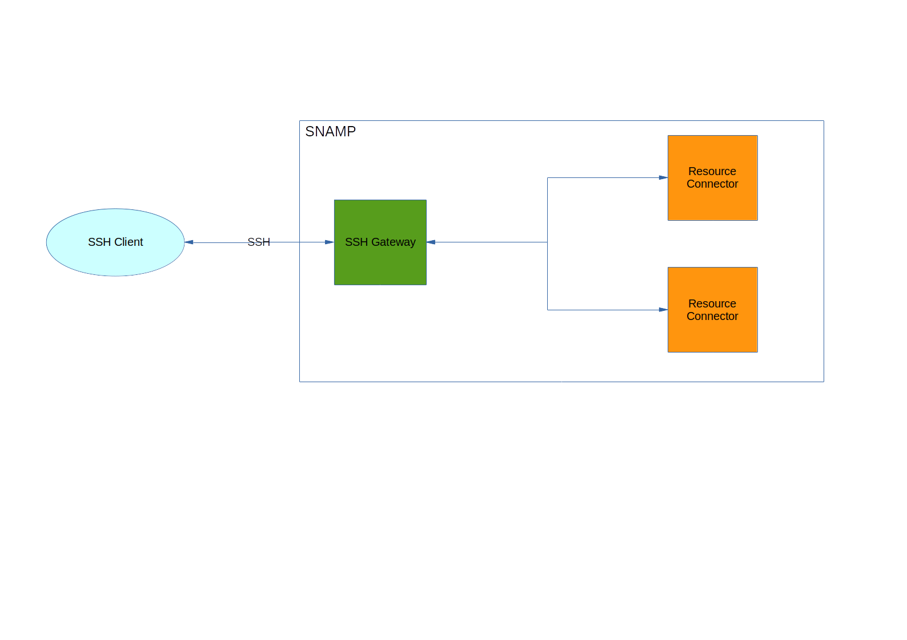

SSH Gateway
====
SSH Gateway provides remote command-line using SSH console. It allows administrators to monitor & manage state of connected resources. You may read or write all attributes and receive notifications that displayed asynchronously in the terminal window. So, you may use _PuTTY_, _WinSCP_, _OpenSSH_ or any other SSH client.

SSH Gateway supports following features (if they are supported by managed resources as well):

Feature | Description
---- | ----
Attributes | Each attribute is being displayed in JSON format. Besides, you may rewrite any writable attribute from the console
Notifications | Each notification is being displayed in JSON format (if that is enabled)
Health check | Displays health status of resource or group in SSH session

Note that this gateway utilizes **its own internal thread pool that can be configured explicitly**.

There are following supported commands:

1. `help` - displays all available commands
1. `exit` - closes SSH session
1. `resources` - displays list of connected resources
1. `attr-list [-s] [-d] [-r <resource-name>]` - displays an attributes of the specified resource
  - `-r <resource-name>`, `--resource <resource-name>` - specifies user-defined name of the connected resource
  - `-s`, `--names` - displays system name for each attribute
  - `-d`, `--details` - displays configuration and resource-supplied parameters associated with each attribute
1. `get -n <name> -r <resource> [-t|-j]` - displays attribute value of the specified resource
  - `-n <name>`, `--name <name>` - specifies user-defined name of the attribute
  - `-r <resource>`, `--resource <resource>` - specifies user-defined name of the connected resource
  - `-t`, `--text` - specifies textual format for attribute value output. Useful for scalar data types
  - `-j`, `--json` - specifies JSON format for attribute value output. Useful for dictionaries and tables
1. `set -n <name> -r <resource> -v <value-as-json>` - sets value of attribute of the specified resource
  - `-n <name>`, `--name <name>` - specifies user-defined name of the attribute
  - `-r <resource>`, `--resource <resource>` - specifies user-defined name of the connected resource
  - `-v <value-as-json>`, `--value <value-as-json>` - specifies a new value of the attribute
1. `notifs [-f <expression>]` - enables listening of incoming notifications. In this mode you are not able to print any commands. Pressing any key causes abortion of notification listening session. Any received notification will be displayed in the console
  - `-f <expression>`, `--filter <expression>` - _RFC 1960_-based expression that describes notification selection candidate. You may use any configuration property in the filtering expression
1. `hs [-r <resource-name>] | [-g <group-name>]` - displays health status of the groups of resources or individual managed resource. One of the parameters is required.
    - `-r <resource-name>`, `--resource <resource-name>` - specifies user-defined name of the connected resource
    - `-g <group-name>`, `--group <group-name>` - specifies group name.

Attribute value and notification object represented in the same JSON format as defined in **HTTP Gateway**.

HTTP Gateway provides its own SSH server that fully supports certificate, JAAS and/or password.

## Configuration Parameters
SSH Gateway recognizes the following configuration parameters:

Parameter | Type | Required | Meaning | Example
---- | ---- | ---- | ---- | ----
host | IP Address or DNS-name | Yes | Address of network interface used to listen incoming SSH connections | `0.0.0.0`
port | Integer | No | Inbound port used to listen clients. Default value is `22` | `23`
hostKeyFile | Filename | Yes | Path to the server certificate (\*.ser or \*.pem file) that represents serialized public/private key pair | `server.pem`
hostKeyFormat | Enum | No | Type of the server certificate | `PEM`
jaasDomain | String | No | Name of JAAS realm used to authenticate SSH clients | `karaf`
userName | String | No | User name of the client that can be authenticated on SSH server | `root`
password | String | No | Password of the user that can be authenticated on SSH server `qwerty`
publicKeyFile | Filename | No | Path to the public key used by client| `client.ssh`
publicKeyFileFormat | Filename | No | Type of the public key used by client | `pkcs8`

Note that parameters related to thread pool is omitted. See **User's Guide** page for more information about thread pool configuration. Other parameters will be ignored.

SSH Gateway supports the following authentication techniques:

1. Using simple _username/password_ pair - specify `userName` and `password` configuration parameters
1. Using _username/password_ pairs defined in _JAAS_ realm - specify `jaasDomain` configuration parameter
1. Using _public key_ - specify _publicKeyFile_ and, optionally, `publicKeyFileFormat` configuration parameters

### Server certificate
Server certificate can be generated using `openssl` utility. Gateway supports following types (`hostKeyType` configuration property) of certificate:

Value | Description
---- | ----
PEM | Pair of public/private keys that can be generated by `openssl` utility
SER | Serialized pair of public/private keys as Java objects

It is highly recommended to use `PEM` file format.

### Client public key
SSH Gateway supports authentication based on pubic key supplied by client. This key can be specified in `publicKeyFile` configuration parameter. Additionally, you can specify the type of this key in `publicKeyFileFormat` parameter:

Value | Description
---- | ----
pkcs8 | Public key in PKCS8 format
openssh | Public key generated by `openssh` utility
putty | Public key generated by `PuTTY` utility

## Other configuration parameters
SSH Gateway ignores additional configuration parameters applied to attributes, events and operations.
