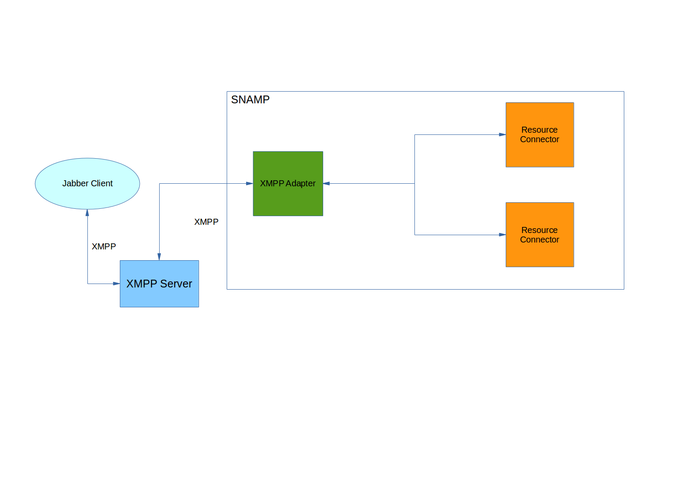

XMPP Resource Adapter
====
XMPP Resource Adapter provides access to the monitoring & management information exposed by connected resources using XMPP protocol. You can use any Jabber client to operate with SNAMP. This connector provides set of commands that can be printed inside of the chat session. Besides, this connector supports M2M communication via XMPP that can be utilized by any third-party software component. M2M mode means that the connector can expose information in the machine-readable XML format (can be handled by the software). Human-readable information is supplied in JSON format.

> Note that XMPP Adapter acting as a chat bot. Therefore, it must be connected to Jabber server.



XMPP Resource Adapter supports the following features (in case these features are supported by managed resources too):

Feature | Description
---- | ----
Attributes | Each attribute is being displayed in JSON format. Also, you may rewrite any writable attribute from the console
Notifications | Each notification is being displayed in JSON format (if that is enabled)

There are following supported commands:

1. `help` - displays all available commands
1. `exit` - closes chat session
1. `resources` - displays list of connected resources
1. `attr-list [-s] [-d] [-r <resource-name>]` - displays an attributes of the specified resource
  - `-r <resource-name>`, `--resource <resource-name>` - specifies user-defined name of the connected resource
  - `-s`, `--names` - displays system name for each attribute
  - `-d`, `--details` - displays configuration and resource-supplied parameters associated with each attribute
1. `get -n <name> -r <resource> [-t|-j]` - displays attribute value of the specified resource
  - `-n <name>`, `--name <name>` - specifies user-defined name of the attribute
  - `-r <resource>`, `--resource <resource>` - specifies user-defined name of the connected resource
  - `-t`, `--text` - specifies textual format for attribute value output. Useful for scalar data types
  - `-j`, `--json` - specifies JSON format for attribute value output. Useful for dictionaries and tables
1. `set -n <name> -r <resource> -v <value-as-json> [-s|--silent]` - sets value of specified resource attribute
  - `-n <name>`, `--name <name>` - specifies user-defined name of the attribute
  - `-r <resource>`, `--resource <resource>` - specifies user-defined name of the connected resource
  - `-v <value-as-json>`, `--value <value-as-json>` - specifies new value of the attribute
  - `-s, --silent` - do not produce response message
1. `notifs [-f <expression>]` - enables listening of incoming notifications. In this mode the notifications will be delivered asynchronously to the chat in JSON and XML format
  - `-f <expression>`, `--filter <expression>` - _RFC 1960_-based expression that describes notification selection candidate. You may use any configuration property in the filtering expression

Attribute value and notification object are represented in the same JSON format as defined in **HTTP Resource Adapter**.

## Configuration Parameters
XMPP Resource Adapters recognizes the following configuration parameters:

Parameter | Type | Required | Meaning | Example
---- | ---- | ---- | ---- | ----
host | IP Address or DNS-name | Yes | Host name of the XMPP/Jabber server | `jabber.acme.com`
port | Integer | No | Listening port on XMPP/Jabber server. By default it has `5222` value | `6733`
userName | String | Yes | Name of the Jabber user | `sheldon`
domain | String | Yes | XMPP domain name | `acme.com`
password | String | Yes | User password used to authenticate on XMPP/Jabber server | `qwerty`
keystorePassword | String | No | Password used to read information from the key store when SSL is enabled | `qwerty`
keystore | String | No | Path to the storage with certificates. Can be defined via `javax.net.ssl.keyStore` JVM property | `/home/admin/.keystore/tls.cert`
keystoreType | String | No | Type of the key storage. Using Java Key Store (JKS) is recommended | `jks`
allowUnsafeCertificate | Boolean | No | Allow to verify untrusted server certificate (which root certificate authority cannot be established). By default it has `false` value | `true`
enableM2M | Boolean | No | Enable injection of machine-readable information as extensions of XMPP protocol. By default it has `false` value | `true`

### SSL support
If your Jabber server supports transport-level security (via SSL) and verification of X509 client certificate - you must specify correctly the following parameters:

* `keystorePassword`
* `keystore`
* `keystoreType`

And, optionally, `allowUnsafeCertificate` parameter. 

`keystore` file can be generated with `keytool` tool from JDK. For example:
 
```bash
keytool -keystore xmpp_tls.cert -genkey
```

### Machine-to-Machine communication
XMPP Resource Adapter is primarily oriented to human-to-machine communication (admin-to-SNAMP using Jabber client). But XMPP protocol is pretty useful as a messaging framework between two applications. If `enableM2M` parameter is enabled - adapter will add extra information to XMPP stanza (packet). This information is located in `properties` XML element with `http://www.jivesoftware.com/xmlns/xmpp/properties` namespace. Following properties will be injected:

* For attributes
  * `writable` - boolean value indicating attribute is writable
  * `readable` - boolean value indicating attribute is readable
  * `type` - type of the attribute (in notation of **SNAMP Management Information Model**)
  * All configuration parameters of the attribute are specified by administrator
* For events
  * All configuration parameters of the attribute are specified by administrator include `severity`
