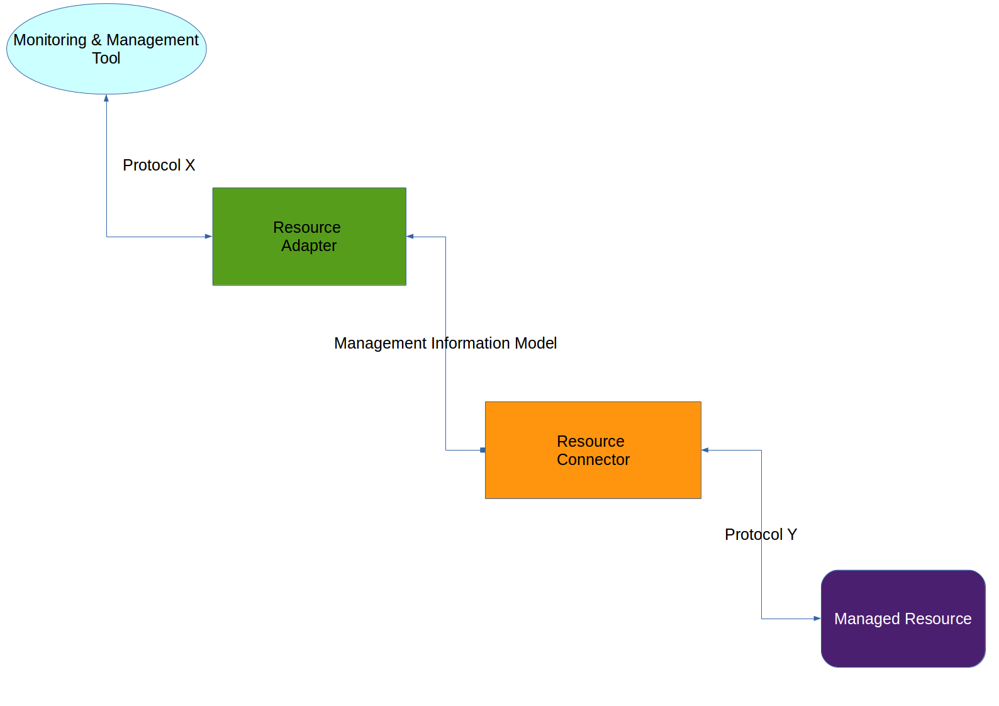

SNAMP Management Information Model
====
SNAMP Management Information Model is a special abstraction layer specifying data exchange between **Resource Connector** and **Resource Adapter**. This layer hides the details of the backed management protocol.

As you can see at the figure above **Resource Connector** converts protocol-specific data to the entities in **Management Information Model**. **Resource Adapter** uses this unified representation of the management information and transforms it to another management protocol expected by **monitoring & management tool**.

Management Information Model consists of the following entities:
* Attributes
* Events
* Operations

The attribute has its _data type_ that reflects format (or semantics) of attribute value.

The event emitted by **managed resource** will be translated into the unified object and delivered to **Resource Adapter** via **Resource Connector**.

The operation has its set of _formal parameters_ and _return value_. Each parameter and return value have a _data type_.

## Type System
SNAMP supports the following set of data types:
* Scalar types
  * Date/time - the number of milliseconds since January 1, 1970, 00:00:00 GMT
  * int8 - 8-bit signed integer
  * int16 - 16-bit signed integer
  * int32 - 32-bit signed integer
  * int64 - 64-bit signed integer
  * float32 - IEEE-754 floating-point number with single precision
  * float64 - IEEE-754 floating-point number with double precision
  * bigint - integer with arbitary precision
  * bigdecimal - floating-point number with arbitary precision
  * char - 16-bit Unicode single character
  * string - 16-bit Unicode string
  * objectname - [JMX Object Identifier](http://www.oracle.com/technetwork/java/javase/tech/best-practices-jsp-136021.html#mozTocId509360)
  * bool - boolean data type with two possible values: `true` and `false`
* Array - an array of any data type supported by SNAMP Management Information Model
* Dictionary - a set of key/value pairs with unique keys. Each key is a _string_. The value in the pair may have any data type supported by SNAMP Management Information Model
* Table - a set of rows and columns. The name of the column is a _string_. The cell value may have any data type supported by SNAMP Management Information Model

You should take into account that the semantics of the protocol-specific data type may be loss during conversion. For example, we have configured SNMP Adapter and JMX Connector. JMX-compliant managed resource exposes attribute of `Float` JMX type. This JMX-specific type can be converted directly to `float` value in SNAMP Management Information Model. But ASN.1 type system (used by SNMP protocol) doesn't have support for IEEE-754 floating-point numbers. Therefore, SNMP Adapter converts `float` value to ASN.1 `OCTET_STRING`.  
> Some Resource Adapter provide configuration properties allowing you to specify conversion rules. For example, `int32` value may be converted into ASN.1 `INTEGER_32` or 4-byte `OCTET_STRING`.

## Notification
Notification is a message emitted by connected **managed resource** and routed to **Resource Adapter** through **Resource Connector**. SNAMP Management Information Model defines unified way for representing notifications called **Notification Object**.

The structure of **Notification Object**:

Field | Data Type | Description
---- | ---- | ----
TimeStamp | date/time | The notification emission date
Source | string | The name of the managed resource emitting notification
Type | string | The name of the notification (differs from event category)
Message | string | Human-readable description of the notification
Sequence Number | int64 | The notification sequence number within the source. It's a serial number identifying a particular instance of notification in the context of the notification source. The notification model does not assume that notifications will be received in the same order that they are sent. The sequence number helps you to sort received notifications
Payload | _any supported data type_ | Additional payload delivered from **managed resource**. The semantics of this part of the notification depends on the connected **managed reresource** and its management protocol
