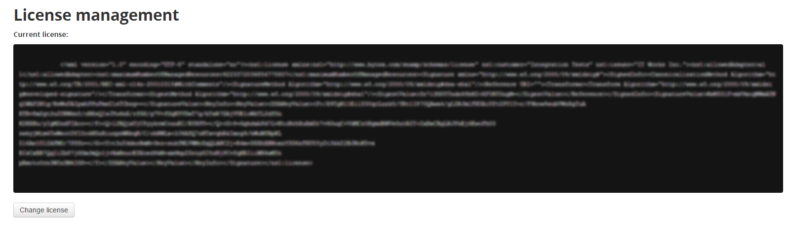

Installing license
====
This article will be helpful only if you have a paid subscription and installed SNAMP Management Console.

##Installation

## Subscription policy
There are two points of licensing:
1. **Which Resource Adapters** you want to use
1. **How many resources** you want to connect to SNAMP

What is not limited by our subscription policy:
1. How many instances of the same resource adapter you want to use
1. How many SNAMP instances you want to deploy into the cluster

## Limitations
There is no functional limitations if you exceed a limits described in the license file. You just see alerts in your SNAMP Management Console. But you should take into account the one important thing: **any incident occurred in period of limits excess are not covered by the SLA agreement**.

## SNAMP Management Console Licensing interface
You can update your license file using simple interface of SNAMP Management Console.

Use "Change license" button to upload a new licence file:

 
Then change the license:


If you did it successfully you wont see such error messages anymore (in case you did):
```
2015-10-12 22:34:00,929 | ERROR | eCheckerThread#0 | webconsole | 122 - com.bytex.snamp.management.webconsole - 1.0.0 | License conditions are violated
```