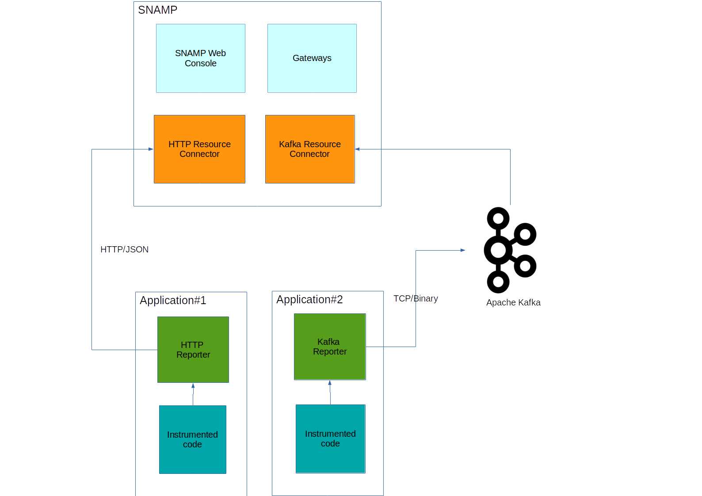

Instrumentation Library
====
SNAMP may receive metrics and spans emitted by software components. This is called a passive collection of metrics. For example, **HTTP Acceptor** may receive metrics and spans through HTTP in JSON format. Received information used by SNAMP for the following things:
* Derive advanced metrics such as percentile(90/95/97), mean, peak, minimum etc.  
* Routes of communication (traces) between components at application level, not at network level
* Compute metrics significant to SLA: availability, number of requests per time unit (workload), response time (percentiles and mean), correlation between workload and response time, efficiency of computational resources utilization etc.

Derivative metrics are grouped into entities called **gauges**.
> Read more about gauges in **SNAMP Management Information Model**.

Software components should be instrumented with special code that send necessary metrics to SNAMP through one of supported protocols. This limitation may restrict usage of some passive resource connectors provided by SNAMP for components written by third parties.

Transport protocols and data formats of these metrics are language-agnostic. So you can implement your own instrumentation from scratch or use one of the existing libraries:

* [Instrumentation library for Java](java.md)

Design of instrumentation libraries and data types are closely intersect with such libraries as [Apache HTrace](http://htrace.incubator.apache.org/), [OpenZipkin](http://zipkin.io/pages/existing_instrumentations.html) and [Dropwizard's Metrics](http://metrics.dropwizard.io/3.2.3/getting-started.html)

## JSON format specification
JSON format used to transfer metrics from instrumented application to SNAMP. For example, **HTTP Acceptor** is a passive resource connector provided by SNAMP out-of-the-box may receive metrics in JSON format through HTTP.
