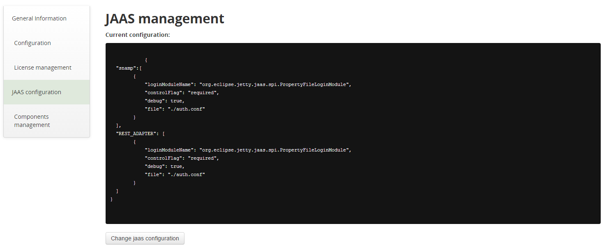
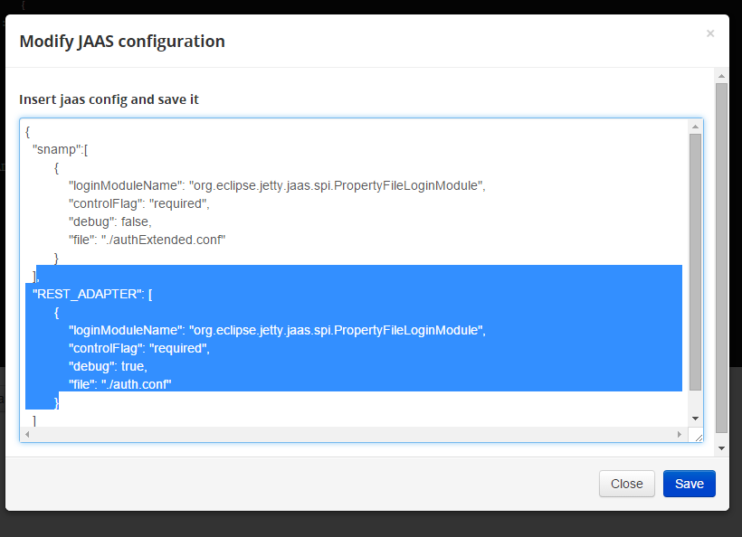

Java Authentication & Authorization Service
====
Originally, Apache Karaf allows to configure groups, users and their passwords, and there is no way to specify custom login modules. But with SNAMP JAAS extension it is possible to specify any JAAS module and realm using external file. This file contains JSON content which is very close to the native JAAS configuration file supported by Java.

If you are not familiar with JAAS it is highly recommended to read the following articles:
* [Java Authentication and Authorization Service Reference Guide](http://docs.oracle.com/javase/7/docs/technotes/guides/security/jaas/JAASRefGuide.html)
* [Apache Karaf Security Framework](https://karaf.apache.org/manual/latest/developers-guide/security-framework.html)

**The first**, you should specify path to JAAS configuration using JVM system property:
```
-Dcom.bytex.snamp.login.config.boot=/dev/shared/jaas.json
```

**The second**, write JAAS configuration in JSON format:
```json
{
  "realmName":[
    {
        "loginModuleName": "Java class that implements LoginModule interface",
        "controlFlag": "required|requisite|sufficient|optional",
        "debug": true,
        "prop1": "value1"
    }
  ]
}
```
`loginModuleName`, `controlFlag` and `debug` are predefined elements of JSON schema. Any other configuration elements depend on the login module.

Example:
```json
{
  "snamp":[
        {
            "loginModuleName": "org.eclipse.jetty.jaas.spi.PropertyFileLoginModule",
            "controlFlag": "required",
            "debug": true,
            "file": "./auth.conf"
        }
  ],
  "REST_ADAPTER": [
        {
            "loginModuleName": "org.eclipse.jetty.jaas.spi.PropertyFileLoginModule",
            "controlFlag": "required",
            "debug": true,
            "file": "./auth.conf"
        }
  ]
}
```

> The file is used to load initial JAAS configuration only. It will be stored in OSGi configuration persistent storage. Factory PID (Persistence IDentifier) is `com.bytex.snamp.login.config`.

**The third**, edit `<snamp>/etc/users.properties` file and use any realm from JSON-based JAAS configuration.

Popular use case of custom JAAS is importing existing users and groups from your Enterprise Directory using LDAP protocol. You can achieve this with `org.apache.karaf.jaas.modules.ldap.LDAPLoginModule` login module name.

Updating JAAS configuration with SNAMP Management Console
===
You can update your JAAS settings using simple interface of SNAMP Management Console.

In the "JAAS configuration" tab you can read and modify your current JAAS property. 

You can update your JAAS settings using simple interface of SNAMP Management Console.

Use "Change JAAS configuration" button to upload new JAAS settings:


Then change the lines:

