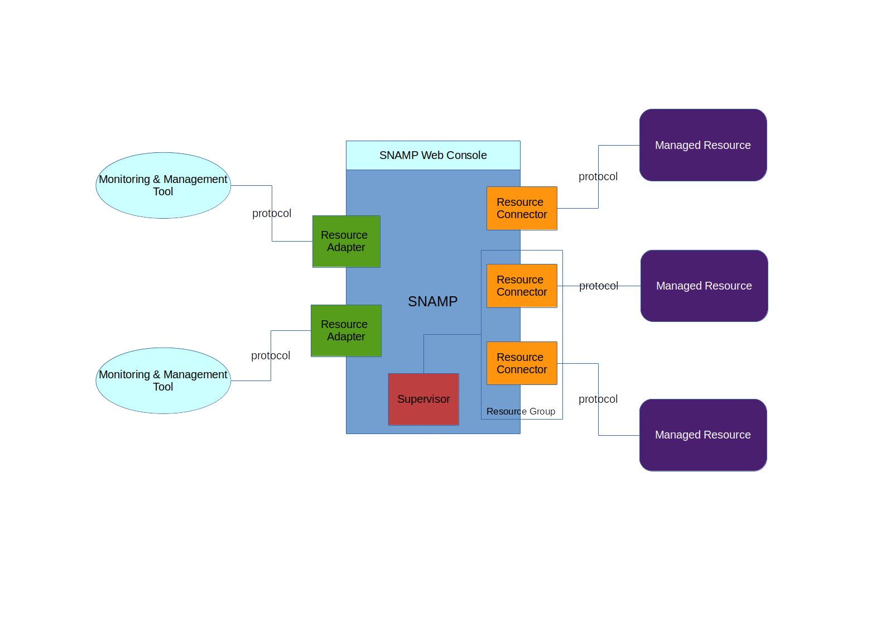
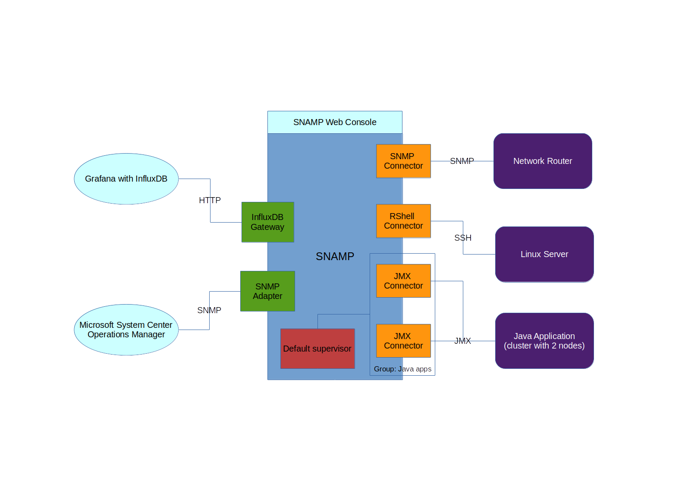
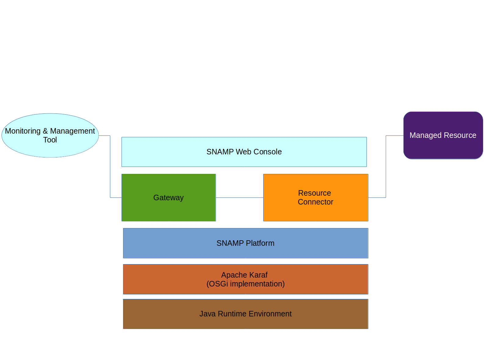

SNAMP Overview
====
SNAMP is a middleware acting as a bridge between **managed resources** and **monitoring & management tools** used in your enterprise and reduce complexity of monitoring & management. Various hardware and software components can be connected to SNAMP using different protocols, such as JMX, SNMP, SSH, HTTP, Modbus etc. You can choose a single unified interface (called Adapter) to gather monitoring information provided by the connected components. This interface can be selected in respect of your existing monitoring & management software such as Nagios and Zabbix. SNAMP has either generic and specialized adapters for various situations.

**Resource Adapter** exposes management information to **monitoring & management tool** using a unified management protocol. Therefore, you can manage & monitor different **managed resources** with a single tool.

**Resource Connector** allows to connect **managed resource** to SNAMP. Each connected **managed resource** can be accessed via **Resource Adapter**.

Let's take a look at this example:

Example configuration contains following entities:
* Three **managed resources**
  * Java Application that can be managed via JMX
  * Linux Server that can be managed via SSH
  * Network Switch that can be managed via SNMP
* Two **monitoring & management tools**
  * Nagios with configured `curl`-based plugin which uses HTTP request to obtain management information from connected **managed resources**
  * Microsoft System Center Operations Manager which uses SNMP protocol to obtain management information from connected **managed resources**

In this configuration, Nagios can monitor Java Application, Linux Server, Network Switch via single HTTP protocol. Microsoft SCOM can monitor Java Application, Linux Server, Network Switch via single SNMP protocol.  

Full set of supported management protocols listed [here](adapters/introduction.md) and [here](connectors/introduction.md).

# Concepts
SNAMP functionality based on the two main components:
* Resource Connector
* Resource Adapter

Resource Connector provides conversion from resource-specific management protocol to the unified [Management Information Model](inform_model.md).

Resource Adapter provides conversion from unified [Management Information Model](inform_model.md) to the a management protocol supported by **monitoring & management tool**.

## Managed Resource
**Managed resource** is a component of the enterprise IT infrastructure you want to manage. The possible (but not limited to) types of managed resources:
* Software component
  * Operating System
  * Application Server
  * Standalone Application
* Hardware component
  * Network Switch/Router
  * Sensor

Managed resource is accessible with SNAMP if and only if that is connected via **Managed Connector**.

## Resource Connector
**Resource Connector** (or **Managed Resource Connector**) is a software component used to connect **managed resource** to SNAMP environment via specific management protocol. Information model of each connected resource consists of the following entities (called **management features**):
* Attributes
* Events (or notifications)
* Operations

Resource Connector may support all these features or some of them. Supported set of features depends on type of the Resource Connector. For example, SNMP Resource Connector doesn't support operations due to SNMP protocol limitations.

**Resource Connector** has the following characteristics:
* _System name_ (or _type_) - name of the installed resource connector. Typically, system name indicates the management protocol used by resource connector
* _Connection string_ - string that specifies information about managed resource
* _Configuration_ - set of configuration parameters controlling behavior of the resource connector

### Attribute
Management attribute (or attribute) describes the atomic metric, parameter or characteristic of the connected managed resource. Each connected managed resource may have one or more attributes.

Attribute has the following characteristics:
* _Name_ - name of the managed resource attribute. Each managed resource provides a strictly defined set of attributes
* _Accessibility_ is what you can do with attribute
  * _Read_ - attribute value is read-only
  * _Write_ - attribute value is write-only
  * _Read/Write_ - attribute value can be modified or obtained
* _Read/write timeout_ - timeout used to read or write attribute value. By default, SNAMP uses infinite timeout
* _Type_ - type of the attribute value. See [Management Information Model](inform_model.md) for detailed information about supported attribute types
* _Configuration_ - set of configuration parameters associated with the attribute

The attribute configuration and attribute name might be specified by the SNAMP administrator. Other characteristics depends on the connected managed resource and cannot be changed by administrator.

Examples of attributes:
* Used disk space, in MB (read-only attribute)
* Number of cores (read-only attribute)
* Utilized volume of RAM, in MB (read-only attribute)
* Count of requests per hour (read-only attribute)
* Logging level (read/write attribute)
* Max size of log file (read/write attribute)

### Event
Event (or notification) is a maintenance message emitted by managed resource. Events carry information about some certain changes in the managed resource.

Event has the following characteristics:
* _Category_ - identifier of the notification/event in the managed resource. Each managed resource provides a strictly defined set of events
* _Configuration_ - set of configuration parameters associated with the attribute
* _Severity_ - severity level of the emitted notifications. That is an optional characteristic

The event configuration, category and severity level (optionally) may be specified by the SNAMP administrator. Other characteristics depend on the connected managed resource and cannot be changed by administrator.

See [Management Information Model](inform_model.md) for detailed information about severity level and notification content.

Examples of notifications:
* Fatal or critical error
* System Heartbeat (availability check)
* Log Event

### Operation
Operation is a maintenance action that may be applied to the managed resource.

Operation has the following characteristics:
* _Name_ - name of the maintenance action. Each managed resource provides a strictly defined set of operations
* _Configuration_ - set of configuration parameters associated with the operation
* _Signature_ - set of formal parameters which should be populated with actual arguments before execution

The operation configuration may be specified by SNAMP administrator. Other characteristics depend on the connected managed resource and cannot be changed by the administrator.

Examples of operations:
* Shutdown software component
* Restart software component
* Upload license file
* Invalidate cache

## Resource Adapter
**Resource Adapter** is a software component used to expose management information of connected managed resources to **monitoring & management tools** using the specific management protocol.

Resource Adapter uses resource connector to extract management information and expose one to the outside world. Resource Adapter may expose all configured management features or some of them. That depends on type of the Resource Adapter. For example, you have configured SNMP Adapter and JMX Connector. JMX Connector supports operations, but SNMP Adapter can't provide access to these operations due to SNMP protocol limitations.

Resource Adapter has the following characteristics:
* _System Name_ (or _Adapter Name_) - name of the Resource Adapter. Generally, system name represents the provided management protocol
* _Configuration_ - set of configuration properties controlling behavior and network accessibility of the adapter

# Technology Stack
SNAMP is constructed on top of [Apache Karaf](http://karaf.apache.org/) and requires Java Runtime Environment.

From the Deployment Viewpoint, SNAMP is a set of OSGi bundles packaged into KAR (Apache Karaf Feature archive) archives.

Additional topics:
* [Apache Karaf User's Guide](http://karaf.apache.org/manual/latest/users-guide/index.html)
* [OSGi Architecture](http://www.osgi.org/Technology/WhatIsOSGi)

# Management Console
SNAMP Management Console is a web console allowing you to configure SNAMP from your browser. It is build on top of [Hawt.IO](http://hawt.io/).
> SNAMP Management Console is available in commercial license only
