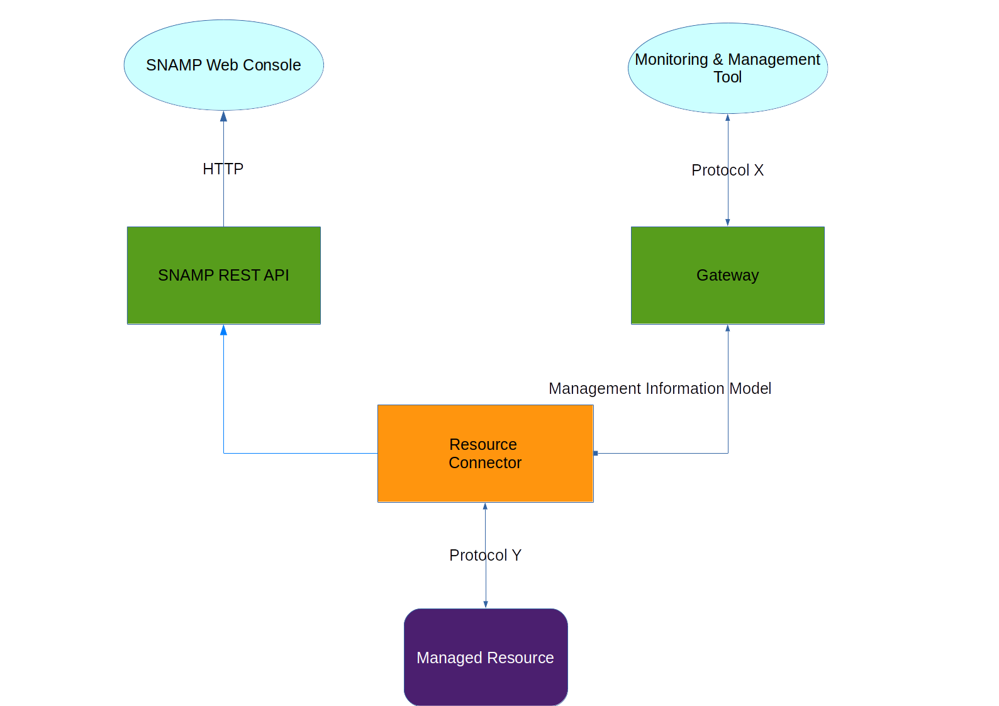

SNAMP Overview
====
SNAMP is a software system for monitoring, distributed tracing and elasticity management of components in IT infrastructure. It is oriented on Operations and DevOps engineers.
* Monitoring functionality includes collecting metrics and notifications from components and displaying them in convenient SNAMP web interface, storing the data for further analysis using tools like Grafana or Kibana or sending it via e-mail.
* Distributed tracing functionality allows to collect spans from software components and display sensitive data related to communication between these components like average response time, availability and topology.
* Elasticity management provides automatic scaling of computation resources based on metrics harvested by SNAMP. For example, SNAMP provides automatic scaling for OpenStack-based environments.

SNAMP can be interpeted as SCADA for software components in IT landscape.

**Gateway** exposes management information to **monitoring & management tool** using a unified management protocol. Therefore, you can manage & monitor different **managed resources** with a single tool.

**Resource Connector** allows to obtain sensitive monitoring data from **managed resource** using some of the supported protocols (SNMP, JMX, SSH etc.). **Managed resource** is a unit of monitoring and can be represented by software or hardware component.

**Resource Group** is a group of managed resources. For example, cluster of some application can be represented as a group of resources and each resource represents instance of the application inside of cluster. Resource Group can specify some configuration that can be used as template configuration of resources in the group.

**Supervisor** controls groups of resources and provided summary metrics. Supervisor is responsible for automatic scaling of the group, health status control and automatic resource discovery.

**SNAMP Web Console** is a web interface for SNAMP available through modern web browsers which provides UI for monitoring with charts, topology of components using tracing information, configuration of elasticity management. It also provides configuration of gateways, resource connectors, resource groups and supervisors.

Let's take a look at this example:

Example configuration contains following entities:

* Four **managed resources**
  * A cluster with two Java Applications that can be managed via JMX
  * Linux Server that can be managed via SSH
  * Network Switch that can be managed via SNMP
* Two **monitoring & management tools**
  * InfluxDB Gateway records all metrics collected from **managed resources** into database. Grafana visualizes information extracted from InfluxDB.
  * Microsoft System Center Operations Manager which uses SNMP protocol to obtain management information from connected **managed resources**
* **Group of resources** with two JMX connectors. This group represents cluster with Java applications. Two other resources doesn't have groups.
* Default **supervisor** configured to supervise group of resources (cluster of Java applications). It provides information about cluster health status and service discovery that automatically register new resource connector in SNAMP when cluster will be enlarged.   

In this configuration, Grafana can monitor Java Applications, Linux Server and router using data stored in unified way in InfluxDB by SNAMP. Microsoft SCOM can monitor Java Applications, Linux Server and router via single SNMP protocol.

> Using of third-party monitoring & management tools is just an offered feature of SNAMP. You can use only SNAMP Web Console for visualization of all necessary monitoring information.

Full set of supported management protocols listed [here](gateways/introduction.md) and [here](connectors/introduction.md).

# Concepts
SNAMP functionality based on the four main components:

* Resource Connector provides conversion from resource-specific management protocol to the unified [Management Information Model](inform_model.md).
* Gateway provides conversion from unified [Management Information Model](inform_model.md) to the a management protocol supported by **monitoring & management tool**.
* Supervisor control group of resources and provides information about health checks or automatically scales the group.
* SNAMP Web Console provides visualization of monitoring data and configuration tools.

The following diagram shows how the monitoring data flows through SNAMP main components:

The following diagram shows relationship between SNAMP main components:

## Managed Resource
**Managed resource** is an object of monitoring in your IT landscape. The possible (but not limited to) types of managed resources:

* Software component
  * Operating System
  * Application Server
  * Standalone Application
* Hardware component
  * Network Switch/Router
  * Sensor

Managed resource is accessible with SNAMP if and only if that is connected via **Resource Connector**.

## Resource Connector
**Resource Connector** is a software component used to connect **managed resource** to SNAMP via specific management protocol. Information model of each connected resource consists of the following entities (called **management features**):

* Attributes
* Events (or notifications)
* Operations
* Health checks

Resource Connector may support all these features or some of them. Supported set of features depends on type of the Resource Connector. For example, SNMP Resource Connector doesn't support operations due to SNMP protocol limitations.

**Resource Connector** has the following characteristics:

* _Resource name_ - descriptive name of the **managed resource** defined by administrator
* _Type_ - name of the installed resource connector. Typically, system name indicates the management protocol used by resource connector, for example, `jmx`
* _Connection string_ - a string that specifies connection details used to access **managed resource** such as port, host, URL etc.
* _Configuration_ - set of configuration parameters controlling behavior of the resource connector
* _Group name_ - name of the resource group. It is optional characteristic

Resource connector may be a member of the group. It is allowed to configure resource connector without membership. If it is a member of the group then configuration will be inherited from configuration of the group.

Resource connectors can be divided into two logical categories:

* _Active_ resource connectors collect monitoring information on demand (when initiated by connected monitoring tool through **Gateway** or **SNAMP Web Console**). This category of connectors operates with managed resources using _request-reply_ approach.
* _Passive_ resource connectors only receive monitoring information. In this case **managed resource** is responsible to send actual information to the resource connector. This category of connectors operates with managed resources using _message-oriented_ approach.

### Attribute
Attribute describes the atomic metric of the connected managed resource. Each connected managed resource may have one or more attributes.

Attribute has the following characteristics:

* _Name_ - name of the managed resource attribute. Each managed resource provides a strictly defined set of attributes
* _Accessibility_ is what you can do with attribute
  * _Read_ - attribute value is read-only
  * _Write_ - attribute value is write-only
  * _Read/Write_ - attribute value can be modified or obtained
* _Read/write timeout_ - timeout used to read or write attribute value. By default, SNAMP uses infinite timeout
* _Type_ - type of the attribute value. See [Management Information Model](inform_model.md) for detailed information about supported attribute types
* _Configuration_ - set of configuration parameters associated with the attribute
* _Override_ - indicates that attribute configuration is overridden by resource connector and should not be inherited from group.

The attribute configuration and attribute name might be specified by the SNAMP administrator. Other characteristics depends on the connected managed resource and cannot be changed by administrator.

Examples of attributes:

* Used disk space, in MB (read-only attribute)
* Number of cores (read-only attribute)
* Utilized volume of RAM, in MB (read-only attribute)
* Count of requests per hour (read-only attribute)
* Logging level (read/write attribute)
* Max size of log file (read/write attribute)

### Event
Event (or notification) is a maintenance message emitted by managed resource. Events carry information about some certain changes in the managed resource.

Event has the following characteristics:

* _Category_ - identifier of the notification/event in the managed resource. Each managed resource provides a strictly defined set of events
* _Configuration_ - set of configuration parameters associated with the attribute
* _Severity_ - severity level of the emitted notifications. That is an optional characteristic
* _Override_ - indicates that event configuration is overridden by resource connector and should not be inherited from group

The event configuration, category and severity level (optionally) may be specified by the SNAMP administrator. Other characteristics depend on the connected managed resource and cannot be changed by administrator.

See [Management Information Model](inform_model.md) for detailed information about severity level and notification content.

Examples of notifications:

* Fatal or critical error
* Log Event

### Operation
Operation is a maintenance action that may be applied to the managed resource.

Operation has the following characteristics:

* _Name_ - name of the maintenance action. Each managed resource provides a strictly defined set of operations
* _Configuration_ - set of configuration parameters associated with the operation
* _Override_ - indicates that operation configuration is overridden by resource connector and should not be inherited from group

The operation configuration may be specified by SNAMP administrator. Other characteristics depend on the connected managed resource and cannot be changed by the administrator.

Examples of operations:

* Shutdown software component
* Restart software component
* Invalidate cache

### Health check
Health check provides information about state of the **managed resource**. Implementation of health checks depends on the type of **Resource Connector** and doesn't require any configuration parameters. Health status divides into two category:

* _OK_ status represents that **managed resource** is fine and operating normally
* _Malfunction_ status represents that **managed resource** is partially or fully unavailable

Health check contains detailed information about malfunction.

## Resource Group
Resource Group can be used to unite similar set of resource connectors. There are two possible ways to define resource group:

* _Implicit_ - it is enough to assign the same group name for each resource connector. In this case the group name is just a logical grouping of resources. Implicit specification of groups is not supported by **Supervisors**.
* _Explicit_ - a group should be configured explicitly using **SNAMP Web Console** with all necessary **management features** and configuration parameters. Each resource connector that is associated with such group through _Group name_ inherits all configuration properties and **management features** from the group.

Resource Group has the following characteristics:
* _Group name_ - descriptive name of the **resource group** defined by administrator. This name can be used by **resource connectors** to specify membership
* _Type_ - name of the installed resource connector. Typically, system name indicates the management protocol used by resource connector, for example, `jmx`. This characteristic will be inherited by all resource connectors in the group
* _Configuration_ - set of configuration parameters controlling behavior of the resource connectors in the group

## Gateway
**Gateway** is a software component used to expose management information of connected managed resources to **monitoring & management tools** using the specific management protocol.

Gateway uses resource connector to extract management information and expose one to the outside world. Gateway may expose all configured management features or some of them. That depends on type of the Gateway. For example, you have configured SNMP Gateway and JMX Connector. JMX Connector supports operations, but SNMP Gateway can't provide access to these operations due to SNMP protocol limitations.

Gateway has the following characteristics:

* _Instance name_ - descriptive name of the gateway instance defined by administrator
* _Type_ - type of the Gateway. Generally, type represents the provided management protocol, for example, `snmp`
* _Configuration_ - set of configuration properties controlling behavior and network accessibility of the gateway

Some of gateways are useful even if you have no plans to use third-party monitoring tools. For example, InfluxDB Gateway can store monitoring information collected from all resource connectors into database for further retrospective analysis using BigData tools. Another example is SMTP Gateway that is responsible for sending e-mails to recipients when one of resource connectors reports important notifications or health checks.

## Supervisor
**Supervisor** is important SNAMP component responsible for supervision of resource groups. It provides the following capabilities:

* _Group health status_. Supervisor collects health statuses of each resource in the group and aggregates health information into health status of the group. It is possible to assign customized health checkers based on values of attributes supplied by resources in the group. Aggregated information called _group health status_ and may include information about health of entire cluster.
* _Elasticity management_ (or _Auto Scaling_) provides automatically scaling of computational resources in the group. For example, OpenStack Supervisor can use information from attributes supplied by each node and make decision about shrinking or enlarging cluster using OpenStack Senlin.
* _Discovery service_ allows to automatically detects **managed resources** and register appropriate **resource connectors** without manual configuration by SNAMP administrator.

A set of supported capabilities depends on the type of supervisor. For example, `default` supervisor doesn't provide _Discovery service_.

Supervisor has the following characteristics:

* _Type_ - type of the supervisor. For example, `openstack`
* _Attribute checkers_ - a set of health conditions associated with attributes. Attribute checker used to read values of attribute from all resources in the group and compute health status. Condition can be defined by administrator. It is optional configuration element.
* _Discovery configuration_ - how the supervisor can discover new **managed resources** and how they can be registered in SNAMP. It optional configuration element.
* _Auto Scaling configuration_ - defines a set of scaling policies for automatic shrinking or enlarging cluster of **managed resources**
* _Configuration_ - set of configuration properties controlling behavior and network accessibility of the gateway

Supervisor should be assigned to the group of resources defined implicitly or explicitly. Administrator can choose the necessary type of supervisor to be associated with the group. By default, SNAMP assigns `default` supervisor for each explicitly defined group. Implicitly defined group has no supervisor by default.

# Technology Stack
SNAMP is constructed on top of [Apache Karaf](http://karaf.apache.org/) and requires Java Runtime Environment.

From the Deployment Viewpoint, SNAMP is a set of OSGi bundles packaged into KAR (Apache Karaf Feature archive) archives.

Additional topics:

* [Apache Karaf User's Guide](http://karaf.apache.org/manual/latest/)
* [OSGi Architecture](http://www.osgi.org/Technology/WhatIsOSGi)
