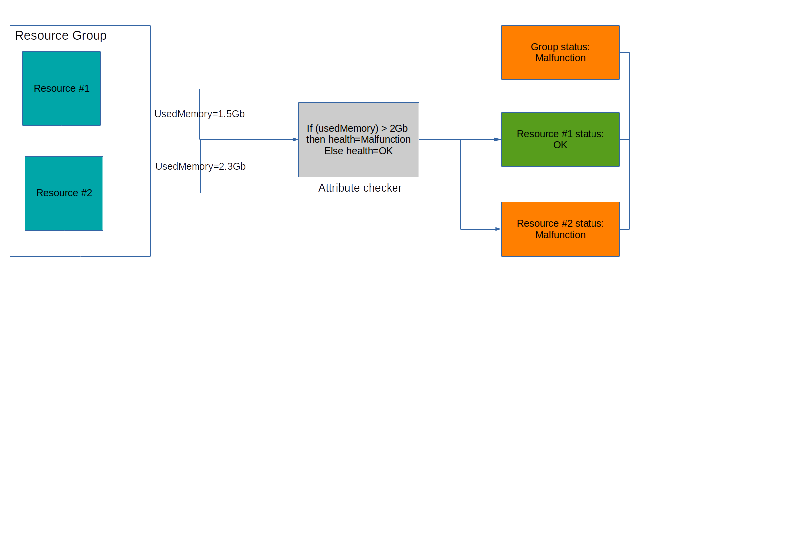
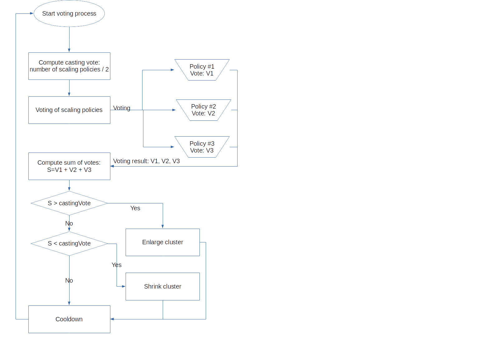

SNAMP Supervisors
====
SNAMP Supervisor is a component of SNAMP platform responsible for supervising group of managed resources. Therefore, supervisor instance should be associated with resource group in configuration. It is not required to register resource group **explicitly** except case when Resource Discovery is supported by supervisor.

Supervisor provides the following functionality:
* **Resource Discovery** responsible for discovering new managed resources and register its in resource group without manual configuration.
* **Group health status** provides aggregated health status constructed from health statuses of each resource in the group plus summary health status of the group that may include health status of entire cluster. Also, it is possible to define custom health checks which can be based on attribute values.
* **Elasticity management** is a decision engine for automatic scaling of managed resources based on scaling policies. This functionality provides efficient utilization of computation resources in the cluster.

SNAMP provides several types of supervisors. The functionality describes above depends on type of supervisor. Some supervisors may not provide elasticity management or automatic resource discovery.

Each resource group is supervised by **default** supervisor implicitly. If other type of supervisor is required then supervisor should be configured explicitly for resource group.

Detailed description for each Gateway supported by SNAMP:

Display name | Type | Resource Discovery | Group health status | Elasticity management
---- | ---- | ---- | ---- | ----
[Default Supervisor](default-supervisor.md) | default | No | Yes | Partially (using Groovy scripts)
[OpenStack Supervisor](openstack-supervisor.md) | openstack | Yes | Yes | Yes

## Resource Discovery
Resource Discovery should be configured explicitly if supervisor supports this functionality as well as resource group should be configured explicitly. Resource group should have attributes, events and operations. Without explicit configuration of resource group with management features a newly discovered managed resource will not provide monitoring information.

Configuration of resource discovery consists of **connection string template**. Connection string template used to create connection string for discovered managed resources. Format of connection string template depends on type of supervisor.

For example, OpenStack supervisor can use the following template for connection string:
```
{first(addresses.private).addr}
```
This means that final connection string is an IP address extracted from cluster node metadata in the form of JSON. Cluster node may have several IP addresses. `addresses.private` is a list of private IP addresses. `first` function returns first IP address in the list of addresses. `addr` field contains raw IP address. When new cluster node is detected by OpenStack supervisor then metadata of this node will be parsed according this template and new managed resource will be registered automatically with parsed connection string.

## Group health status
Group health status is a combination all statuses associated with each managed resource in the group plus summary health status. Summary health status may include health status of entire cluster. For example, OpenStack supervisor constructs group health status from health status of every cluster node and health status of OpenStack cluster manager.

> For more information about possible health statuses read **SNAMP Management Information Model**.

Additionally, it is possible to define custom health checkers called **attribute checkers**. Attribute checker will be executed on every managed resource in the resource group and analyzes values of attributes supplied by these managed resources. It produces health status for managed resource as a result of health check.



It is possible to configure custom health checkers for many attributes.

SNAMP offers two types of attribute checkers:
* Colored attribute checker
* Groovy-based attribute checker

### Colored attribute checker
Colored attribute checker is suitable for most situations. It provides three possible colors for attribute values: **green**, **yellow** and **red**:
* Green color indicates OK status
* Yellow color indicates malfunction status with **LOW** severity
* Red color indicates malfunction status with **MODERATE** severity

Green and yellow colors can be defined using simple condition-based expression called predicate. If green and yellow predicates are `false` then SNAMP provides red color. SNAMP recognizes the following types of predicates for each color:
* Constant: `true` or `false` without any checking of attribute value. Useful if you don't have yellow condition for attribute value.
* Range: checks whether the value is in range. For example, `[10..20)` means that attribute value must be greater than `10` inclusively and less than `20` exclusively.
* Comparator: simple conditional expression. Supported operators are: `>`, `<`, `>=`, `<=`, `<>` (not equals), `=` (equals).

For example, all resources in group provide attribute `usedMemory` indicating number of memory allocated by application and we want to control memory utilization using checkers. The possible configuration can be represented as follows:
```
Green: comparator(usedMemory < 1Gb)
Yellow: range(usedMemory in [1Gb, 2Gb])
```

When memory utilization is less than 1Gb then everything OK. If memory is greater than 1Gb but less than 2Gb inclusively then group health status will be changed to malfunction with **LOW** severity to let operator know.

### Groovy attribute checker
In Groovy attribute checker you can implement any analysis logic using full instrumentation that gives Groovy language including [Groovy Grapes](http://docs.groovy-lang.org/latest/html/documentation/grape.html).

DSL for Groovy attribute checker supplies `attributeName` and `attributeValue` global properties. Three possible values should be chosen as script result: `OK`, `SUSPICIOUS` and `MALFUNCTION`. These check results have the same semantics as for colored attribute checker:
* `OK` means OK status
* `SUSPICIOUS` means malfunction status with **LOW** severity
* `MALFUNCTION` means malfunction status with **MODERATE** severity

### Health triggers
Health trigger can be used to detected changes of health status. It is fired when phase transition between health statuses occurred. For example, if previous health status was OK and new measured health status is malfunction then trigger will be invoked. If previous and new measured statuses are the same then trigger will not be invoked. Difference between malfunction levels (low, moderare, severe etc.) treats as phase transition.

SNAMP supports programming health triggers using Groovy. DSL provides `previousStatus` and `newStatus` global properties for handling situation. It can be useful for reporting via e-mail or executing external tools.

## Elasticity management
Automatic scaling is applied on group of resources. It is based on scaling policies. Each scaling policy participate in voting process which is executed by supervisor periodically or eventually depends on its type.

Elasticity manager requires the following parameters to be configured for correct automatic scaling:

Parameter | Meaning
---- | ----
MaxClusterSize | Maximum nodes in the cluster
MinClusterSize | Minimum nodes in the cluster. Cannot be less than 1
CooldownTime | Time period that helps to ensure that Elasticity Manager doesn't launch or terminate additional instances before the previous scaling activity takes effect
ScalingSize | Number of nodes added to or removed from cluster when scaling appears  

Auto scaling decision process is designed especially for efficient utilization of computation resources. Voting process used in core of decision engine helps to avoid workload anomalies. Voting process has main characteristic called `castingVote`:
```
castingVote = number of scaling policies / 2
```
Each scaling policy produces vote weight as a result of voting process. If total sum of votes produced by scaling policies is greater than `castingVote` then supervisor enlarges cluster and registers new managed resources in resource group. If total sum of votes produced by scaling policies is less than `-castingVote` then supervisor shrinks cluster and removes managed resources from group. Single scaling policy relies on some indicator that can be represented by attribute value, health status or custom script.

The following diagram describes voting process:



Scaling policy may decide return zero vote weight. In this case it has no influence on voting result. But other scaling policies may produce non-zero vote weights and its decision will force scaling.

For example, there are three configured scaling policies P1, P2 and P3. Casting vote is 3 / 2 = 1.5. This means that cluster size will be decreased if sum of votes after voting process is less than -1.5 and cluster size will be increased if sum of votes after voting process is greater than 1.5. Let's image that voting process produces the following results: P1=0.5, P2=1, P3=0. Sum of votes P1+P2+P3=0.6+1+0=1.6 that is greater than casting vote. Therefore, elasticity manager decide to enlarge cluster.

SNAMP offers the following types of scaling policies:
* **Attribute-based scaling policy** that relies on attribute values chosen by operator as decision-sensitive indicators. It is weighted scaling policy because this policy should have configured vote weight
* **Status-based scaling policy** that relies on health status of managed resource group. This scaling policy takes into account health statuses produced by attribute checkers. It is weighted scaling policy because this policy should have vote weight
* **Groovy-based scaling policy** that relies on handwritten Groovy script with any decision algorithm

### Attribute-based scaling policy
Attribute-based scaling policy ables to specify operational range of possible attribute values used as scaling indicators. If attribute value is in operational range then policy will produce zero vote weight. If attribute value is less than lower bound of operational range then policy vote for downscaling. If attribute value is greater than upper bound of operational range then policy vote for upscaling.

The policy has the following characteristics:

Characteristic | Meaning
---- | ----
Vote weight | Vote weight associated with the policy. Should be configured by operator
Attribute name | Name of attribute which values extracted from managed resources in group used for producing final vote weight
Incremental vote weight | `true` to increase linearly result vote if attribute value still bad. `false` to not increase final vote weight
Observation time | Observation time of bad attribute value. This is optional characteristic and should be used in conjunction with **Incremental vote weight**
Values aggregation method | Aggregation of attributes values supplied by managed resources in resource group
Operational range | Range of normal attribute values. Can be defined in interval notation: `(0..10]`, `[0..+∞)`, `[-10..10]` etc.
Analysis depth | Time interval used for computing statistics for recommendation system. Read more in section **Recommendation system**

Result vote of attribute-based scaling policy is equal to the **vote weight** configured by operator if aggregated attribute value is not in operational range. Result vote may be greater than configured **vote weight** if incremental vote weight is enabled.

Possible aggregation methods:
* _MAX_ - extracts maximum value of attribute from resources in resource group
* _MIN_ - extracts minimum value of attribute from resources in resource group
* _MEAN_ - computes average value of attribute extracted from resources in resource group
* _MEDIAN_ - computes median (50-percentile) value of attribute extracted from resources in resource group
* _SUM_ - computes sum value of attribute extracted from resources in resource group
* _PERCENTILE-90_ - computes 90-percentile value of attribute extracted from resources in resource group
* _PERCENTILE-95_ - computes 95-percentile value of attribute extracted from resources in resource group
* _PERCENTILE-97_ - computes 90-percentile value of attribute extracted from resources in resource group

For example, we have a resource group with 3 resources R1, R2 and R3. Attribute `usedMemory` is provided by each managed resource because this attribute is configured explicitly in resource group. Attribute-based scaling policy is defined with the following parameters:
* Vote weight is 1.5
* Operational range is [1Gb..4Gb]
* Incremental vote weight is disabled
* Observation time is not specified (it has no meaning because incremental vote weight is disabled)
* Aggregation method is _MEAN_. It means that average memory utilization between 1Gb and 4Gb per node is normal for cluster.

At time of voting process scaling policy relies on the following values of attribute `usedMemory` supplied by each managed resource:
* usedMemory(R1) = 0.5Gb
* usedMemory(R2) = 8Gb
* usedMemory(R3) = 6Gb

According with selected aggregation method the policy computes final value of attribute: (0.5Gb + 8Gb + 6Gb) / 3 = 4.83Gb. Value 4.83Gb is greater than upper bound of operational range [1Gb..4Gb], therefore, scaling policy returns vote for increasing cluster size with vote weight 1.5. If mean value is in operational range then scaling policy will return zero vote weight. If mean value is less than 1Gb then scaling policy will vote for downscaling with vote weight -1.5.

Incremental vote weight can be used to increase weight of the scaling policy if some anomaly is observed during some period of time. Take our example described above and enable incremental vote weight with observation time of 1 second:
* At interval of time from 0 to 1 seconds vote result will be equal to 0.
* At interval of time from 1 to 2 seconds vote result will be equal 1.5.
* At interval of time from 2 to 3 seconds vote result will be equal to 3.

It is recommended to use incremental vote weight for metrics that cannot be decreased over time. For example, used disk space.

### Status-based scaling policy
Status-based scaling policy based on health statuses collected for each resource in resource group. If one of resources in group is not OK then scaling policy produces vote for upscaling. This type of scaling policy never votes for downscaling.

The policy has the following characteristics:

Characteristic | Meaning
---- | ----
Vote weight | Vote weight associated with the policy. Should be configured by operator
Incremental vote weight | `true` to increase linearly result vote if health status still bad. `false` to not increase final vote weight
Observation time | Observation time of malfunction status. This is optional characteristic and should be used in conjunction with **Incremental vote weight**
Malfunction level | Minimum malfunction level required for voting. If aggregated malfunction status is greater than or equal to the specified level then policy votes for upscaling; otherwise, policy produces zero vote.

Incremental vote weight and observation time used for linear incrementation of vote weight if specified malfunction status observed too long.

### Groovy-based scaling policy
Groovy-based scaling policy delegates computation of vote weight to script and doesn't have configuration parameters in comparison with attribute-based or status-based policies. It is possible to use full power of Groovy language including Groovy Grapes to compute vote weight. Script program should return floating-point number with vote weight.

Example of scaling policy written on Groovy which returns positive vote weight every time:
```groovy
println "Resource in group: ${resources}"

2D /*Return vote weight*/
```

### Tuning of scaling policies
Concept of scaling based on voting process with policies offers high level of flexibility. This section shows a number of strategies that can be used for tuning vote weight of scaling policies. These strategies are just recommendation and not represented in the form of configuration elements.

Assume that three scaling policies are configured in supervisor with predefined weights: P1, P2 and P3. `castingVote` is 3/2=1.5.

**All-of** strategy means that scaling is forced when and only when **all** scaling policies produce non-zero votes. Vote weight for each scaling policy should be defined as P1=P2=P3=0.6. In this case none of two policies cannot force scaling: P1+P2=P2+P3=P1+P3=1.2 (< 1.5). But P1+P2+P3=1.8 (> 1.5). This is equivalent of `P1 AND P2 AND P3`.

**Any-of** strategy means that scaling is forced when **any** scaling policy produces non-zero vote. Vote weight should be defined as P1=P2=P3=1.6 (> 1.5). This is equivalent of `P1 OR P2 OR P3`.

**Most of all** strategy means that scaling is forced when majority of scaling policies vote for scaling action. Vote weight for each scaling policy should be defined as P1=P2=P3=1. In this case any two scaling policies may force scaling action: P1+P2=P1+P3=P2+P3=2 (> 1.5). 

In spite of these recommendations, you can choose your most suitable strategy. For example, set greater vote weight for single policy in comparison with other.

### Recommendation system
Recommendation system provided by SNAMP helps to change operational range in more efficient manner and reduce number of false scaling decisions produced by attribute-based scaling policy. It is necessary to define correct analysis depth for attribute-based scaling policy. This depth is an interval of time used for accumulation of statistics about attribute values. Note that small value of analysis depth may produce bad recommendation for operational range. Recommended analysis depth is 24 hours.
