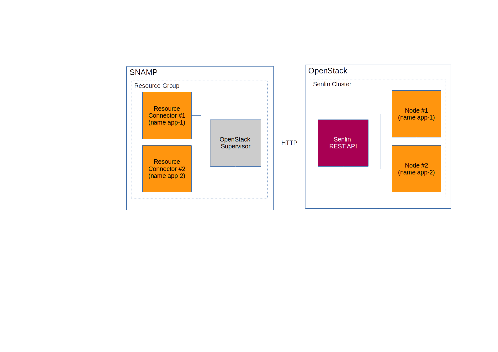

OpenStack Supervisor
====
OpenStack Supervisor used when managed resources served as cluster nodes in OpenStack. Requirements for OpenStack installation:
* Mitaka release or later
* Keystone V3
* Installed Senlin 1.x

OpenStack Senlin API is used by the supervisor for provisioning, control and removing nodes from cluster. It is possible to use compute, network and Heat profiles for cluster.



List of supported features:

Feature | Description
---- | ----
Group health status | Yes
Elasticity management | Yes
Resource Discovery | Yes

Senlin cluster should be configured properly before using OpenStack Supervisor:
1. Describe cluster node profile as **yaml** file. Example of profile:
```yaml
type: os.nova.server
version: 1.0
properties:
  name: cirros_server
  flavor: 1
  image: "cirros-0.3.5-x86_64-disk"
  key_name: snamp-key
  networks:
   - network: private
  metadata:
    test_key: test_value
  user_data: |
    #!/bin/sh
    echo 'hello, world' > /tmp/test_file
```
1. Upload profile using command-line tool `openstack cluster profile` or Horizon
1. Create Senlin cluster and specify name of cluster. Note that name of resource group in SNAMP is treated as cluster name. If group name doesn't match to cluster name then use `clusterID` configuration parameter to associate GUID of cluster with group name in SNAMP explicitly.

## Configuration properties
OpenStack Supervisor recognizes the following configuration properties:

Parameter | Type | Required | Meaning | Example
---- | ---- | ---- | ---- | ----
userName | String | Yes | User name used for authentication into Keystone V3 | `admin`
password | String | Yes | Password used for authentication into Keystone V3 | `admin`
authURL | URL | Yes | URL of Keystone V3 endpoint | `http://192.168.100.3:5000/v3`
cloudProvider | String | No | Cloud provided that hosts OpenStack installation. Possible values are `rackspace` and `hpcloud`. This parameter helps correctly define some internal settings for remote connection to OpenStack endpoints | `rackspace`
userDomain | String | No | [Domain](https://docs.openstack.org/mitaka/install-guide-obs/common/glossary.html#term-domain) of user. Default is `default` (suitable for DevStack) | `default`
project | String | No | OpenStack [Project](https://docs.openstack.org/mitaka/install-guide-obs/common/glossary.html#term-domain). Default is `demo` (suitable for DevStack) | `demo`
projectDomain | String | No | [Domain](https://docs.openstack.org/mitaka/install-guide-obs/common/glossary.html#term-domain) of project. Default is `default` (suitable for DevStack) | `default`
region | String | No | A discrete OpenStack environment with dedicated API endpoints that typically shares only the Identity (keystone) with other regions | `US`
clusterID | GUID | No | GUID of cluster in OpenStack Senlin. Should be used if group name in SNAMP doesn't match to cluster name in Senlin | `java-apps`
autoDiscovery | Boolean | No | `true` for automatic synchronization cluster nodes in Senlin with managed resources in SNAMP. Default is `true` | `false`
checkNodes | Boolean | No | Invoke [CHECK action](https://docs.openstack.org/developer/senlin/user/actions.html) on cluster nodes periodically. Default is `false` | `true`

### Elasticity management
OpenStack Supervisor uses Senlin API for creating or deleting cluster nodes when scaling required. Note that configuration of maximum and minimum cluster size in supervisor should not be confused with the same configuration properties in Senlin cluster settings.

### Health checks
OpenStack Supervisor requesting health status of Senlin cluster periodically and combine result with summary health status of the group. It uses the following mapping between cluster status returned by Senlin and SNAMP health status:

Senlin Cluster Status | SNAMP Health Status
---- | ----
RESIZING | Malfunction status with **LOW** level
RECOVERING | Malfunction status with **MODERATE** level
CRITICAL and ERROR | Malfunction status with **CRITICAL** level
WARNING | Malfunction status with **SUBSTANTIAL** level

Other cluster status are treated as OK.

For more information about SNAMP health statuses please read **SNAMP Management Information Model**.

Additionally, the supervisor check cluster node status and convert it into SNAMP health status:

Cluster node status | SNAMP Health Status
---- | ----
ERROR | Malfunction status with **SEVERE** level
MIGRATING | Malfunction status with **MODERATE** level
REBOOT | Malfunction status with **MODERATE** level
HARD_REBOOT | Malfunction status with **SUBSTANTIAL** level
SHUTOFF | Malfunction status with **MODERATE** level
PAUSED | Malfunction status with **MODERATE** level
RESIZE | Malfunction status with **LOW** level
SUSPENDED | Malfunction status with **MODERATE** level

## Resource Discovery
If automatic discovery is enabled then connection string template should be configured properly. Format of connection string template is based on [StringTemplate](https://github.com/antlr/stringtemplate4/blob/master/doc/cheatsheet.md) templating language. Cluster node metadata provided by Senlin is used as input for connection string template.

The following example constructs a new connection string for managed resource based on private IP address of cluster node:
```
http://{first(addresses.private).addr}/health.json
```
If cluster node has `192.168.0.2` private IP-address then final connection string for resource is `http://192.168.0.2/health.json`.

OpenStack Discovery Service uses cluster node name as a name for managed resource.
