SNAMP main configuration tab
====
In the main configuration tab you can change and save your current SNAMP configuration in the user-friendly mode.

SNAMP configuration has hierarchical structure and represented as a tree. It has a view similar to the following image:

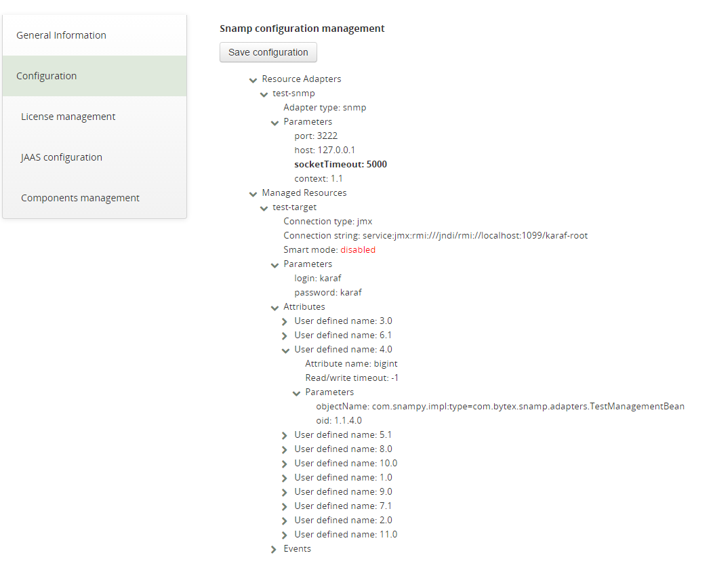

As you can see two main nodes are:
* Resource-adapters (SNAMP adapters)
* Managed resources (SNAMP connectors)

Main instrument for interaction with a tree is a context menu (right click in the node you want to modify):

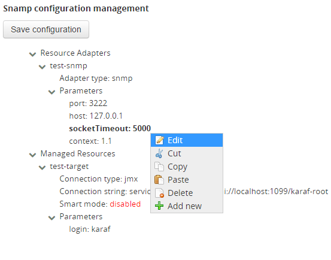

You can change the value of the regular parameter (i.e. adapter/connector name or parameter of its children) just with edit menu item:

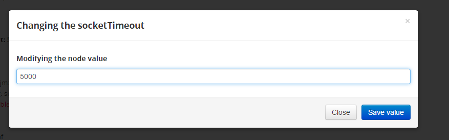

You also can change the type of adapter or managed resource's connection type:

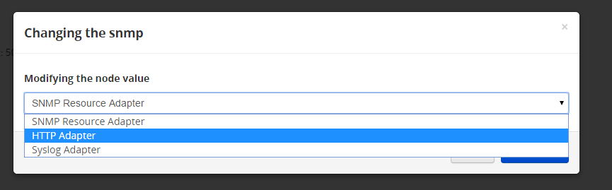

Webconsole provides useful function for appending/changing parameters of adapter/managed resource - just select "Add.." context submenu (or edit for existing one):

Our GUI retrieves possible params automatically. Each param has its own set of properties (mandatory, support suggestion, description etc)

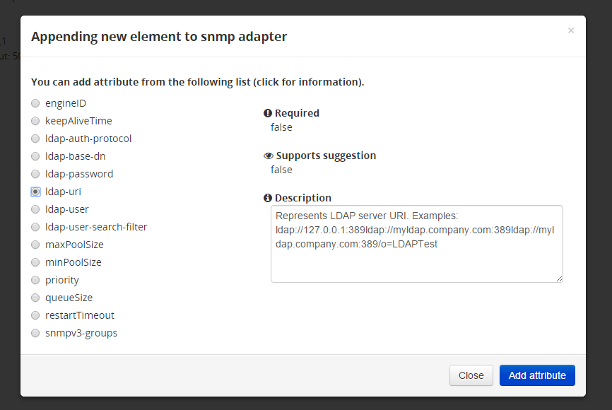

In case you need to append new adapter/managed resourse - just click "Add.." submenu on the corresponding main root:

Here you can select necessary type from the list of available entities:

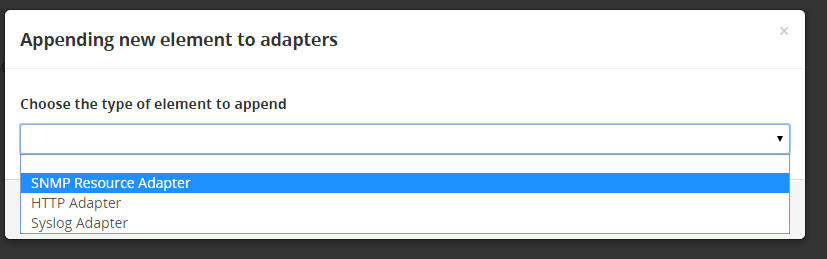

Appending params for connector is similar as for adapter:

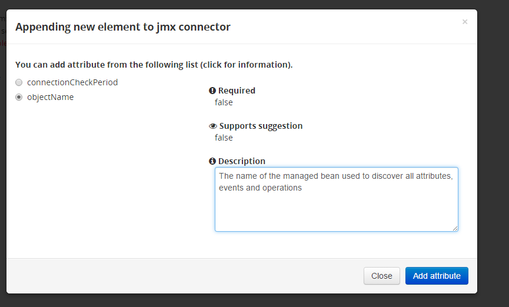

Managed resources have its attributes. You can append it with "Add.." submenu item or change existing one.
If connectors supports suggestion - GUI will provide you set of predefined attributes. You can append your own one:

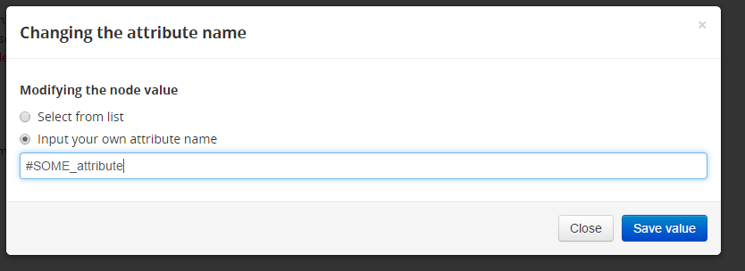

Or select from the list, grouped by its additional parameters:

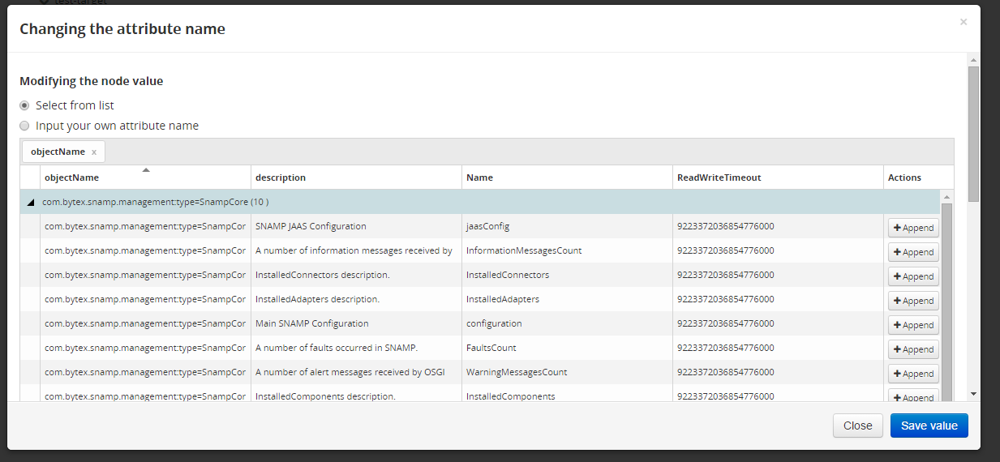

Use same workflow for modifying events of managed resource:

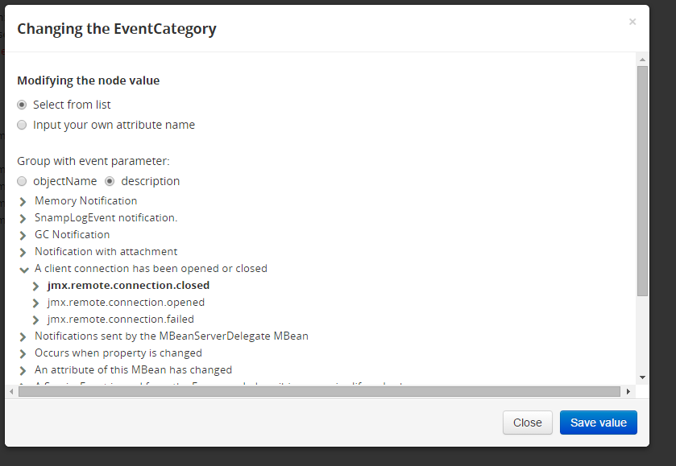

If managed resource supports "smart mode" - you can just enable it:

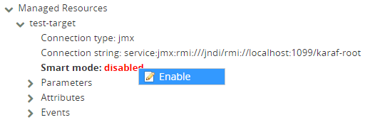

In case you activated smart mode for managed resource - you may leave the attributes/events configuration blank - all necessary entities will be retrieved automatically.
If managed resource supports smart mode and it has been enabled (scheme should be saved) - you can browse attributes and events that belong to connector. 
Click "Attributes" or "Events" submenu of corresponding managed resource context menu
 
Attributes:

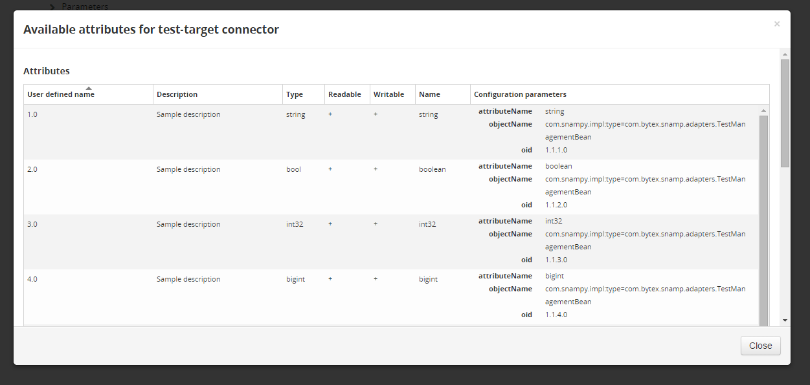 

Events:

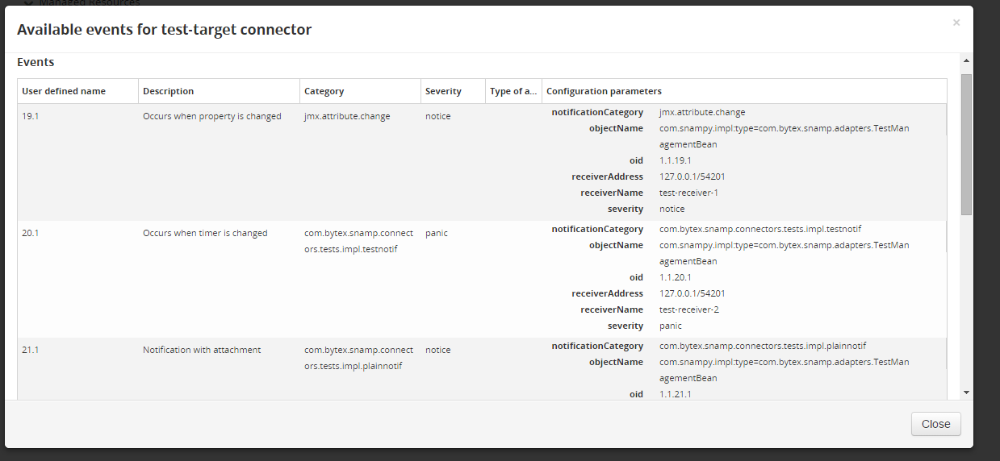

You also can browse binding information for adapters - just select appropriate submenu within the adapter's context menu:
Binding information is group by user defined name of attribute. You can disable grouping or change another grouping column. The table is also sortable.

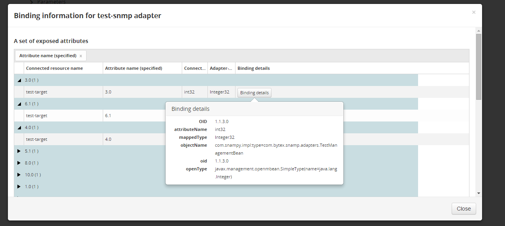

