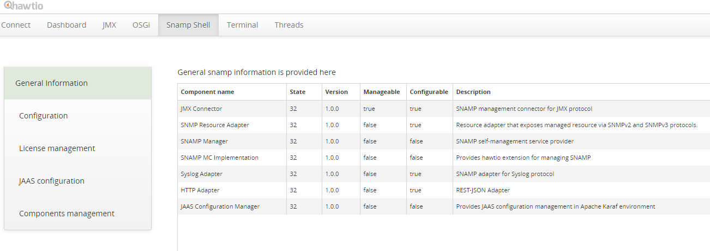

SNAMP platform and modules state
====
The main (and default) tab contains of the table with the information about all SNAMP modules (including core modules).

It belongs to "General information" tab. Tables in the SNAMP web-console support sorting - header rows are clickable.

You will see the table similar to the following example:

Columns definition:

* Component name - display name of SNAMP component
* Description - short description of SNAMP component
* Version - component version
* State - state of the component inside of OSGI environment
* Manageable - true if the component supports command-line interaction
* Configurable - true if the component provides description of its configuration schema