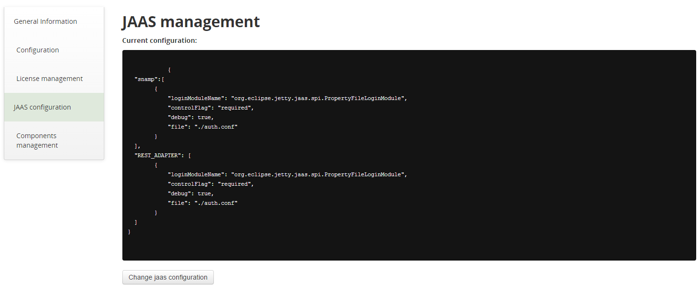
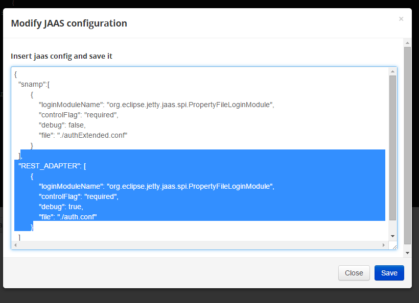

JAAS settings managing via web-console module
====
In the "JAAS configuration" tab you can read and modify your current JAAS property. 

You can update your JAAS settings using simple interface of SNAMP Management Console.

Use "Change JAAS configuration" button to upload new JAAS settings:

Then change the lines:
