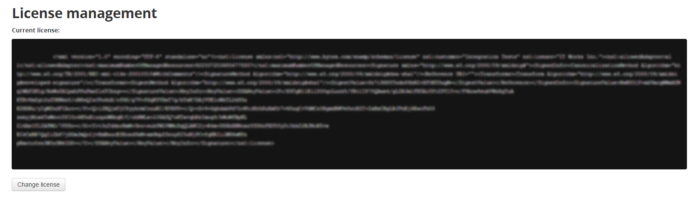
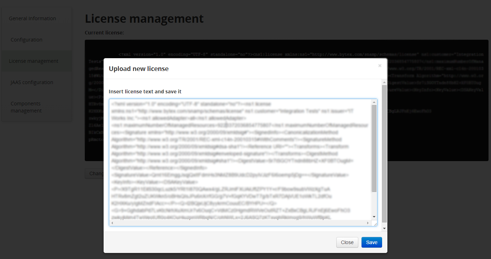

Licensing managing via web-console module
====
In the "License Management" tab you can read and modify your current license file. 

The interface is pretty simple. Use "Change license" button to upload a new licence file:

 
Then change the license:

If you did it successfully you wont see such error messages anymore (in case you did):

2015-10-12 22:34:00,929 | ERROR | eCheckerThread#0 | webconsole | 122 - com.bytex.snamp.management.webconsole - 1.0.0 | License conditions are violated