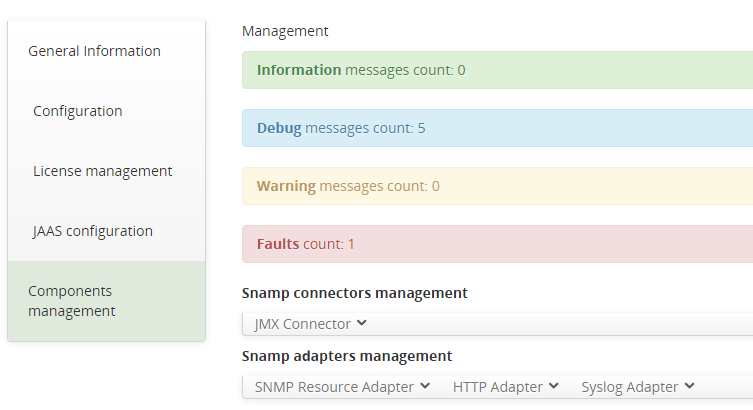
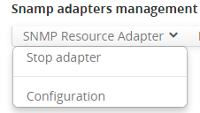
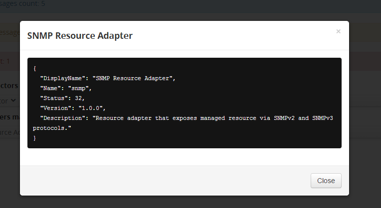

Managing SNAMP component
====

SNAMP web-console provides functions for managing components and some service objects such as statistics of logging events or configuration param for components (read-only).

Take a look on the main tab window:

Here you can see some count of different messages in the karaf log messages directly related to SNAMP. 
These messages are automatically updated once a certain period of time (you can see StatisticRenewalTime attribute of the SNAMP MBean).

In this tab you also can start/stop adapter or connector:

You also can see current settings for connector or adapter (without configuration tab) - as a JSON objects representation:

